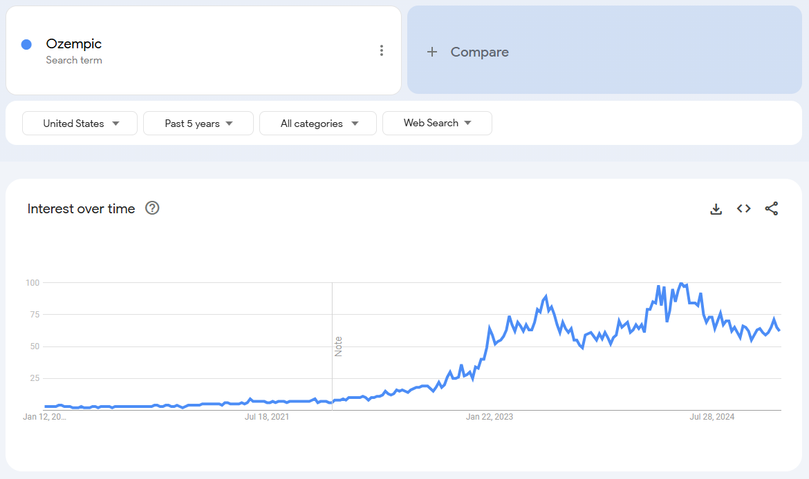
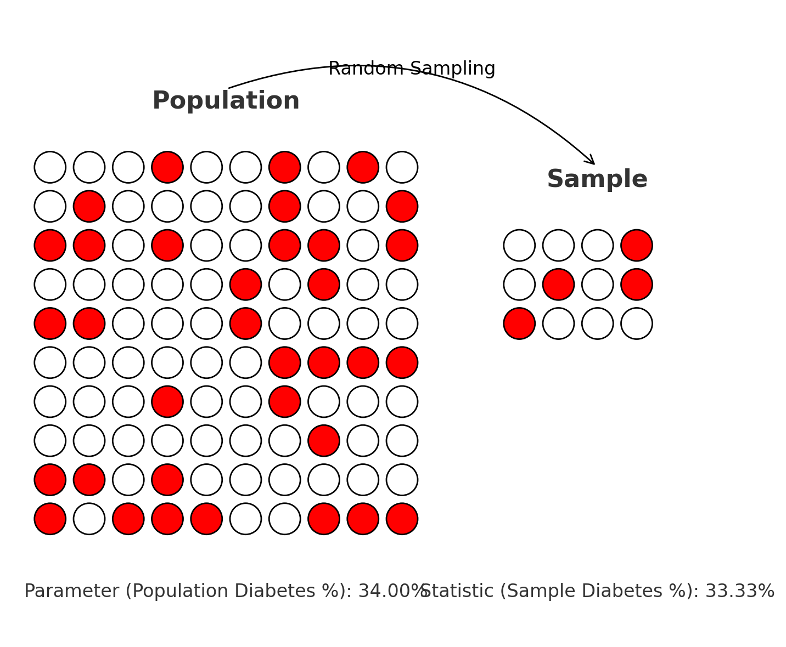

### Summary

- In the last class:
  - We discussed the organization of the course
  - We overviewed forecasting methods
  - We learned about methods of qualitative forecasting
  - *Reference:* Forecasting Methods and Applications, chapter 1
  

- This set of classes: 
  - We will start learning about exploratory analysis preparing the forecast
    - We will learn to translate business problems to statistical problems
    - We will learn about various **data types**
    - We will learn how to **summarize data and observed patterns**
    - *Reference:* Forecasting Methods and Applications, chapter 2.1-2.4

---

#### Why do we care?

- To use scientific methods we need to set business problem as a statistical problem
- Define thins that we want to find to identify appropriate methods 

---

### Specific Scenario

**The Opportunity**
- Online pharmacies are rapidly growing, offering convenience and accessibility to customers.
  - Example in Mexico: *Choiz*, which provides prescription services and drug subscriptions.

--

**The Trend**
- A new generation of highly effective anti-diabetes medications, like *Ozempic*, is gaining popularity for dual benefits: managing diabetes and aiding weight loss.

---
**Search Interest in Ozempic**  


---

**Your Role**
- You have been hired as a consultant for a start-up aiming to launch a subscription service for these medications in Mexico.


--

**The Challenge**
- Your boss needs a detailed exploratory market analysis to forecast sales and identify key customer segments


---

### Parameters vs Statistics

- You need to know how many people in Mexico have diabetes

--
#### Parameter
- Call $\mu_d$ the proportion of Mexican population which has diabetes
  - Usually the parameter is an **unknown** number **describing the whole population**
  - You want to learn what it is
  - In our example, $\mu_d$ is a parameter that you want to learn
  - More generally, parameter describes an aspect of the entire population

--
#### Statistic
- But you don't have data on the whole population. At best you can get a sample from a survey 
  - So you will try to estimate this parameter with sample
  - Statistic is a **guess of the parameter** which can be **calculated from the sample**
  - You will calculate a statistic $\hat{\mu}_p$ which is the proportion of diabetics in the sample
  

---
### Sampling: categorical variable


---
### Sampling: continuous variable
```{r, warning=FALSE, message=FALSE, echo=FALSE, fig.height=4.5}
set.seed(2025)

# Simulate population: all diners over a month (in minutes)
n_pop <- 10000
population <- data.frame(
  table_time = rgamma(n_pop, shape = 4, rate = 0.05)
)

# Sample: 100 customers
n_sample <- 50
sample <- population[sample(1:n_pop, n_sample), , drop = FALSE]

# Shared x-axis limits
x_limits <- c(0, 200)

# Load libraries
library(ggplot2)
library(patchwork)

# Calculate means
mu <- mean(population$table_time)
xbar <- mean(sample$table_time)

# Get max y for density and histogram for label placement
max_density_y <- max(density(population$table_time)$y)
max_hist_y <- max(hist(sample$table_time, plot = FALSE)$counts)

# Plot 1: Population density with μ (Parameter)
p1 <- ggplot(population, aes(x = table_time)) +
  geom_density(fill = "lightgreen", alpha = 0.7) +
  geom_vline(xintercept = mu, color = "darkgreen", linetype = "dashed", size = 1.2) +
  annotate("text", x = mu + 5, y = max_density_y * 0.9,
           label = paste0("μ = ", round(mu, 1), " min\n(Parameter)"),
           hjust = 0, color = "darkgreen", size = 4) +
  labs(title = "Population: All Customers (1 Month)", 
       x = "Time at Table (minutes)", y = "Density") +
  xlim(x_limits) +
  theme_minimal()

# Plot 2: Sample histogram with x̄ (Statistic)
p2 <- ggplot(sample, aes(x = table_time)) +
  geom_histogram(binwidth = 5, fill = "salmon", color = "white") +
  geom_vline(xintercept = xbar, color = "red", linetype = "dashed", size = 1.2) +
  annotate("text", x = xbar + 5, y = max_hist_y * 0.9,
  label = "x̄ = 88 min (Statistic)",
           hjust = 0, color = "red", size = 4) +
  labs(title = "Sample: 50 Customers", 
       x = "Time at Table (minutes)", y = "Number of Customers") +
  xlim(x_limits) +
  theme_minimal()

# Combine plots
p1 / p2 + plot_annotation(
  title = "Customer Time at Table: Population vs. Sample Mean",
  theme = theme(plot.title = element_text(face = "bold"))
)

```


---

### Parameters vs Statistics

- What is population, sample, parameter and statistic in the following examples?

--

- You want to know the probability that a user who got a match on tinder will go out on a date with that person. You survey 1000 users and ask them about each match they got if they went on a date. You then calculate the share of dates which ended up in a match for these users. 

--
- You want to know what whether starbucks baristas are faster than Cielito Querido baristas. You go to 10 starbucks and 10 Cielito Querido and measure the time it takes to make a coffee. You then calculate the average time it takes to make a coffee in each of these chains.

--
- You want to know the average age of people who go to the gym. You go to a gym and ask 100 people about their age. You then calculate the average age of these people.

--
- You want to know the variance of internet speed during in Mexico City. You visit 500 households and calculate the variance of their internet speed.

---

### Parameters vs Statistics

- What are some examples of the statistics we will use and why do we care?

---
layout: false
class: inverse, middle

# Summary Statistics

---

### Summary Statistics

- Any advanced analysis always starts with describing the data

 1. **Cambridge Analytica**
- Analyzed voter demographics and turnout patterns to target swing voters with tailored political ads.

--

 2. **Tesla**
- Summarized battery efficiency and charging times to improve EV performance and user experience.

--

 3. **Walmart**
- Optimized opening hours and staffing by analyzing distribution

--

 4. **BBVA**
- Analyzed average credit card balances and repayment trends to design tailored credit offers and improve customer retention.


--
Basically any modern company relies on summarizing data to make decisions


---
# Measures of Central Tendency
## Mean

- **Mean** represents the arithmetic average of the data.
- Sometimes called the expected value of the random variable E(X)
- The population mean $\mu$ is the sum of all observations divided by the total population size:

$$\mu =E(X)=\frac{\sum_{i=1}^{N} x_i}{N}=\sum_{x\in X}P(X=x) \times x$$

- where $N$ is the total population size, and $x_i$ are individual data points.

- The sample mean, denoted as $\bar{x}$, is the sample equivalent:

$$\bar{x} = \frac{\sum_{i=1}^{n} x_i}{n} = \frac{x_1+x_2+...x_{n-1}+x_n}{n}$$

where $n$ is the sample size.


---
## Mean

Intuitively, mean is the balancing point of the distribution. 

```{r, warning=FALSE, fig.height=4.5}
# Load necessary libraries
# Load necessary libraries
library(ggplot2)

# Create a sample dataset with positive and negative values
set.seed(42)
sample_data <- c(rnorm(200, mean = -20, sd = 10), rnorm(200, mean = 25, sd = 30))

# Calculate the sample mean
sample_mean <- mean(sample_data)

# Create a data frame for the plot
df <- data.frame(Value = sample_data)

# Create the plot
ggplot(df, aes(x = Value)) +
  geom_histogram(binwidth = 3) +
  geom_vline(xintercept = sample_mean, linetype = "dashed", color = "grey", size = 1.5) +
  labs(title = "",
       x = "Values", y = "Frequency") +
  theme_xaringan() +
  theme(legend.position = "none")
```

---
## Mean of a binary variable

What if a mean of a **binary variable**?
  - Binary variable is a variable which takes value 0 or 1
  - For example: do you have diabetes (yes=1, no=0)
  
--

What is the intuitive interpretation of the mean of this variable?

  - $\bar{x} = \frac{\sum_{i=1}^{n} x_i}{n}$
  - $\bar{x} = \frac{1+0+0+...0+1}{n}=\frac{n_{diabetes}}{n}=\hat{\mu}_{diabetes}$
  
--

It's the proportion of people with diabetes in the sample: mean(diabetes)= `r format(round(mean(Health_data$diabetes),3), scientific=FALSE)`

---


## Weighted Mean

- In some scenarios, data points have different weights. 
- For a dataset with weights $w_i$ and values $x_i$, the weighted mean is:

$$\small \text{Weighted Mean} = \frac{\sum_{i=1}^{n} w_i \cdot x_i}{\sum_{i=1}^{n} w_i}$$
```{r, echo=FALSE, results='asis'}
# Create a data frame for the table
df <- data.frame(Person = c("Midterm 1", "Midterm 2", "Quizzes", "Final Project", "Final exam"),
                 Weight = c(0.2, 0.2, 0.15, 0.15, 0.3),
                 Grade = c(6, 8, 9, 4, 8))

# Display the data in a table
datatable(df,
          fillContainer = FALSE,
          options = list(
            pageLength = 4,
            searching = FALSE,
            initComplete = JS(
              "function(settings, json) {",
              "$(this.api().table().container()).css({'font-size': '12px'});",
              "}"
            )
          ),
          rownames = FALSE
)
```


The ** weighted mean** is:

\begin{align*}
\small
    \bar{x} & =\frac{0.2\times 6+0.2\times 8+0.15 \times  9+ 0.15 \times  4+0.3 \times 8}{0.2+0.2+0.15+0.15+0.3} 
\end{align*}


---
## Mean

- Is mean always a right measure?

#### "Bill Gates walks into a bar"

- Suppose a group of people, including Bill Gates, walks into a bar.
- Let's say the net worth of everyone in the group is as follows:

.pull-left[
```{r, echo=FALSE, results='asis'}
# Create a data frame for the table
df <- data.frame(Person = c("Person 1", "Person 2", "Person 3", "Person 4", "Person 5", "Bill Gates"),
                 Net_Worth = c(10, 20, 30, 40, 50, 600000))

# Display the data in a table
datatable(df,
          fillContainer = FALSE,
          options = list(
            pageLength = 6,
            searching = FALSE,
            initComplete = JS(
              "function(settings, json) {",
              "$(this.api().table().container()).css({'font-size': '12px'});",
              "}"
            )
          ),
          rownames = FALSE
)
```
]

.pull-right[
The **mean** is:

\begin{align*}
    \bar{x} & =\frac{10 + 20 + 30 + 40 + 50 + 60000}{6} \\
    & = 10025 \\
\end{align*}


Mean is seriously skewed due to the outlier.
]

---

## Mean vs Median

<center>

</center>

---
## Median

- **Median** represents the middle value when data is sorted
- Half of observations are below it, half are above it.
- For a dataset with odd size $n$, the median is the $\frac{n+1}{2}$-th value
- For even size $n$, it's the average of $\frac{n}{2}$-th and $\frac{n}{2}+1$-th values.

.pull-left[
| Day | Number of Customers |
|-----|---------------------|
| 1   | 20                  |
| 2   | 18                  |
| 3   | 25                  |
| 4   | 22                  |
| 5   | 30                  |
| 6   | 21                  |
| 7   | 27                  |
]

.pull-right[
The dataset has $n=7$ (odd) observations, so to find the median:

- Arrange the data in ascending order:
    - 18, 20, 21, 22, 25, 27, 30.
- The median is the $\frac{n+1}{2}$-th value, which is the 4th value.
- Thus, the median is the 4th value, which is 22.
]

---

### Let's look at the median weight in our population
```{r, warning=FALSE, fig.height=5, echo=FALSE}
mean_weight_original <- mean(Health_data$weight)
median_weight_original <- median(Health_data$weight)
```
- Mean: `r format(mean_weight_original, scientific=FALSE)`
- Median: `r format(median_weight_original, scientific=FALSE)`

--

```{r, warning=FALSE, fig.height=4, out.width='100%'}
# Load the required libraries


# Calculate the mean and median of the original weight variable


# Create a histogram of the weight variable with extreme values
ggplot(Health_data, aes(x = weight)) +
  geom_histogram(binwidth = 5, fill = "lightblue", color = "black") +
  labs(title = "", x = "Weight", y = "Frequency") +
  theme_xaringan() +
  theme(plot.title = element_text(hjust = 0.5)) +
  # Add vertical lines for mean and median of original data
  geom_vline(xintercept = mean_weight_original, color = "red", linetype = "dotted", size = 2) +
  geom_vline(xintercept = median_weight_original, color = "blue", linetype = "dashed", size = 2)
  # Add labels for mean and median of original data

# Add some extreme values to the right of the weight distribution
extreme_values <- rep(c(290, 300, 305, 315, 320, 330, 340),100)
Health_data_with_extremes <- c(Health_data$weight, extreme_values)

# Calculate the mean and median of the weight variable with extreme values
mean_weight_extremes <- mean(Health_data_with_extremes)
median_weight_extremes <- median(Health_data_with_extremes)


```
- Mean is dotted
- Median is dashed
---

### Median and outliers

I added couple of observations on the right tail of the distribution

- Old Mean: `r format(round(mean_weight_original,2), scientific=FALSE)`, **New Mean: `r format(round(mean_weight_extremes,2), scientific=FALSE)`**
- Old Median: `r format(round(median_weight_original,2), scientific=FALSE)`, **New Median:  `r format(round(median_weight_extremes,2), scientific=FALSE)`**


```{r abc, warning=FALSE, fig.height=4, out.width='100%'}
# Load the required libraries
library(ggplot2)


# Create a histogram of the weight variable with extreme values
ggplot(data.frame(weight = Health_data_with_extremes), aes(x = weight)) +
  geom_histogram(binwidth = 5, fill = "lightblue", color = "black") +
  labs(title = "", x = "Weight", y = "Frequency") +
  theme_xaringan() +
  theme(plot.title = element_text(hjust = 0.5)) +
  # Add vertical lines for mean and median of original data
  geom_vline(xintercept = mean_weight_original, color = "red", linetype = "dotted", size = 2) +
  geom_vline(xintercept = median_weight_original, color = "blue", linetype = "dashed", size = 2) +
  # Add vertical lines for mean and median with extreme values
  geom_vline(xintercept = mean_weight_extremes, color = "orange", linetype = "dotted", size = 2) +
  geom_vline(xintercept = median_weight_extremes, color = "Green", linetype = "dashed", size = 2) 
  # Add labels for mean and median of original data
  # Add labels for mean and median with extreme values

```


---

## Side note on the Mode

**Mode** is the most frequent value in the data

- Let's look at the distribution of age of people with diabtese
```{r, out.width='100%', fig.height=4, warning=FALSE}
frequency_table <- table(Health_data[Health_data$diabetes==1,]$age)
frequency_table <- as.data.frame(frequency_table)
colnames(frequency_table) <- c('Age', 'n_i')

# Adding relative frequencies (p_i)
frequency_table$p_i <- prop.table(frequency_table$n_i)
frequency_table$p_i <- round(prop.table(frequency_table$n_i), 3)

datatable(frequency_table,
          fillContainer = FALSE,
          options = list(
            pageLength = 6,
            searching = FALSE,
            initComplete = JS(
              "function(settings, json) {",
              "$(this.api().table().container()).css({'font-size': '12px'});",
              "}"
            )
          ),
          rownames = FALSE)

```


---

## Mode

<center>

</center>

---
## Percentiles


<center>

</center>


---

## Percentiles


<center>

</center>

---

## Percentiles


<center>

</center>

---


---

## Percentiles


<center>

</center>


---

## Percentiles


<center>

</center>

Credits: Wall Street Journal
[Article Link](https://www.wsj.com/tech/personal-tech/spotify-wrapped-2023-taylor-swift-e303333d)

---
## Percentiles

- How much inventory of milk you need to keep in your Starbucks?

--
- What is the tradeoff of keeping too much vs too litle inventory?

--
- Suppose we want to have enough of milk to cover sales on 95% of days

--
- To figure it out, let's look at the distribution of the daily use of milk

```{r Sales_dist_figure, out.width='100%', fig.height=3, warning=FALSE}

# Set seed for reproducibility
set.seed(42)

# Generate sample data for daily milk sales (right-skewed gamma distribution)
shape_param <- 5  # Shape parameter for the gamma distribution
scale_param <- 30  # Scale parameter for the gamma distribution
num_samples <- 1000
daily_sales_data <- rgamma(num_samples, shape = shape_param, scale = scale_param)

# Calculate the desired inventory level to avoid stockouts on at least 95% of days
desired_service_level <- 0.95
optimal_inventory_level <- qgamma(desired_service_level, shape = shape_param, scale = scale_param)

# Calculate the stockout probability
stockout_probability <- sum(daily_sales_data < optimal_inventory_level) / num_samples

# Create a data frame for the histogram
hist_data <- data.frame(DailySales = daily_sales_data)

# Create the ggplot figure
ggplot(hist_data, aes(x = DailySales)) +
  geom_histogram(aes(y = after_stat(count / sum(count))), bins = 30, fill = "lightblue", color = "black") +
  labs(title = "",
       x = "Daily Use of Milk",
       y = "Relative frequency") +
  theme_xaringan()
```


---

## Percentiles

- Let $s_i$ be the daily sales of milk
- We want to choose amount $M$, such that $P(s_i \leq M)=0.95$
- That is, in 95% of days sales are smaller or equal than $M$

--
```{r Sales_dist_figure_with_shaded_region, out.width='100%', fig.height=3, warning=FALSE}
hist_data$up=hist_data$DailySales<optimal_inventory_level

ggplot(hist_data, aes(x = DailySales, fill = after_stat(x) > optimal_inventory_level)) +
  geom_histogram(aes(y = after_stat(count / sum(count))), bins = 30, color = "black") +
  geom_vline(xintercept = optimal_inventory_level, color = "red", linetype = "dashed", size = 1) +
  scale_fill_manual(values = c("red", "lightblue")) +
  geom_text(aes(x = optimal_inventory_level * 0.5, y = 0.005, label = "95%"), color = "white", size = 5) +
  labs(title = "",
       x = "Daily Milk Use",
       y = "Relative frequency") +
  theme(legend.position = "none")+
  theme_xaringan()

```

--

- What is this number? 
- It's the 95th percentile of the distribution (274 liters)

---
## Percentiles

- *Percentiles* divide the ordered data into 100 equal parts. 
- $p$th percentile is a value such that $p\%$ of the data are below it
    - $v_p$ is such that $P(x_i \leq v_p)=p$
    - $v_{95}$ is such that $P(x_i \leq v_{95})=95\%$

---
## Percentiles

--

- What is the the height such that 75% of ITAM students are smaller than this height?

--

- What is the income level such that 25% of people in Mexico earn less than that level?

--

- What is the age, such that 50% of people die before that age?

-- 

- When do I need to leave home to be on time for class 90% of the days?


---

## How to find it in a sample
1. Arrange the data in ascending order

--
2. Find which observation corresponds to the relevant percentile
  - Formula: $i = \left(\frac{p}{100}\right)(n+1)$
  - Example: To find 95th percentile in a sample of 1000 observations we look at $i = \left(\frac{95}{100}\right)(1000+1)=950.95$ observation
  
--

3. If it's an integer, value of ith observation is your percentile
4. If it's not, take the average between ith rounded down and ith rounded up 
    - In our example it would be the average of 950th and 951th observation
 
 
 --

## Or use the CDF

- $ECDF(v)=P(x_i \leq v)$

```{r Image_of _CDF, out.width='100%', fig.height=3, warning=FALSE}
ecdf_data <- ecdf(Health_data$weight)

# Plot the cumulative distribution
cdf_plot <- ggplot(data.frame(weight = c(min(Health_data$weight), sort(Health_data$weight))), aes(x = weight)) +
stat_ecdf(geom = "line", size = 1.5) +
  labs(title = "Cumulative Distribution Function ", x = "Weight", y = "Cumulative Probability") +
  theme_xaringan() 

# Display the plot
ggplotly(cdf_plot,
        width = 800,   # Adjust the width according to your preference
        height = 300)

```
---
## Common values

- **Median** - 50th percentile - half of the values are below the median

- **Quartiles** - 25th, 50th and 75th percentile. 
  - How poor is the poorest quartile of the society? 
  - Their income is below the 25th percentile
  
```{r Image_with_shaded_area_Qtiles, out.width='100%', fig.height=3, warning=FALSE}
# Generate sample data for income distribution (assuming a normal distribution)

# Define the mean and standard deviation
mean <- 20000
std_dev <- 2000

# Calculate the 1st quartile (25th percentile)
q1 <- qnorm(0.25, mean = mean, sd = std_dev)

# Create the ggplot figure
ggplot(data.frame(x = c(0, 40000)), aes(x)) +
  stat_function(fun = dnorm,
                geom = "area",
                fill = "steelblue",
                xlim = c(0, 18461.66),
                args = list(
                  mean = mean,
                  sd = std_dev
                )) +
  stat_function(fun = dnorm,
                geom = "line",
                xlim = c(18461.66, 40000),
                args = list(
                  mean = mean,
                  sd = std_dev
                )) +
  geom_vline(xintercept = q1, color = "red", linetype = "dashed") +
  annotate("text", x = q1, y = 0.00008, label = "18461.66", color = "red", angle = 90) +
  annotate("text", x = 13000, y = 0.00005, label = "25%", color = "black") +
  xlim(0, 40000) +
  labs(y="frequency", x="income")+
  theme_xaringan()


```

---

- **Deciles** - 10th, 20th, ... 90th 
  - How bad pollution gets in CDMX during top 10% polluted days?
  - During top 10% of polluted days pollution level is larger or than 9th decile.  
  
```{r Image_with_shaded_area_Deciles, out.width='100%', fig.height=4, warning=FALSE}
library(ggplot2)

# Generate sample data for daily pollution (using a normal distribution as an example)
set.seed(42)
mean_pollution <- 25  # WHO guideline for annual mean PM2.5
std_dev_pollution <- 5  # Standard deviation of pollution (adjust as needed)
num_days <- 365  # Number of days
pollution_data <- rnorm(num_days, mean = mean_pollution, sd = std_dev_pollution)

# Calculate the 90th percentile (top 10% polluted days)
pct_90 <- quantile(pollution_data, probs = 0.9)

# Create the ggplot figure
ggplot(data.frame(x = c(0, 50)), aes(x)) +
  stat_function(fun = dnorm,
                args = list(mean = mean_pollution, sd = std_dev_pollution),
                geom = "area",
                fill = "steelblue",
                xlim = c(0, pct_90)) +
  stat_function(fun = dnorm,
                args = list(mean = mean_pollution, sd = std_dev_pollution),
                geom = "line",
                xlim = c(pct_90, 50)) +
  geom_vline(xintercept = pct_90, color = "red", linetype = "dashed") +
  annotate("text", x = pct_90 - 2.5, y = 0.02, label = paste0(round(pct_90, 1), " μg/m³"),
           color = "red", angle = 90, size = 4) +
  annotate("text", x = 20, y = 0.005, label = "90% of Days",
           color = "black", size = 5) +
  xlim(0, 50) +
  xlab("PM2.5")+
  ylab("frequency")+
  theme_xaringan()


```

---

### Example with data

Here is a data on distribution of how many views have various tik-tok videos. 
- What is the 1st decile?
- What is the 95th percentile?

```{r, out.width='100%', fig.height=4, warning=FALSE}
# Set the seed for reproducibility
set.seed(42)

# Number of observations
num_observations <- 200

# Generate synthetic data for views (lognormal distribution with long right tail)
views <- round(rlnorm(num_observations, meanlog = 10, sdlog = 1.5))

# Generate video names
video_names <- paste("TikTok Video", 1:num_observations)

# Create the dataset
tiktok_dataset <- data.frame(VideoTitle = video_names, Views = views)
datatable(tiktok_dataset,
          fillContainer = FALSE,
          options = list(
            pageLength = 4,
            searching = FALSE,
            initComplete = JS(
              "function(settings, json) {",
              "$(this.api().table().container()).css({'font-size': '12px'});",
              "}"
            )
          ),
          rownames = FALSE)

```

--

- Index for the first decile is: $i = \left(\frac{10}{100}\right)(200+1)=20.1$
  - First decile is the average of the 20th and 21st observation
- Index for the 95th percentile is: $i = \left(\frac{95}{100}\right)(200+1)=190.95$
  - 95th percentile is the average of the at 190th and 191st observation

---


---
# Measures of Dispersion


--

- Suppose a store has an average daily revenue of 10 000 pesos
- It could be that on each day it has exactly 10 000 pesos revenue
- Or it could be that on half of days it gets 20 000 pesos but on other half it gets 0 pesos
- Dispersion makes a big difference, especially when trying to understand risk! 


--
## Range

- **Range** the difference between minimum and maximum value in the data 


$$R=x_{max}-x_{min}$$


--

- What is the difference between the oldest and the youngest person with diabetes? 
- **R**=`r max(Health_data[Health_data$diabetes==1,]$age)-min(Health_data[Health_data$diabetes==1,]$age)`=`r format(round(max(Health_data[Health_data$diabetes==1,]$age),2))`-`r format(round(min(Health_data[Health_data$diabetes==1,]$age),2))`


---
- Very sensitive to outliers


```{r 11, out.width='100%', fig.height=5, warning=FALSE}
### Illustrate with two dotplots, where I just change one observation at the end

# Generate normal distributed data with mean 40 and sd 10
set.seed(123)  # for reproducibility
num_values <- 50
values <- rnorm(num_values, mean = 40, sd = 10)
data_initial <- data.frame(Values = values)

# Calculate range for initial dataset
range_initial <- range(values)

plot_initial <-  ggplot(data_initial, aes(x = Values)) +
  geom_dotplot(binwidth = 2, method = 'histodot', show.legend = FALSE) +
  geom_segment(aes(xend = range_initial[1], y = 0.7, x = range_initial[2], yend = 0.7), color = "blue", size = 1.5) +
  geom_text(aes(x = round(c(range_initial[2] - range_initial[1]),2), y = 0.75, label = paste("Range: ", round(c(range_initial[2] - range_initial[1]),2))), 
            color = "blue", size = 6, vjust = -1) +
  labs(title = "", x = "Values", y = "Density")+theme_xaringan()+
  xlim(0,110)

# Modify one observation
modified_values <- c(values[-which.max(values)], 100)  # Replace last value with an outlier
data_modified <- data.frame(Values = modified_values)

# Calculate range for modified dataset
range_modified <- range(modified_values)

plot_modified <-  ggplot(data_modified, aes(x = Values)) +
  geom_dotplot(binwidth = 2, method = 'histodot', show.legend = FALSE) +
  geom_segment(aes(xend = range_modified[1], y = 0.7, x = range_modified[2], yend = 0.7), color = "blue", size = 1.5) +
  geom_text(aes(x = round(range_modified[2] - range_modified[1],2)), y = 0.75, label = paste("Range: ", round(range_modified[2] - range_modified[1],2)), 
            color = "blue", size = 6, vjust = -1) +
  labs(title = "", x = "Values", y = "Density")+theme_xaringan()+
  xlim(0,110)


combined_plot <- plot_grid(plot_initial, plot_modified, labels = c("A", "B"), nrow = 2)

# Print the combined plot
print(combined_plot)


```

---
## Interquartile Range
- **Interquartile range** is the difference between the first and the third quartile of the data:
$$IQR=q_3-q_1$$
- What is the IQR of age in people with diabetes? 
- **IQR**=`r quantile(Health_data[Health_data$diabetes==1,]$age,0.75)-quantile(Health_data[Health_data$diabetes==1,]$age, 0.25)`=`r format(round(quantile(Health_data[Health_data$diabetes==1,]$age, 0.75),2))`-`r format(round(quantile(Health_data[Health_data$diabetes==1,]$age, 0.25),2))`

--
- 50% of the sample is between $q_3$ and $q_1$

--
```{r 2, out.width='100%', fig.height=3, warning=FALSE}
### Show two dotplots which have same mean/median but different interquartile ranges 

diabetes_data <- Health_data[Health_data$diabetes == 1, ]

# Calculate range and interquartile range (IQR)
range_diabetes <- range(diabetes_data$age)
iqr_diabetes <- IQR(diabetes_data$age)

plot_diabetes <- ggplot(diabetes_data, aes(x = age)) +
  geom_histogram(binwidth = 5, fill = "lightblue", color = "black", show.legend = FALSE) +
  geom_segment(aes(xend = range_diabetes[1], y = 8, x = range_diabetes[2], yend = 8), color = "blue", size = 1.5) +
  geom_text(aes(x = mean(range_diabetes), y = 9, label = paste("Range: ", round(range_diabetes[2] - range_diabetes[1], 2))), 
            color = "blue", size = 6, vjust = -1) +
  geom_segment(aes(xend = quantile(diabetes_data$age, 0.25), y = 300, x = quantile(diabetes_data$age, 0.75), yend = 300), color = "red", size = 1.5) +
  geom_text(aes(x = quantile(diabetes_data$age, 0.5), y = 301, label = paste("IQR: ", round(iqr_diabetes, 2))), 
            color = "red", size = 6, vjust = -1) +
  labs(title = "", x = "Age", y = "Frequency") + 
  theme_xaringan() + xlim(0, max(diabetes_data$age) + 10)

# Print the plot
print(plot_diabetes)


```


---
- Is it more or less sensitive to outliers than range?

```{r 1, out.width='100%', fig.height=5, warning=FALSE}
### Illustrate with two dotplots, where I just change one observation at the end


# Generate normal distributed data with mean 40 and sd 10
set.seed(123)  # for reproducibility
num_values <- 50
values <- rnorm(num_values, mean = 40, sd = 10)
data_initial <- data.frame(Values = values)

# Calculate interquartile range (IQR) for initial dataset
iqr_initial <- IQR(values)

plot_initial <-  ggplot(data_initial, aes(x = Values)) +
  geom_dotplot(binwidth = 2, method = 'histodot', show.legend = FALSE) +
  geom_segment(aes(xend = quantile(values, 0.25), y = 0.7, x = quantile(values, 0.75), yend = 0.7), color = "blue", size = 1.5) +
  geom_text(aes(x = quantile(values, 0.5), y = 0.75, label = paste("IQR: ", round(iqr_initial, 2))), 
            color = "blue", size = 6, vjust = -1) +
  labs(title = "", x = "Values", y = "Density") + theme_xaringan() +
  xlim(0, 110)

# Modify one observation
modified_values <- c(values[-which.max(values)], 100)  # Replace last value with an outlier
data_modified <- data.frame(Values = modified_values)

# Calculate interquartile range (IQR) for modified dataset
iqr_modified <- IQR(modified_values)

plot_modified <-  ggplot(data_modified, aes(x = Values)) +
  geom_dotplot(binwidth = 2, method = 'histodot', show.legend = FALSE) +
  geom_segment(aes(xend = quantile(modified_values, 0.25), y = 0.7, x = quantile(modified_values, 0.75), yend = 0.7), color = "blue", size = 1.5) +
  geom_text(aes(x = quantile(modified_values, 0.5), y = 0.75, label = paste("IQR: ", round(iqr_modified, 2))), 
            color = "blue", size = 6, vjust = -1) +
  labs(title = "", x = "Values", y = "Density") + theme_xaringan() +
  xlim(0, 110)

combined_plot <- plot_grid(plot_initial, plot_modified, labels = c("A", "B"), nrow = 2)

# Print the combined plot
print(combined_plot)

```

---
### Interquartile Range 

---


### Example with data

- What is the IQR?

```{r, out.width='100%', fig.height=4, warning=FALSE}
# Set the seed for reproducibility
set.seed(42)

# Number of observations
num_observations <- 20

# Generate synthetic data for views (lognormal distribution with long right tail)
views <- round(rlnorm(num_observations, meanlog = 3, sdlog = 0.3))

# Generate video names
video_names <- paste("TikTok Video", 1:num_observations)

# Create the dataset
tiktok_dataset <- data.frame(VideoTitle = video_names, Views = views)
datatable(tiktok_dataset,
          fillContainer = FALSE,
          options = list(
            pageLength = 4,
            searching = FALSE,
            initComplete = JS(
              "function(settings, json) {",
              "$(this.api().table().container()).css({'font-size': '12px'});",
              "}"
            )
          ),
          rownames = FALSE)

```


---

### Example with data

Here is a (smaller) data on distribution of how many views have various tik-tok videos. 
- Suppose that all views triples and 1000 additional people viewed them as well
$$y_i=3x_i+1000$$
- What is new IQR?
```{r, out.width='100%', fig.height=4, warning=FALSE}
# Set the seed for reproducibility
# Create the dataset
tiktok_dataset <- data.frame(VideoTitle = video_names, OldViews = views, NewViews=views*3+1000)
datatable(tiktok_dataset,
          fillContainer = FALSE,
          options = list(
            pageLength = 4,
            searching = FALSE,
            initComplete = JS(
              "function(settings, json) {",
              "$(this.api().table().container()).css({'font-size': '12px'});",
              "}"
            )
          ),
          rownames = FALSE)

```

---
### IQR


- Order of observations was not affected, so same observations correspond to the first and the third quartile

$$q^{New}_{1}=3q^{Old}_1+1000$$
$$q^{New}_{3}=3q^{Old}_3+1000$$

--
- And more generally, for $$y_i=bx_i+a$$ and $b>0$

$$v^y_p=bv^{x}_p+a$$
- if $b<0$ then the order reverses. 

--
- So what does it mean for IQR?

$$IQR^{New}=q^{New}_{3}-q^{New}_{1}=3q^{Old}_3-3q^{Old}_1=3*IQR^{Old}$$


---


```{r 5aa, out.width='100%', fig.height=5, warning=FALSE}
### Illustrate with two dotplots, where I just change one observation at the end


# Generate normal distributed data with mean 40 and sd 10

data_initial <- data.frame(VideoTitle = video_names, OldViews = views, NewViews=views*3+1000)

# Calculate interquartile range (IQR) for initial dataset
iqr_initial <- IQR(data_initial$OldViews)

plot_initial <-  ggplot(data_initial, aes(x = OldViews)) +
  geom_dotplot(binwidth = 2, method = 'histodot', show.legend = FALSE) +
  geom_segment(aes(xend = quantile(data_initial$OldViews, 0.25), y = 0.35, x = quantile(data_initial$OldViews, 0.75), yend = 0.35), color = "blue", size = 1.5) +
  labs(title = "", x = "Values", y = "Density") + theme_xaringan() +
  xlim(0,125)

# Calculate interquartile range (IQR) for modified dataset
iqr_modified <- IQR(data_initial$NewViews)

plot_modified <-  ggplot(data_initial, aes(x = NewViews)) +
  geom_dotplot(binwidth = 2, method = 'histodot', show.legend = FALSE) +
  geom_segment(aes(xend = quantile(data_initial$NewViews, 0.25), y = 0.35, x = quantile(data_initial$NewViews, 0.75), yend = 0.35), color = "blue", size = 1.5) +
  labs(title = "", x = "Values", y = "Density") + theme_xaringan()+
  xlim(1000,1125)

combined_plot <- plot_grid(plot_initial, plot_modified, labels = c("A", "B"), nrow = 2)

# Print the combined plot
print(combined_plot)

```


---

### Variance & Standard Deviation

**Variance** measures how far an average observation is from the mean:

- **Population variance**: 
$$\sigma^2=E[(X-\mu)^2]=E[X^2]-\mu^2 =\frac{1}{N} \sum^N_{i=1}(x_i-\mu)^2=\frac{1}{N} (\sum^N_{i=1}x^2_i-N\mu^2)$$
For Discrete Variables it can be: $\sigma^2=\sum_k P(X=k)(k-\mu)^2$, where k is any possible value that X can take. 

--
- But variance does not have the right units since it squares everything...

--
- **Population standard deviation** deviation:

$$\sigma=\sqrt{\frac{1}{N} \sum^N_{i=1}(x_i-\mu)^2}$$
---


### Variance & Standard Deviation


--
- Why do we first take squares and then take square root? 

--
- Can't we just do $\frac{1}{N}\sum^N_{i=1}(x_i-\mu)$?

--
- NO! Because $\\sum^N_{i=1}(x_i-\mu)=0$

--

- Why don't we just do Mean Absolute Deviation?
 - $MAD=frac{1}{N}\sum^N_{i=1}|(x_i-\mu)|$
 
 
--
- MAD is not differentiable at 0 :( 

--
- Variance puts more weight on far away observations. 
- It's a weighted average distance, where weights are distances themselves. 

--
$$\sigma^2=\sum^N_{i=1}(x_i-\mu)^2=\frac{1}{N}\sum^N_{i=1} \underbrace{|(x_i-\mu)|}_{Weight}*\underbrace{|(x_i-\mu)|}_{Distance}$$
- It makes it very sensitive to outliers, which get a lot of weight!
- Standard deviation retains this property


---

```{r 3, out.width='100%', fig.height=5, warning=FALSE}
### Show three histograms with different level of variances: one symmetric, one symmetric with wider tail, and other one bimodal with much mass on both ends of the distribution. note how different is the variance. Annotate each with the standard deviation. 
library(ggplot2)

# Generate data for the histograms
set.seed(123)
data_symmetric <- rnorm(1000, mean = 0, sd = 1)
data_wide_tail <- rnorm(1000, mean = 0, sd = 2)
data_bimodal <- c(rnorm(500, mean = -2, sd = 0.5), rnorm(500, mean = 2, sd = 0.5))

# Create a data frame for plotting
df <- data.frame(
  Category = rep(c("Bimodal","Wide Tail", "Symmetric" ), each = 1000),
  Value = c(data_bimodal,data_wide_tail, data_symmetric )
)

means <- c(mean(data_symmetric), mean(data_wide_tail), mean(data_bimodal))
sds <- c(sd(data_symmetric), sd(data_wide_tail), sd(data_bimodal))


# Create histograms with annotations
p <- ggplot(df, aes(x = Value, fill = Category)) +
  geom_histogram(binwidth = 0.5, position = "identity", alpha = 0.6) +
  facet_grid(~ Category) +
  labs(x = "Value", y = "Frequency", fill = "Distribution Type") +
  theme_xaringan() +
  theme(legend.position = "none") +
 geom_vline(
    data = data.frame(Category = c("Symmetric", "Wide Tail", "Bimodal"),
                      Mean = means),
    aes(xintercept = Mean),
    linetype = "dashed",
    color = "red"
  ) 

print(p)


```

---

```{r 3b, out.width='100%', fig.height=5, warning=FALSE}
### Show three histograms with different level of variances: one symmetric, one symmetric with wider tail, and other one bimodal with much mass on both ends of the distribution. note how different is the variance. Annotate each with the standard deviation. 
library(ggplot2)

# Generate data for the histograms
set.seed(123)
data_symmetric <- rnorm(1000, mean = 0, sd = 1)
data_wide_tail <- rnorm(1000, mean = 0, sd = 2)
data_bimodal <- c(rnorm(500, mean = -2, sd = 0.5), rnorm(500, mean = 2, sd = 0.5))

# Create a data frame for plotting
df <- data.frame(
  Category = rep(c("Bimodal","Wide Tail", "Symmetric" ), each = 1000),
  Value = c(data_bimodal,data_wide_tail, data_symmetric )
)

means <- c(mean(data_symmetric), mean(data_wide_tail), mean(data_bimodal))
sds <- c(sd(data_symmetric), sd(data_wide_tail), sd(data_bimodal))


# Create histograms with annotations
p <- ggplot(df, aes(x = Value, fill = Category)) +
  geom_histogram(binwidth = 0.5, position = "identity", alpha = 0.6) +
  facet_grid(~ Category) +
  labs(x = "Value", y = "Frequency", fill = "Distribution Type") +
  theme_xaringan() +
  theme(legend.position = "none") +
  geom_text(
    data = data.frame(Category = c("Symmetric", "Wide Tail", "Bimodal"),
                      SD = c(sd(data_symmetric), sd(data_wide_tail), sd(data_bimodal))),
    aes(x = 0, y = 30, label = paste("SD =", round(SD, 2))),
    hjust = 0, vjust = 0,
    size = 5
  )+  geom_vline(
    data = data.frame(Category = c("Symmetric", "Wide Tail", "Bimodal"),
                      Mean = means),
    aes(xintercept = Mean),
    linetype = "dashed",
    color = "red"
  ) 

print(p)


```


---


### Variance & Standard Deviation

Consider two bets/situations:
- Bet A: with 75% you get 200 pesos and with 25% you lose me 200 pesos
  - 75% chance your life goes normal and you keep making money
  - 25% change your house burns down


--
- Bet B: with 75% you get 110 pesos and with 25% you get 70
  -  When your life goes normal you get 110 (you pay 90 for insurance)
  -  When your house burns down you are  paid some compensation (70)


--
- Compute expected value and variance of each bet
- Which one would you prefer?


--
- What if I change Bet B:
  - Bet B: with 75% you get 109 pesos and with 25% you get 69


--
- That's how insurance companies make profits


---

### Sample equivalents

- **Sample variance**: 
$$s^2=\frac{1}{n-1} \sum^n_{i=1}(x_i-\bar{x})^2=\frac{1}{n-1}( \sum^n_{i=1}x_i^2-n\bar{x}^2)$$
--
- **Sample standard deviation** deviation:

$$s=\sqrt{\frac{1}{n-1}( \sum^n_{i=1}x_i-\bar{x})^2}=\sqrt{\frac{1}{n-1}( \sum^n_{i=1}x_i^2-n\bar{x}^2)}$$
--
- Why we divide by $n-1$ rather than $n$?

--


---
- **Intuition** - observed values usually fall closer to the sample mean than to the population mean. Distances are artificially small. 

```{r 4, out.width='100%', fig.height=5, warning=FALSE}
### Show a vizualization illustrating this, population curve on the top (with mean marked), and below it three samples with their means marked 


# Generate data for the population
set.seed(123)
population_data <- rnorm(10000, mean = 0, sd = 1)

# Create data frame for plotting
population_df <- data.frame(Value = population_data)

# Calculate population mean
population_mean <- mean(population_data)

# Create the visualization
population_plot <- ggplot(population_df, aes(x = Value)) +
  geom_density(fill = "blue", alpha = 0.5) +
  geom_vline(xintercept = population_mean, linetype = "dashed", color = "black", linewidth=1.3) +
  labs(x = "Value", y = "Density") +
  theme_minimal()


# Generate samples from the population
num_samples <- 3
sample_size <- 20
samples <- lapply(1:num_samples, function(i) {
  sample_data <- sample(population_data, sample_size, replace = TRUE)
  data.frame(Sample = paste("Sample", i), Value = sample_data)
})


i=1
# Create a list of dotplot layers for the samples
dotplot_layers <- lapply(1:num_samples, function(i) {
  ggplot(samples[[i]], aes(x = Value)) +
    geom_dotplot(binwidth = 0.01, stackdir = "center",  dotsize = 10, alpha=0.7) +
    geom_vline(xintercept = mean(samples[[i]]$Value), linetype = "dashed", color = "red") +
    labs(x = NULL, y = NULL) +
    theme_minimal() +
    theme(legend.position = "none")+xlim(-4,4)
})

dotplot_layers_1=c(list(population_plot),dotplot_layers )


# Combine the population plot and the dotplot layers for the samples


arranged_plots <- grid.arrange(grobs = dotplot_layers_1, ncol = 1)


```

---
### Sample equivalents

- So the deviations from the sample mean underestimate the population standard deviation

--

- So we divide by a smaller number to correct for it

--

- In big sample $\frac{1}{n}$ and $\frac{1}{n-1}$ are similar, so correction doesn't matter as much


---
- **Intuition** - in big samples, our estimate of the population mean is already good, no need to correct

```{r 4b, out.width='100%', fig.height=5, warning=FALSE}
### Show a vizualization illustrating this, population curve on the top (with mean marked), and below it three samples with their means marked 


# Generate data for the population
set.seed(123)
population_data <- rnorm(10000, mean = 0, sd = 1)

# Create data frame for plotting
population_df <- data.frame(Value = population_data)

# Calculate population mean
population_mean <- mean(population_data)

# Create the visualization
population_plot <- ggplot(population_df, aes(x = Value)) +
  geom_density(fill = "blue", alpha = 0.5) +
  geom_vline(xintercept = population_mean, linetype = "dashed", color = "black", linewidth=1.3) +
  labs(x = "Value", y = "Density") +
  theme_minimal()


# Generate samples from the population
num_samples <- 3
sample_size <- 200
samples <- lapply(1:num_samples, function(i) {
  sample_data <- sample(population_data, sample_size, replace = TRUE)
  data.frame(Sample = paste("Sample", i), Value = sample_data)
})


i=1
# Create a list of dotplot layers for the samples
dotplot_layers <- lapply(1:num_samples, function(i) {
  ggplot(samples[[i]], aes(x = Value)) +
    geom_dotplot(binwidth = 0.01, stackdir = "center",  dotsize = 10, alpha=0.7) +
    geom_vline(xintercept = mean(samples[[i]]$Value), linetype = "dashed", color = "red") +
    labs(x = NULL, y = NULL) +
    theme_minimal() +
    theme(legend.position = "none")+xlim(-4,4)
})

dotplot_layers_1=c(list(population_plot),dotplot_layers )


# Combine the population plot and the dotplot layers for the samples


arranged_plots <- grid.arrange(grobs = dotplot_layers_1, ncol = 1)


```

---
### Standard Deviation

Consider a random variable X with $E(X)=\mu_x$ and standard deviation $\sigma_x$.

Ex: X is number of instagram followers distributed like this:

```{r 5aag, out.width='100%', fig.height=2, warning=FALSE}
### Illustrate with two dotplots, where I just change one observation at the end


# Generate normal distributed data with mean 40 and sd 10

data_initial <- data.frame(VideoTitle = video_names, OldViews = views, NewViews=views*3+1000)

# Calculate interquartile range (IQR) for initial dataset
iqr_initial <- IQR(data_initial$OldViews)

plot_initial <-  ggplot(data_initial, aes(x = OldViews)) +
  geom_dotplot(binwidth = 2, method = 'histodot', show.legend = FALSE) +
  labs(title = "", x = "Values", y = "Density") + theme_xaringan() +
  xlim(0,150)

# Print the combined plot
print(plot_initial)

```


---
### Standard Deviation

- What happens to mean and standard deviation if everyone gets 40 more followers?
- $Y=X+40$

```{r 5aagfb, out.width='100%', fig.height=2, warning=FALSE}
### Illustrate with two dotplots, where I just change one observation at the end


# Generate normal distributed data with mean 40 and sd 10

data_initial <- data.frame(VideoTitle = video_names, OldViews = views, NewViews=views+40)


plot_modified <- ggplot(data_initial) +
  # Original OldViews in gray
  geom_dotplot(aes(x = OldViews), binwidth = 2, method = 'histodot', fill = "gray", alpha = 0.4, color=NA, show.legend = FALSE) +
  # NewViews
  geom_dotplot(aes(x = NewViews), binwidth = 2, method = 'histodot', fill = "blue", show.legend = FALSE) +
  labs(title = "", x = "Values", y = "Density") +
  theme_xaringan() +
  xlim(0, 150)

plot_modified
```

--

$$\scriptsize \mu_Y=E(Y)=\frac{\sum_{i=1}^N(y_i+40)}{N}=\frac{\sum_{i=1}^N(x_i+40)}{N}=\frac{\sum_{i=1}^Nx_i+N*40}{N}=E(X)+40=\mu_X+40$$

--

$$\scriptsize \sigma_Y=\sqrt{Var(Y)}=\sqrt{\frac{\sum_i(y_i-\mu_y)^2}{N}}=\sqrt{\frac{\sum_i((x_i+40)-(\mu_x+40))^2}{N}}=\sqrt{\frac{\sum_i(x_i-\mu_x)^2}{N}}=\sqrt{Var(X)}=\sigma_X$$
$$\scriptsize E(X+c)=E(X)+c \quad\text{and} \quad Var(X+c)=Var(X)$$

---
### Standard Deviation

- What happens to mean and standard deviation if everyone followers get multiplied by 3? (without addition)
- $Y=3*X$

```{r 5aagf, out.width='100%', fig.height=2, warning=FALSE}
### Illustrate with two dotplots, where I just change one observation at the end


# Generate normal distributed data with mean 40 and sd 10

data_initial <- data.frame(VideoTitle = video_names, OldViews = views, NewViews=views*3)

plot_modified <- ggplot(data_initial) +
  # Original OldViews in gray
  geom_dotplot(aes(x = OldViews), binwidth = 2, method = 'histodot', fill = "gray", alpha = 0.4, color=NA, show.legend = FALSE) +
  # NewViews
  geom_dotplot(aes(x = NewViews), binwidth = 2, method = 'histodot', fill = "blue", show.legend = FALSE) +
  labs(title = "", x = "Values", y = "Density") +
  theme_xaringan() +
  xlim(0, 150)

plot_modified


```
--

$$\scriptsize \mu_Y=E(Y)=\frac{\sum_iy_i}{N}=\frac{\sum_i3x_i}{N}=3\frac{\sum_ix_i}{N}=3E(X)=3\mu_X$$

--
$$\scriptsize \sigma_Y=\sqrt{Var(Y)}=\sqrt{\frac{\sum_i(y_i-\mu_y)^2}{N}}=\sqrt{\frac{\sum_i(3x_i-3\mu_x)^2}{N}}=\sqrt{3^2\frac{\sum_i(x_i-\mu_x)^2}{N}}=\sqrt{3^2Var(X)}=3\sigma_X$$
--
$$\scriptsize E(cX)=cE(X) \quad\text{and} \quad Var(cX)=c^2Var(X)$$

---

### Coefficient of Variation

**Coefficient of Variation** divides the standard deviation by the mean. 

$$C.V.=\frac{\sigma}{|\mu|}$$

And sample eqiuvalent
$$c.v.=\frac{s}{|\bar{x}|}$$
--

- Why?
  - It expresses standard deviation as proportion of the mean
      - Small value means variation is low compared to the mean
  - It is unit free
  - You can compare it across variables with different units/magnitudes

---

### Coefficient of Variation

**Example** - variation of stocks in different currencies 

.pull-left[
```{r 6, out.width='100%', fig.height=3, warning=FALSE}
### Table with stocks in Pesos vs some Stock in Dollars 

library(dplyr)

# Set seed for reproducibility
set.seed(123)

# Generate date sequence
start_date <- as.Date("2023-07-01")
dates <- seq(start_date, by = "day", length.out = 20)

# Generate data for MXN and USD stocks
data <- data.frame(
  Date = dates,
  MXN_Stock = round(rnorm(20, mean = 100, sd = 15),2),
  USD_Stock = round(rnorm(20, mean = 1.2, sd = 0.18),2)
)

datatable(data,
          fillContainer = FALSE,
          options = list(
            pageLength = 6,
            searching = FALSE,
            initComplete = JS(
              "function(settings, json) {",
              "$(this.api().table().container()).css({'font-size': '12px'});",
              "}"
            )
          ),
          rownames = FALSE
)


```
]

.pull-right[
- **Standard deviation**:
  - USD: 0.149
  - MXN: 14.59


- **Coefficient of variation**:
  - USD: 0.12
  - MXN: 0.14
]
---

### Coefficient of Variation

So more generally, if $y_i=bx_i$, then

$$C.V._y=\frac{\sigma_y}{|\mu_y|}=\frac{|b|\sigma_x}{|b\mu_x|}=C.V._x$$
What if $y_i=bx_i+a$?

--

Then 

$$C.V._y=\frac{\sigma_y}{|\mu_y|}=\frac{|b|\sigma_x}{|b\mu_x+a|} \neq C.V._x$$


---

### Box and Whiskers plot 

- Helps to see the distribution of the data
- Helps to see to see the outliers
  - Outliers are useful to see anomalies and potential errors in data collection
  - Whisker can be maximally 1.5 times the interquartile range
  - Any point beyond that is an outlier
  - If no point beyond 1.5 times the interquartile range, whisker goes just to the last datapoint and is shorter than 1.5 times the interquartile range

```{r 7a, out.width='100%', fig.height=3, warning=FALSE}
### Box and whiskers plot for weight (using ggdist)

set.seed(123)
data <- data.frame(values = rnorm(1000))

combined_plot <- ggplot(data, aes(y=values)) +
  
  # Rotated and mirrored histogram on the left
  geom_histogram(aes(x = -..density.. * 0.5), bins=30, fill="skyblue", orientation="y") +
  
  # Boxplot on the right, slightly further from the histogram
  geom_boxplot(aes(x=0.1), fill="pink", width=0.05) +
  
  # Annotations for the boxplot closer to the box
  annotate("text", x = -0.04, y = quantile(data$values, 0.25), label = "Q1", hjust=0) +
  annotate("text", x = -0.04, y = median(data$values), label = "Median", hjust=0) +
  annotate("text", x = -0.04, y = quantile(data$values, 0.75), label = "Q3", hjust=0) +
  annotate("text", x = -0.04, y = max(data$values[data$values < (quantile(data$values, 0.75) + 1.5 * IQR(data$values))]), 
             label = "Lower Whisker: Q1 + 1.5 × IQR",, hjust=0) +
  annotate("text", x = -0.04, y = min(data$values[data$values > (quantile(data$values, 0.25) - 1.5 * IQR(data$values))]), 
             label = "Lower Whisker: Q1 − 1.5 × IQR", hjust=0) +
  
  # Aesthetics and labels
  theme_minimal() +
  theme(axis.title.y=element_blank(),
        axis.title.x=element_blank(),
        axis.text.x=element_blank(),
        axis.ticks.x=element_blank()) +
  labs(title = "")

# Displaying the plot
print(combined_plot)


```


---
### Box and Whiskers plot 

**Dataset comparisons**
- They summarize data very well
```{r 8a, out.width='100%', fig.height=4.5, warning=FALSE}
### Box and whiskiers plot for two different distributions, with different amount of variation and different amount of outliers
### wages in food sector vs wages in accounting sector 

Health_data %>% 
  ggplot(aes(x = factor(diabetes), y = age, fill = factor(diabetes))) +
  # add half-violin from {ggdist} package
  geom_boxplot(
    width = 0.12,
    # purple outlier points
    outlier.color = "purple",
    alpha = 0.5)+
  # boxplot
  coord_flip()+
  theme_xaringan()+
  theme(legend.position = "none")

```

---

### Box and Whiskers plot 

**Dataset comparisons**
- They summarize data very well
```{r 8b, out.width='100%', fig.height=4.5, warning=FALSE}
### Box and whiskiers plot for two different distributions, with different amount of variation and different amount of outliers
### wages in food sector vs wages in accounting sector 

Health_data %>% 
  ggplot(aes(x = factor(diabetes), y = age, fill = factor(diabetes))) +
  # add half-violin from {ggdist} package
  geom_boxplot(
    width = 0.12,
    # purple outlier points
    outlier.color = "purple",
    alpha = 0.5)+
  stat_halfeye(
    # adjust bandwidth
    adjust = 0.5,
    # move to the right
    justification = -0.2,
    # remove the slab interval
    .width = 0,
    point_colour = NA) +
  # boxplot
  coord_flip()+
  theme_xaringan() +
  theme(legend.position = "none")

```

---

<center>

</center>


---


