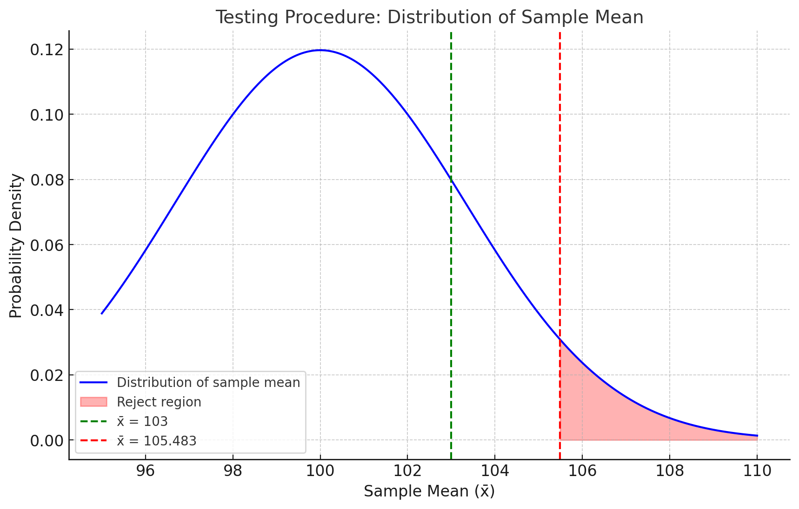
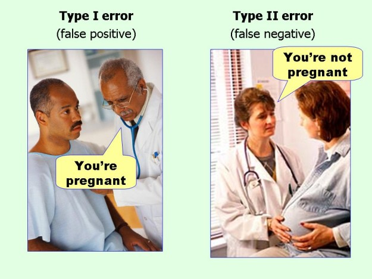
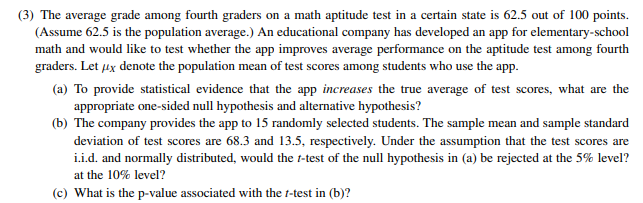

layout: false
class: inverse, middle

# Hypothesis Testing

---
### Hypothesis Testing

Let's go back to our question: can we get a higher price if cleanliness level is above 4.5?

This type of question can be answered with **hypothesis testing**, where we see which of two competing hypotheses is more likely given the data.

- .blue[Hypothesis] is a claim about a parameter or a distribution.

--
1. $H_0$ **Null Hypothesis**:
  - Claim to be tested, the skeptical perspective

--
      - Prices of clean and dirty apartments are equal
      - $H_0: \mu_c=\mu_d$

--
2. $H_A$ **Alternative Hypothesis**:
  - An alternative claim under consideration

--
      - Prices of clean apartments are higher than prices of dirty apartments
      - $H_A: \mu_c>\mu_d$

--

- Assume the null is true and see if there is enough data to reject it in favor of the alternative
- You either reject the null, or fail to reject it (but never "accept" it)
---
### Hypothesis Testing

Some examples of hypotheses testing:

- You released a new promotion to some customers (10% off) and you want to test if people who got the promotion spend different amount of money than those who didn't

--
  - $H_0$: People who got the promotion spend the same as people who didn't get the promotion
      - $H_0: \mu_p =  \mu_n$
  - $H_A$: People who got the promotion spend different amount than people who didn't get the promotion
      - $H_A: \mu_p \neq \mu_n$

--

- You designed a new healthy snack and want to test whether it needs "excessive sugar" sticker. It gets the sticker if it exceeds 100g of sugar. You take a sample and test.

--
  - $H_0$: The average sugar content is 100 or less
      - $H_0: \mu_s =  100$
  - $H_A$: The average sugar content is more than 100
      - $H_A: \mu_s >  100$

---
### Hypothesis Testing

- Suppose we calculated the sample mean for sugar content. It's either below or above 100g

--

- Why would we need a fancy test?

--

- Because we only have a sample, but we want to learn about the population parameter!

--

- Maybe in our sample it's below 100g, but in the whole population it's above

--

- Hypotheses are always about parameters! Never about sample statistics

---
### Testing Procedure


A **test procedure** is a rule based on sample data for deciding whether to reject the null or not.

It relies on two elements:
 - .blue[Test statistic]
  - A function of the sample data that summarizes evidence for or against the hypothesis
  - We know how it is distributed under the null (e.g. standardized mean)
 - .blue[Rejection region]
  - Values of the test statistic for which we reject the null
    - These are values that are very unlikely under the null hypothesis
  - Typically threshold-based: reject $H_0$ if the test statistic > k
 

---
### Testing Procedure: Example

Let's go back to the sugar example. Suppose we have a sample $n=36$ and the population standard deviation is known, $\sigma_x=20$.

 - .blue[Test statistic]
  - Our test statistic could be:
  $$z=\frac{\bar{x}-100}{\underbrace{\sigma_x/\sqrt 36}_{SE}}$$

 - .blue[Rejection region] 
  - For a 5% significance level, our rejection region would be: 
  - $\{1.645, \infty \}$
  
.center[
```{r}
magick::image_read_pdf("Rejection.pdf",
                       pages = 1)
```
]

<div class="learnr-ref">LearnR: Sugar sticker z-test</div>


---
### Testing Procedure: Example

- Suppose I reject if $z>1.645$
- Suppose $\sigma_x=20$. How large does the mean need to be to reject the null?

--

Reject if: 
- $\frac{\bar{x}-100}{20/\sqrt 36}>1.645$
- Or equivalently if $\bar{x}>105.483$
- Those two formulations are equivalent

--
- Why don't we reject even if $\bar{x}=103$?


---
### Testing Procedure: Example
- Because there is randomness in the sample:

- Even if $\mu_s=100$, we could get a sample with $\bar{x}>100$


.center[

]

--

- Why $\bar{x}>105.483$ though? 
- Formally about it later, but it's very unlikely to get a sample mean that large if $\mu_s=100$


---
### Testing Procedure Summary

1. Set up your hypotheses
2. Calculate your test statistic
3. Check it against the rejection region
4. Decision: Reject or fail to reject the null hypothesis

We will now go into the details of each step.

---
layout: false
class: inverse, middle

# Decision errors

---

### Decision errors


|             | Do not reject $H_0$ | Reject $H_0$ in favor of $H_A$ |
| ----------- | ------------------- | ------------------------------- |
| $H_0$ true  | Okay                | Type 1 Error                    |
| $H_A$ true  | Type 2 Error        | Okay                            |

- $H_0$: You are not pregnant
- $H_1$: You are pregnant

--
.center[

]
---
### Decision errors

Do people spend more if they get free shipping? ($H_0$ is that they spend the same)

--

- .blue[Type 1 error]: reject null when $H_0$ is true
  - Conclude that people spend more when they got free shipping, while in reality they spend the same as those who didn't

--
- .blue[Type 2 error]: don't reject null when $H_A$ is true
  - Conclude that people who got free shipping spend the same as those without free shipping, while those with free shipping spend more

--
- Imagine a trial of a murderer and suppose $H_0$ is innocent, and $H_1$ is guilty. 
- Describe error type 1 and 2 in these scenarios

--
  - Type 1: Convict an innocent
  - Type 2: Do not convict a murderer

--
- Probability of making type 1 error is $\alpha$
  - It's also called .blue[size], or .blue[significance level] of the test
  - We don't want to incorrectly reject null more than $\alpha$*100 percent of times. 

--
- Probability of making type 2 error is $\beta$
  - To calculate $\beta$, you need to know the true $\mu$


---

### Probability of type 1 error

- In the sugar sticker example, suppose that the null is true and $\mu_s=100$

--
- You take a sample of 36. 


--
- Example:  You were very unlucky in your sampling, by chance you  got a sample with those rare packages with  a lot of sugar and your $\bar{x}=106$ which means $z=\frac{106-100}{\frac{20}{\sqrt{36}}}=1.8$. According to the test procedure, you reject the null. You make an error.

--
- Q: What is the probability that the (standardized) mean of these 36 is in the rejection region (larger than 1.645)?


--
- What's the probability of making such error?

$$\small \alpha = P_{H_0}(\bar{X} > 105.483) = P_{H_0}\!\left( \frac{\bar{X} - 100}{20/\sqrt{36}} > \frac{105.483 - 100}{20/\sqrt{36}} \right)$$

$$\small \overset{\text{CLT}}{=}\; P(Z > 1.645) = 1 - \Phi(1.645)$$

---


```{r, warning=FALSE, fig.height=2.5, out.width='100%'}

curve(dnorm(x, 0, 1),
      xlim = c(-3, 3),
      yaxs = "i",
      xlab = "Value of test statistic",
      ylab = "",
      lwd = 2,
      axes = "F")

# add x-axis
axis(1, 
     at = c(-1.645, 0, 1.645), 
     padj = 0.75,
     labels = c(-1.645,expression(0),
                expression(1.645)))


polygon(x = c(1.645, seq(1.645, 3, 0.01), 3),
        y = c(0, dnorm(seq(1.645,3, 0.01), 0, 1), 0),
        col = "steelblue")

# add vertical line at the mean (mu)
abline(v = 1.645, col = "red", lwd = 2)


text(2.5, 0.2, "Rejection \n region", col = "black", cex = 1.5)
text(1.8, 0.02, expression(alpha), col = "white", cex = 1.5)

```

--
- Higher critical value = lower chance of mistake (lower $\alpha$)
- Lower critical value = higher chance of mistake (higher $\alpha$)

--

- Choosing critical value determines $\alpha$
- Or symmetrically, choosing $\alpha$ determines critical value
- We usually choose $\alpha$ and this will determine the rejection region. 

--

- What would be the critical value for $\alpha=0.1$?
- What would be the critical value for $\alpha=0.01$?
- What would be the critical value for $\alpha=0$?

.learnr-ref[**LearnR:** Critical values — use `qnorm()` to find the critical value for a given $\alpha$]

.learnr-ref[**LearnR:** Testing intuition & Type 1 error — simulate samples and see how often you'd incorrectly reject]

---
### Probability of type 2 error

- What's the probability our sample shows mean sugar content below critical value, if the true sugar content is above 100?

--
- What is the probability we do not reject the null, although the alternative is true?
- If I take 10000 samples from distribution with true mean > 100, what share of sample means will fall below the rejection region?
--

- In our example 
$$\scriptsize \beta=P(\text{Type 2 error})=\underbrace{P_{H_A}(z<1.645)}_{\text{Pr. if alt is true}}=P_{H_A}(\frac{\bar{x}-100}{20/ \sqrt 36}<1.645)$$
--
- Problem: How is $\small \frac{\bar{x}-100}{20/ \sqrt 36}$ distributed if the alternative is true?

--
- CLT does not apply to: $\small  \frac{\bar{x}-100}{20/ \sqrt 36}$ because 100 is not the true mean under the alternative


--
- To calculate it, we need to specify what is the true mean. Say $\mu_s=110$
- Then CLT applies to: $\small  \frac{\bar{x}-110}{20/ \sqrt 36}$ 

---


### Probability of type 2 error

- We need to rewrite it so we have $\frac{\bar{x}-110}{20/ \sqrt 36}$ on the left-hand side. 


$$\scriptsize \beta
= P_{H_A}(\frac{\bar{x}-100}{20/ \sqrt 36}<1.645)=P_{H_A}(\bar X < 105.483)
= P\!\left(\frac{\bar X-110}{20/\sqrt{36}}
< \frac{105.483-110}{20/\sqrt{36}}\right)$$

--

- Now this becomes: 
$$\small P\!\left(z
< \frac{105.483-110}{20/\sqrt{36}}\right)=P(z<-1.3551)$$
- Where z is normally distributed thanks to CLT

---
### Probability of type 2 error

- More generally for this type of test:

$$\scriptsize \beta = P_{H_A}(\bar{X}<\mu_0+z_{1-\alpha}\tfrac{\sigma_x}{\sqrt{n}}) = P\!\left(\frac{\bar{X}-\mu_s}{\sigma_x/\sqrt{n}}<\frac{\mu_0-\mu_s}{\sigma_x/\sqrt{n}}+z_{1-\alpha}\right)$$

- Depends on what true $\mu$ is and where our rejection region is!

- When you decrease probability of type 1 error, you increase the probability of type 2 error

.learnr-ref[**LearnR:** Type 2 error — simulate samples when the null is false and count how often you fail to reject]


---
### Trade-off between type 1 and 2 errors

$$\beta=P(\text{Type 2 error})=P(Z<\frac{\mu_0-\mu_s}{\sigma_x/ \sqrt n}+z_{1-\alpha})=\underbrace{\Phi(\frac{\mu_0-\mu_s}{\sigma_x/ \sqrt n}+z_{1-\alpha})}_{\text{Normal CDF}}$$

$$\alpha=P(\text{Type 1 error})=P(Z>z_{1-\alpha})=1-\underbrace{\Phi(z_{1-\alpha})}_{\text{Normal CDF}}$$
If I change critical value $z_{1-\alpha}$, it will have the opposite effect on them.

Interactive visualization: https://shiny.rit.albany.edu/stat/betaprob/

---
### Power of a test

- Power of a test is the probability of rejecting if alternative is true
- Power will be different for any possible value of the alternative and hypothesis 
- Power for one sided test 

$$Power=P_{H_A}(Reject)=1-\underbrace{P_{H_A}(\text{Not Reject})}_{\text{type 2 error}}=1-\beta$$

$$Power=1-P(Z<\frac{\mu_0-\mu_s}{\sigma_x/ \sqrt n}+z_{1-\alpha})$$

Interactive visualization: https://shiny.rit.albany.edu/stat/betaprob/

Power increases if:
- n increases
- Alternative is further away from the null
- $\sigma$ decreases
- $\alpha$ increases

---

### A/B Test Power: Professional Photos

- Airbnb wants to test if professional photos increase weekly revenue
- Design:
  - Control: no photos (baseline $\mu_0=2000$)
  - Treatment: professional photos (suspected $\mu_a=2200$)
  - $\sigma=600$, $n=100$ per group, $\alpha=0.01$

--
- Steps:
  1. State hypotheses: $H_0: \mu_T - \mu_C = 0$ vs $H_A: \mu_T - \mu_C > 0$
  2. Find the critical value
  3. Compute power $= 1 - \beta$
  4. Find minimum $n$ for 80% power

.learnr-ref[**LearnR:** Power exercise — Design the Airbnb photography A/B test, calculate power, and find minimum sample size]

---

### General Procedure

1. Determine the null and alternative hypotheses

--
2. Collect your sample of independent observations

--
3. Choose the appropriate test

--
4. Calculate the test statistic

--
5. Compare it to the rejection region

--
6. Reject or fail to reject the null hypothesis


--
Let's talk about **appropriate tests**!
---

### Choosing the Appropriate Test

The choice of test statistic and rejection region depends on:

- **Type of data we are testing?**
  - .blue[Single sample]
      - Example of hypothesis: $H_0: \mu=\mu_0$ vs $H_A: \mu \neq \mu_0$ 
  - .blue[Two independent samples]
      - Example of hypothesis: $H_0: \mu_{s1}=\mu_{s2}$ vs $H_A: \mu_{s1} \neq \mu_{s2}$
  - .blue[Paired data]
      - Example of hypothesis: $H_0: \mu_{d1}=\mu_{d2}$ vs $H_A: \mu_{d1} \neq \mu_{d2}$
  

- **Can we estimate standard deviation well?**
  - .blue[Yes]
      - Large sample
      - Known standard deviation
  - .blue[No]
      - Small sample but normal distribution
  

---

layout: false
class: inverse, middle

# Hypothesis Testing: Single Sample

---

### Single Sample Test for Mean

**General idea:** 
- We test if the parameter is equal/larger/smaller than some concrete value
  - Ex: $H_0: \mu=3$ vs $H_A: \mu \neq 3$

--
- .blue[Test statistic]: normalized sample mean

$$\text{test statistic}=\frac{\bar{X}-\mu_0}{SE}$$
 
  - Where SE is standard error and depends on estimate of standard deviation
      - If standard deviation known: $\small SE=\frac{\sigma}{\sqrt n}$
      - If standard deviation not known: $\small SE=\frac{s}{\sqrt n}$

--
- .blue[Rejection region]: depends on the distribution 
  - If large sample or known variance $\small \text{test statistic}=Z_{test} \sim N(0,1)$
      - Critical values come from standard normal distribution
  - If small sample with normal distribution $\small \text{test statistic}=T_{test} \sim t(n-1)$
      - Critical values come from student t with n-1 degrees of freedom


---
### Single Sample - Mean - Two Sided Test

**Hypothesis:**
$H_0: \mu=\mu_0$  and 
$H_A: \mu \neq \mu_0$

**Rejection Region:**
For a test of significance level $\alpha$, reject

- If large sample or known variance from normal
$$\small \frac{\bar{X}-\mu_0}{SE}<z_\frac{\alpha}{2} \qquad or  \qquad \frac{\bar{X}-\mu_0}{SE}>z_{1-\frac{\alpha}{2}}$$
--

- If small sample from normal
$$\small \frac{\bar{X}-\mu_0}{SE}<t_{(n-1),\frac{\alpha}{2}} \qquad or  \qquad \frac{\bar{X}-\mu_0}{SE}>t_{(n-1),1-\frac{\alpha}{2}}$$
--
Where 
- $z_{1-\frac{\alpha}{2}}$ and $t_{(n-1),1-\frac{\alpha}{2}}$ are  $\small (1-\frac{\alpha}{2})$ quantiles of standard normal and Student's t with n-1 degrees of freedom

---
### Single Sample - Mean - Two Sided Test

.center[
```{r, warning=FALSE, fig.height=4, out.width='100%'}
# plot the standard normal density on the interval [-4,4]
curve(dnorm(x),
      xlim = c(-3, 3),
      main = "Distribution under H0",
      yaxs = "i",
      xlab = "Test Statistic",
      ylab = "",
      lwd = 2,
      axes = "F")


# add x-axis
axis(1, 
     at = c(-1.96,  0,  1.96), 
     padj = 0.75,
     labels = c(expression(z[frac(alpha,2)]),
                expression(0),
                expression(z[1-frac(alpha,2)])))

# add a vertical line at the mean (mu)

# shade the tails for the 2.5% regions
polygon(x = c(-3, seq(-3, -1.96, 0.01), -1.96),
        y = c(0, dnorm(seq(-3, -1.96, 0.01)), 0),
        col = "steelblue", alpha = 0.2)

polygon(x = c(1.96, seq(1.96, 3, 0.01), 3),
        y = c(0, dnorm(seq(1.96, 3, 0.01)), 0),
        col = "steelblue", alpha = 0.2)

# add vertical line at the mean (mu)
abline(v = 0, col = "red", lwd = 2)

# add the "2.5%" labels on tails
text(-2.2, 0.1, expression(alpha/2), col = "black", cex = 1.5)
text(2.2, 0.1, expression(alpha/2), col = "black", cex = 1.5)
```
]


---
### Link between Tests and Confidence Intervals

Imagine a test for a parameter $\mu$ with hypothesis $H_0: \mu=4$ and $H_A: \mu \neq 4$.

- Suppose the population standard deviation is known, $\sigma=3$. You draw a sample of 49 units with a mean $\bar{x}=3$
- Our test statistic is $z_{test}=\frac{3-4}{\sigma/\sqrt{49}}=\frac{3-4}{3/7}=-2.34$
- Our critical values at $\alpha=0.05$ are -1.96 and 1.96, hence we reject

--
- We can also calculate the 95% confidence interval for our sample mean:

$$\small \{3-1.96\frac{\sigma}{\sqrt {49}}, 3+1.96\frac{\sigma}{\sqrt {49}}\}=\{2.16, 3.84\}$$
- It does not contain the null hypothesis


---
### Link between two sided Tests and Confidence Intervals

- More generally: the $1-\alpha$ confidence interval doesn't contain null = null would be rejected with a test of significance $\alpha$

https://kzaremba.shinyapps.io/Hypothesis_Confidence/

--
- Mathematically: 

  - Let $\mu_0$ be the null hypothesis. We reject (in two sided test) the null at $\alpha$ if 
  $$\scriptsize \left| \small \frac{\bar{X}-\mu_0}{ s/ \sqrt n} \right|>z_{1-\frac{\alpha}{2}}$$
  
  - Which can be rewritten as: 

  $$\scriptsize  \mu_0<\bar{X}-z_{1-\frac{\alpha}{2}}\frac{s}{\sqrt n}  \qquad or  \qquad \mu_0>\bar{X}+z_{1-\frac{\alpha}{2}}\frac{s}{\sqrt n}$$

.learnr-ref[**LearnR:** CI and Hypothesis Test equivalence — verify that rejecting at $\alpha$ matches the CI not containing $\mu_0$]

.learnr-ref[**LearnR:** One-Sample t-test — Test whether a Twitter campaign generates at least 200 likes per tweet]

---

### Single Sample - Mean - One sided - Case 1

**Hypothesis:**
$H_0: \mu=\mu_0$ and 
$H_A: \mu < \mu_0$

- This includes any null hypothesis like $\mu \geq \mu_0$. Why?

--
- If you rejected $\mu_0$ at $\alpha$, you would reject for sure anything larger than $\mu_0$


--
**Rejection Region:**
For a test of significance level $\alpha$, reject

- If large sample or known variance from normal
$$\small \frac{\bar{X}-\mu_0}{SE}<z_\alpha$$
--

- If small sample from normal
$$\small \frac{\bar{X}-\mu_0}{SE}<t_{(n-1),\alpha}$$
--
Where
- $z_\alpha$ and $t_{(n-1),\alpha}$ are  $\small \alpha$ quantiles of standard normal and Student's t with n-1 degrees of freedom

---
### Single Sample - Mean - One sided - Case 1

.center[
```{r, warning=FALSE, fig.height=3, out.width='100%'}
# plot the standard normal density on the interval [-4,4]
curve(dnorm(x),
      xlim = c(-3, 3),
      main = "Distribution under H0",
      yaxs = "i",
      xlab = "Test Statistic",
      ylab = "",
      lwd = 2,
      axes = "F")


# add x-axis
axis(1, 
     at = c(-1.645,  0 ,1.645), 
     padj = 0.75,
     labels = c(expression(z[alpha]),
                expression(0),
                expression(z[1-alpha])))

# add a vertical line at the mean (mu)

# shade the tails for the 2.5% regions
polygon(x = c(-3, seq(-3, -1.645, 0.01), -1.645),
        y = c(0, dnorm(seq(-3, -1.645, 0.01)), 0),
        col = "steelblue", alpha = 0.2)


# add vertical line at the mean (mu)
abline(v = 0, col = "red", lwd = 2)

# add the "2.5%" labels on tails
text(-2.2, 0.1, expression(alpha), col = "black", cex = 1.5)

```
]

- .blue[Intuition]:
  -  We never reject $H_0$ if $\bar{X} \geq \mu_0$.
  -  We reject $H_0$ if $\bar{X}$ is sufficiently smaller than $\mu_0$
  -  If null is true ( $\mu=\mu_0$ ) then we reject with probability
$$\small P(\frac{\bar{X}-\mu_0}{s/\sqrt n}<z_\alpha)=P(Z<z_\alpha)=\alpha$$


---

### Single Sample - Mean - One sided - Case 2

**Hypothesis:**
$H_0: \mu=\mu_0$ and 
$H_A: \mu > \mu_0$

- This includes any null hypothesis like $\mu \leq \mu_0$. Why?

--
- If you rejected $\mu_0$ at $\alpha$, you would reject for sure anything smaller than $\mu_0$


--
**Rejection Region:**
For a test of significance level $\alpha$, reject

- If large sample or known variance from normal
$$\small \frac{\bar{X}-\mu_0}{SE}>z_{1-\alpha}$$
--

- If small sample from normal
$$\small \frac{\bar{X}-\mu_0}{SE}>t_{(n-1),1-\alpha}$$
--
Where
- $z_{1-\alpha}$ and $t_{(n-1),1-\alpha}$ are  $\small (1-\alpha)$ quantiles of standard normal and Student's t with n-1 degrees of freedom

---
### Single Sample - Mean - One sided - Case 2

.center[
```{r, warning=FALSE, fig.height=3, out.width='100%'}
# plot the standard normal density on the interval [-4,4]
curve(dnorm(x),
      xlim = c(-3, 3),
      main = "Distribution under H0",
      yaxs = "i",
      xlab = "Test Statistic",
      ylab = "",
      lwd = 2,
      axes = "F")


# add x-axis
axis(1, 
     at = c(-1.645,  0 ,1.645), 
     padj = 0.75,
     labels = c(expression(z[alpha]),
                expression(0),
                expression(z[1-alpha])))

# add a vertical line at the mean (mu)

# shade the tails for the 2.5% regions
polygon(x = c(1.645, seq(1.645, 3, 0.01), 3),
        y = c(0, dnorm(seq(1.645, 3, 0.01)), 0),
        col = "steelblue", alpha = 0.2)


# add vertical line at the mean (mu)
abline(v = 0, col = "red", lwd = 2)

# add the "2.5%" labels on tails
text(2.2, 0.1, expression(alpha), col = "black", cex = 1.5)

```
]

- .blue[Intuition]:
  -  We never reject $H_0$ if $\bar{X} \leq \mu_0$.
  -  We reject $H_0$ if $\bar{X}$ is sufficiently larger than $\mu_0$
  -  If null is true ( $\mu=\mu_0$ ) then we reject with probability
$$\small P(\frac{\bar{X}-\mu_0}{s/\sqrt n}>z_{1-\alpha})=P(Z>z_{1-\alpha})=\alpha$$


---

### P-values

**Definition:**
The p-value is the probability (between 0 and 1), under the null hypothesis, of obtaining a test statistic at least as extreme as the one calculated from the sample.

Depends on:
- Your hypothesis
- Calculated test statistic

--
- Suppose the test statistic under $H_0$ is $Z_{test} \sim N(0,1)$
- One sided tests:
  - For  $H_A: \mu>\mu_0$ $p-value=P(Z_{Test} \geq (computed-test-statistic))$
  - For  $H_A: \mu<\mu_0$ $p-value=P(Z_{Test} \leq (computed-test-statistic))$
- Two sided test:
  - For  $H_A: \mu \neq\mu_0$ $p-value=2P(Z_{Test} \geq |(computed-test-statistic)|)$
---
**Example**: 
- We test for $H_0: \mu=5$ and $H_A: \mu>5$ 
- Suppose in sample a of 36 we have $\bar{x}=5.5$ and $s=2$. 


--
- Test statistic in this case is distributed normally
$$p-value=P(Z>\frac{5.5-5}{2/6})=P(Z>1.5)=0.066$$


--

**Intuitively:**
The probability that a statistic we calculated (or more extreme value) could arise just by chance if null is true


---
### P-value in two-sided test

- In a two-sided test, the p-value accounts for **both tails**
- We double the one-tail probability: $p\text{-value}=2P(Z \geq |z_{test}|)$

Interactive visualization: https://rpsychologist.com/pvalue/

.learnr-ref[**LearnR:** P values — compute the p-value for a coin fairness test]

---
### P-values and Test Significance

- In our example we calculated the p-value of 0.066
- Would the test at $\alpha=0.05$ reject the null?

--
- Any test with the significance level $\alpha>p-value$ would reject the null


**Another way to think about p-values**
- The P-value is the smallest significance level $\alpha$ at which the $H_0$
can be rejected

<center></center>


---
layout: false
class: inverse, middle

# Hypothesis Testing: Two samples

---

### Two Samples and the Difference in Means
We have 2 iid samples .red[independent] of each other from two populations $X_1,X_2,..,X_n$ and $Y_1,Y_2,..,Y_m$.

**General idea:** 
- We test the difference between .blue[population means] in two populations
  - Ex: $H_0: \mu_X-\mu_Y=100$ vs $H_A: \mu_X-\mu_Y \neq 100$
  - Ex: $H_0: \mu_X-\mu_Y=0$ vs $H_A: \mu_X-\mu_Y>0$
  
--
  - Test for no difference:
      - Ex: $H_0: \mu_X-\mu_Y=0$ vs $H_0: \mu_X-\mu_Y \neq 0$

--
- .blue[Test statistic]: normalized difference in sample means
$$\small \text{test stat}=\frac{\bar{X}-\bar{Y}-\overbrace{(\mu_{X,0}-\mu_{Y,0})}^{\Delta_0}}{SE}=\frac{\bar{X}-\bar{Y}-\Delta_0}{SE}$$
 
---
### Variance in two samples 

  - Where SE is standard error and depends on the estimate of standard deviation
      - If standard deviation known: $\small SE=\sqrt{\frac{\sigma_X^2}{n}+\frac{\sigma_Y^2}{m}}$

--

  - Why? Because $\small Var(\bar{X}-\bar{Y})=Var(\bar{X})+Var(\bar{Y})=\frac{\sigma_X^2}{n}+\frac{\sigma_Y^2}{m}$
  - If standard deviation not known: $\small SE=\sqrt{\frac{s_X^2}{n}+\frac{s_Y^2}{m}}$


--

- .blue[Rejection region]: depends on the distribution 
  - If large sample or known variance from normal $\small \text{test statistic}=Z_{test} \sim N(0,1)$
      - Critical values come from standard normal distribution
  - If small sample with normal distribution $\small \text{test statistic}=T_{test} \sim t(v)$
      - Critical values come from student t with v degrees of freedom

---

**Side note on the number of degrees of freedom for difference in means**

Two ways to do it:

--
1. Proper, complex (and annoying):

$$\small v=\frac{\left(\frac{s_X^2}{n}+\frac{s_Y^2}{m}\right)^2}{\frac{(s_X^2/n)^2}{n-1}+\frac{(s_Y^2/m)^2}{m-1}}$$
Round down to nearest integer

--
2. Simple, approximate shortcut:

$$v=min(n-1,m-1) $$


---
### Difference in means - Two Sided Test

**Hypothesis:**
$H_0: \mu_x-\mu_Y=\Delta_0$  and 
$H_A: \mu_x-\mu_Y \neq \Delta_0$

**Rejection Region:**
For a test of significance level $\alpha$, reject

- If large sample or known variance from normal
$$\small \frac{\bar{X}-\bar{Y}-\Delta_0}{SE}<z_\frac{\alpha}{2} \qquad or  \qquad \frac{\bar{X}-\bar{Y}-\Delta_0}{SE}>z_{1-\frac{\alpha}{2}}$$
--

- If small sample from normal
$$\small \frac{\bar{X}-\bar{Y}-\Delta_0}{SE}<t_{v,\frac{\alpha}{2}} \qquad or  \qquad \frac{\bar{X}-\bar{Y}-\Delta_0}{SE}>t_{v,1-\frac{\alpha}{2}}$$
--
Where 
- $z_{1-\frac{\alpha}{2}}$ and $t_{v,1-\frac{\alpha}{2}}$ are  $\small (1-\frac{\alpha}{2})$ quantiles of standard normal and Student's t with v degrees of freedom

---
### Difference in means - Two Sided Test

If CLT kicks in, the distributions are:

$$\bar{X} \sim N(\mu_X, \sigma_X/\sqrt n) \qquad and \qquad \bar{Y} \sim N(\mu_Y, \sigma_Y/\sqrt m)$$
The difference of two normal (independent) distributions under: 

$$\bar{X}-\bar{Y} \sim N(\mu_X-\mu_Y, \sqrt{\sigma_X^2/n+\sigma_Y^2/m})$$ 
So if null is true, then standardized statistic:

$$\frac{\bar{X}-\bar{Y}-(\mu_{X,0}-\mu_{Y,0})}{\sqrt{s_X^2/n+s_Y^2/m}} \sim N(0,1)$$
---

.center[
```{r, warning=FALSE, fig.height=4, out.width='100%'}
# plot the standard normal density on the interval [-4,4]
curve(dnorm(x),
      xlim = c(-3, 3),
      main = "Distribution under H0",
      yaxs = "i",
      xlab = "Test Statistic",
      ylab = "",
      lwd = 2,
      axes = "F")


# add x-axis
axis(1, 
     at = c(-1.96,  0,  1.96), 
     padj = 0.75,
     labels = c(expression(z[frac(alpha,2)]),
                expression(0),
                expression(z[1-frac(alpha,2)])))

# add a vertical line at the mean (mu)

# shade the tails for the 2.5% regions
polygon(x = c(-3, seq(-3, -1.96, 0.01), -1.96),
        y = c(0, dnorm(seq(-3, -1.96, 0.01)), 0),
        col = "steelblue", alpha = 0.2)

polygon(x = c(1.96, seq(1.96, 3, 0.01), 3),
        y = c(0, dnorm(seq(1.96, 3, 0.01)), 0),
        col = "steelblue", alpha = 0.2)

# add vertical line at the mean (mu)
abline(v = 0, col = "red", lwd = 2)

# add the "2.5%" labels on tails
text(-2.2, 0.1, expression(alpha/2), col = "black", cex = 1.5)
text(2.2, 0.1, expression(alpha/2), col = "black", cex = 1.5)
```
]

---
### Confidence interval for a difference

Following this idea, we can construct a confidence interval for the difference:


$$\small P\!\left(z_{\alpha/2}<\frac{\bar{X}-\bar{Y}-(\mu_{X,0}-\mu_{Y,0})}{\sqrt{s_X^2/n+s_Y^2/m}}<z_{1-\alpha/2}\right)=1-\alpha$$

$$\small CI_{1-\alpha}=\left(\bar{X}-\bar{Y} \pm z_{1-\alpha/2}\sqrt{s_X^2/n+s_Y^2/m}\right)$$

---

### Two Samples - Mean - One sided - Case 1

**Hypothesis:**
$H_0: \mu_X-\mu_Y=\Delta_0$ and 
$H_A: \mu_X-\mu_Y<\Delta_0$

- This includes any null hypothesis like $\mu_X-\mu_Y \geq \Delta_0$. Why?

--
- If you rejected $\mu_X-\mu_Y=\Delta_0$ at $\alpha$, you would reject for sure anything larger than $\Delta_0$


--
**Rejection Region:**
For a test of significance level $\alpha$, reject

- If large sample or known variance from  normal
$$\small \frac{\bar{X}-\bar{Y}-(\Delta_0)}{SE}<z_\alpha$$
--

- If small sample from normal
$$\small \frac{\bar{X}-\bar{Y}-(\Delta_0)}{SE}<t_{v,\alpha}$$
--
Where
- $z_\alpha$ and $t_{v,\alpha}$ are  $\small \alpha$ quantiles of standard normal and Student's t with v degrees of freedom

---
### Two Samples - Mean - One sided - Case 1

.center[
```{r, warning=FALSE, fig.height=2.7, out.width='100%'}
# plot the standard normal density on the interval [-4,4]
curve(dnorm(x),
      xlim = c(-3, 3),
      main = "Distribution under H0",
      yaxs = "i",
      xlab = "Test Statistic",
      ylab = "",
      lwd = 2,
      axes = "F")


# add x-axis
axis(1, 
     at = c(-1.645,  0 ,1.645), 
     padj = 0.75,
     labels = c(expression(z[alpha]),
                expression(0),
                expression(z[1-alpha])))

# add a vertical line at the mean (mu)

# shade the tails for the 2.5% regions
polygon(x = c(-3, seq(-3, -1.645, 0.01), -1.645),
        y = c(0, dnorm(seq(-3, -1.645, 0.01)), 0),
        col = "steelblue", alpha = 0.2)


# add vertical line at the mean (mu)
abline(v = 0, col = "red", lwd = 2)

# add the "2.5%" labels on tails
text(-2.2, 0.1, expression(alpha), col = "black", cex = 1.5)

```
]

- .blue[Intuition]:
  -  We never reject $H_0$ if $\bar{X}-\bar{Y} \geq \Delta_0$.
  -  We reject $H_0$ if $\bar{X}-\bar{Y}$ is sufficiently smaller than $\Delta_0$
  -  If null is true ( $\mu_X-\mu_Y=\Delta_0$ ) then we reject with probability
$$\small P(\frac{\bar{X}-\bar{Y}-\Delta_0}{\sqrt{s^2_X/n+s^2_Y/ m}}<z_\alpha)=P(Z<z_\alpha)=\alpha$$


---

### Two Samples - Mean - One sided - Case 2

**Hypothesis:**
$H_0: \mu_X-\mu_Y=\Delta_0$ and 
$H_A: \mu_X-\mu_Y>\Delta_0$

- This includes any null hypothesis like $\mu_X-\mu_Y \leq \Delta_0$. Why?

--
- If you rejected $\mu_X-\mu_Y=\Delta_0$ at $\alpha$, you would reject for sure anything smaller than $\Delta_0$


--
**Rejection Region:**
For a test of significance level $\alpha$, reject

- If large sample or known variance with normal
$$\small \frac{\bar{X}-\bar{Y}-(\Delta_0)}{SE}>z_{1-\alpha}$$
--

- If small sample from normal
$$\small \frac{\bar{X}-\bar{Y}-(\Delta_0)}{SE}>t_{v,1-\alpha}$$
--
Where
- $z_{1-\alpha}$ and $t_{v,1-\alpha}$ are  $\small (1-\alpha)$ quantiles of standard normal and Student's t with v degrees of freedom

---
### Two Samples - Mean - One sided - Case 2

.center[
```{r, warning=FALSE, fig.height=2.7, out.width='100%'}
# plot the standard normal density on the interval [-4,4]
curve(dnorm(x),
      xlim = c(-3, 3),
      main = "Distribution under H0",
      yaxs = "i",
      xlab = "Test Statistic",
      ylab = "",
      lwd = 2,
      axes = "F")


# add x-axis
axis(1, 
     at = c(-1.645,  0 ,1.645), 
     padj = 0.75,
     labels = c(expression(z[alpha]),
                expression(0),
                expression(z[1-alpha])))

# add a vertical line at the mean (mu)

# shade the tails for the 2.5% regions
polygon(x = c(1.645, seq(1.645, 3, 0.01), 3),
        y = c(0, dnorm(seq(1.645, 3, 0.01)), 0),
        col = "steelblue", alpha = 0.2)


# add vertical line at the mean (mu)
abline(v = 0, col = "red", lwd = 2)

# add the "2.5%" labels on tails
text(2.2, 0.1, expression(alpha), col = "black", cex = 1.5)

```
]

- .blue[Intuition]:
  -  We never reject $H_0$ if $\bar{X}-\bar{Y} \leq \Delta_0$.
  -  We reject $H_0$ if $\bar{X}-\bar{Y}$ is sufficiently larger than $\Delta_0$
  -  If null is true ( $\mu_X-\mu_Y=\Delta_0$ ) then we reject with probability
$$\small P(\frac{\bar{X}-\bar{Y}-\Delta_0}{\sqrt{s^2_X/n+s^2_Y/ m}}>z_{1-\alpha})=P(Z>z_{1-\alpha})=\alpha$$


---
### Airbnb: Clean vs Dirty Prices

|   Sample   |    n    | Mean | SD  |
|------------|---------|------|-----|
|   Clean    |   100   | 1245 | 962 |
|   Dirty    |   100   |  869 | 693 |

```{r abd, warning=FALSE, fig.height=2.3, out.width='100%'}
ggplot(data = Sample_list, aes(x = clean_label, y = price, fill = clean_label)) +
  geom_boxplot(alpha = 0.6) +
  scale_fill_manual(values = c("Clean" = "#2980b9", "Dirty" = "#e74c3c")) +
  labs(x = "Cleanliness", y = "Price") +
  coord_flip() +
  theme_xaringan() + theme(legend.position = "none")
```

- State the null and alternative hypothesis

--
- Calculate the value of the test statistic

--
- Calculate the p-value

--
- At which $\alpha$ do we reject the null?

--
- Calculate 95% confidence interval for the difference

.learnr-ref[**LearnR:** Two Sample Difference — Calculate test statistic and p-value for this comparison]

.learnr-ref[**LearnR:** Using `t.test()` in R — learn the built-in function for one-sample, two-sample, and paired tests]

---
### Exercise: McDonald's vs Burger King

We suspect Burger King might have larger caloric content for kids' meals. Let's test it.

|   Sample   |    n    | Sample Mean | Sample Standard Deviation |
|------------|---------|-------------|---------------------------|
|   McDonald    |   9    |    475     |           230            |
|   Burger King    |   16    |    520      |            180            |


- State the null and alternative hypothesis

--
- Calculate the value of the test statistic

--
- Determine the appropriate number of degrees of freedom

--
- Calculate the p-value

--
- At which $\alpha$ do we reject the null?

.learnr-ref[**LearnR:** Small-sample t-test — work through this McDonald's vs Burger King comparison with exact df]

---

### A/B Testing: The Business Question

.center[
```{r, out.width="60%", echo=FALSE, fig.align='center'}

```
]

- Suppose **Airbnb** wants to know:  
  *Do professional photos increase host revenue?*

- **Historical data**: Listings with better photos show higher revenues.


--
- But… **Correlation ≠ Causation**.
  - Better photos may be linked to other factors:  
    - More organized hosts  
    - Higher quality listings  
    - Better customer service

--
- Revenues may reflect these differences, not the photos themselves.
- A simple comparison only tells us about **association**, not causality.
---

### The Business Decision

- Should Airbnb **invest in professional photography** for hosts?


--
- If photos aren’t the true driver → investment wastes money.  

We need a method to **isolate the effect of photos**.


--
#### Enter A/B Testing

.pull-left[
**Definition:**  
- A method to measure *causal* effects.  
- Widely used in modern business, especially tech.  
]

--
.pull-right[
**Examples:**  
- Netflix: Which thumbnail gets more clicks?  
- Amazon: Does a new checkout button increase sales?  
- Instagram: Do longer videos increase engagement?  
]


---

### The Setup

We divide hosts into **two groups**:

1. **Control group:**  
   - No intervention (existing photos).  

2. **Treatment group:**  
   - Airbnb provides **professional photography**.  

**The KEY:**  
- Groups are assigned **randomly**.

--
#### Why Randomization Matters

- Without randomization: groups differ in many ways.  
- With randomization: groups are (on average) identical, except for photos.  

.center[This is what gives us **causal inference**!]


---

### Classroom Exercise: Randomization Check

- Take a sample of Airbnb listings
- Randomly assign to two groups
- Compare characteristics (beds, location)

They should look very similar!

.learnr-ref[**LearnR:** AB Testing Randomization — sample listings, randomize, and check balance]

--

Why? We are taking two samples from the same population.

- All properties and expectations will be the same for both samples

---

### Measuring the Effect

- After randomization: **the only difference is the photos**

- Provide photography to treatment group
- Wait to see potential effects
- Collect outcome data (revenue, reviews, bookings)
- Run a simple two-sample test between treatment and control
- If the treatment group earns more revenue, we know it was **caused by the professional photos**

.center[**This is the causal effect.**]

--

- A/B testing is used extensively in modern business, especially in tech
- We have all been subjects of these experiments, often without knowing


---
layout: false
class: inverse, middle

# Hypothesis Testing: Paired Data

---

### Paired Data

- Sometimes we have only one set of individuals or objects, but two (or more) observations per each. 

- .blue[Example]: We look at employees productivity. For each employee we have two observations: their productivity when working from home and their productivity when working from the office. 

- .blue[Example]: We look at sales at Walmart and Soriana in each neighborhood. We have two observations per neighborhood: sales at local Walmart and sales at local Soriana

---
### Paired Data

We have a set of independent pairs of data $(X_1,Y_1),(X_2,Y_2),..., (X_n,Y_n)$

--
Observation within the pair are not necessarily independent!
- Some productive workers are productive both in the office and at home, some unproductive are unproductive both in the office and at home.


--

- We are interested in the difference between $X$ and $Y$. We observe that difference for each individual in the sample: $X_i-Y_i=d_i$


- We want to look at the population value of that difference: $\mu_X-\mu_Y=\Delta$
  - We can check if the means are the same: $\Delta=0$
      - No difference in productivity between work at home and at the office
  - Or mean $X$ is bigger than mean $Y$:  $\Delta>0$

---
### Paired Data

Null hypothesis: $H_0: \Delta=\Delta_0$

**Test Statistic** is:

$$\text{test statistic}=\frac{\overbrace{\bar{X}-\bar{Y}}^{\bar{d}}-\Delta_0}{SE}=\frac{\bar{d}-\Delta_0}{SE}$$ 

--
- Note on the Standard Error - it's not the same formula as for the two independent samples:
$Var(X_i-Y_i) \neq Var(X_i)+Var(Y_i)$

- We just calculate it from the differences. 
  - If we know the variance, $SE=\frac{\sqrt{var(d_i)}}{\sqrt n}=\frac{\sigma_d}{\sqrt n}$
  - If we don't: $SE=\frac{s_d}{\sqrt n}$

---
### Paired Data

**Rejection Region:**
For a test of significance level $\alpha$:

- If large sample or known variance with normal distribution:

- for $H_A: \bar{d} \neq \Delta_0$, reject if:
$$\small \frac{\bar{d}-\Delta_0}{SE}<z_\frac{\alpha}{2} \qquad or \qquad  \frac{\bar{d}-\Delta_0}{SE}>z_{1-\frac{\alpha}{2}}$$
--

- for $H_A: \bar{d} > \Delta_0$, reject if:
$$\small \frac{\bar{d}-\Delta_0}{SE}>z_{1-\alpha}$$
--

- for $H_A: \bar{d} < \Delta_0$, reject if:
$$\small \frac{\bar{d}-\Delta_0}{SE}<z_\alpha$$
--


- If small sample from normal, replace critical values with .blue[t-distribution with n-1 degrees of freedom] 

---
### Paired or Unpaired Data?


1. We would like to know if Intel’s stock and Southwest Airlines’
stock have similar rates of return. To find out, we take a
random sample of 50 days, and record Intel’s and Southwest’s
stock on those same days

--
- Paired

--
2. We randomly sample 50 items from Target stores and note
the price for each. Then we visit Walmart and collect the price
for each of those same 50 items. 

--
- Paired

--
3. A school board would like to determine whether there is a
difference in average SAT scores for students at one high
school versus another high school in the district. To check,
they take a simple random sample of 100 students from each
high school

--
- Not paired

.learnr-ref[**LearnR:** Paired or Unpaired? — practice classifying four more business scenarios]

---
### Exercise: Does IQ Decrease with Age?

A psychologist thinks that age influences IQ. They take a random sample of 100 people aged 40. For each person we know their IQ at age 16 and now. On average, IQ at young age was 8 points higher than at age 40. The standard deviation of that difference was 7 points. Using $\alpha=0.01$, test the hypothesis that IQ decreases with age.

.learnr-ref[**LearnR:** Paired Data test for means — work through this IQ example in R]

---
#### Hypothesis Testing for Correlation

.blue[Example]: are cleanliness score (C) and price (P) correlated in the population?

Assume you have **normally distributed variables** in **independent pairs**. $\{(C_1,P_1), (C_2, P_2),...\}$

.blue[Null hypothesis]: $H_0: \rho(C,P)=\rho_0$

**Test statistic** and its distribution under the null:

$$\small T_{test}=\frac{\hat{\rho}(C,P)-\rho_0}{\sqrt{\frac{1-\hat{\rho}(C,P)^2}{n-2}}} \sim t_{n-2}$$

where $\hat{\rho}(C,P)$ is sample correlation coefficient


.blue[Alternative hypothesis] and their **rejection regions**:
- $\small H_A: \rho(C,P) \neq \rho_0$ - reject $\small H_0$ if $\small t_{test}>t_{1-\frac{\alpha}{2},n-2}$ or $\small t_{test}<t_{\frac{\alpha}{2},n-2}$
- $\small H_A: \rho(C,P)>\rho_0$  - reject $\small H_0$ if $\small t_{test}>t_{1-\alpha,n-2}$
- $\small H_A: \rho(C,P)<\rho_0$  - reject $\small H_0$ if $\small t_{test}<t_{\alpha,n-2}$

---
### Correlation test

- Suppose we test $H_0: \rho(C,P)=0$ vs $\rho(C,P)>0$ in our Airbnb Data (clean score vs price)

--

- We **assume** that:
  - The variables are normally distributed
  - Pairs are independent
  - Relationship would be linear

--

- Sample correlation is: 0.159, we have $n=200$

--

- So $t_{test}=\frac{\hat{\rho}(C,P)\sqrt {(n-2)}}{\sqrt{1-\hat{\rho}(C,P)^2}}=\frac{0.159\sqrt {198}}{\sqrt{1-0.025}}=2.27$

--

- Since $n=200$, t-student is identical to standard normal. We can either
  - Compare calculated statistic to critical regions at various significance levels
  - Compute its p-value
  
- $p-value=P(Z>t_{test})=P(Z>2.27)=0.0126$

--
  - Test at $\alpha=0.05$ would reject $H_0$

---
### Correlation Test — Distributions

```{r, warning=FALSE, fig.height=3, out.width='100%', message=FALSE}
p1 <- ggplot(data=Sample_list, aes(review_scores_cleanliness))+
  geom_histogram(bins=20, fill="steelblue", color="white")+
  labs(x="Cleanliness Score", y="Count")+
  theme_xaringan()

p2 <- ggplot(data=Sample_list, aes(price))+
  geom_histogram(bins=30, fill="steelblue", color="white")+
  labs(x="Price", y="Count")+
  theme_xaringan()

grid.arrange(p1, p2, ncol = 2)
```


---
### Correlation Test — Scatter Plot

```{r, warning=FALSE, fig.height=3.5, out.width='100%', message=FALSE}
ggplot(data=Sample_list, aes(review_scores_cleanliness, price))+
  geom_point(alpha=0.5) +
  geom_smooth(method = "loess", fill=NA, level=0.90)+
  labs(x="Cleanliness Score", y="Price")+
  theme_xaringan()
```


---
### Exercise: Correlation Test

Suppose you have a random sample of 27 units (from a bivariate normal). X measures client's age and Y measures their spending. You calculated the correlation coefficient $\hat{\rho}=-0.45$. Can you reject the null $\rho=0$ in favor of the alternative $\rho \neq 0$ at the 5% significance level?

.learnr-ref[**LearnR:** Paired Data Test for Correlation — compute the t-statistic for this exercise]


