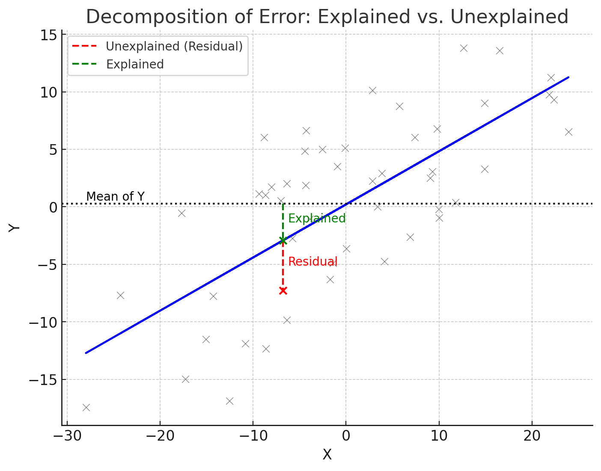

## Roadmap


### This set of classes
- What is a simple linear regression?
- How to estimate it?
- How to test hypothesis in the regression?


---

### Motivation

1. Suppose you are a consultant working for Ecobici

--
2. Your boss is worried about the impact of global warming on bike use

--
3. She wants to know: how the bike use will change when the temperature increases by 1 degreee

--
4. This is exactly what the linear regression will tell us!

---
### Simple linear regression

1. Suppose you have paired data: $\{(x_1,y_1),(x_2,y_2),...(x_n,y_n)\}$ 


.pull-left[
```{r, echo=FALSE}
# Load the DT package
library(DT)


# Display the data table
datatable(Data_BP[,c("fecha_retiro","Trips","TMP","PM2.5")],
          fillContainer = FALSE,
          options = list(
            pageLength = 7,
            searching = FALSE,
            initComplete = JS(
              "function(settings, json) {",
              "$(this.api().table().container()).css({'font-size': '12px'});",
              "}"
            )
          ),
          rownames = FALSE
)
```
]
.pull-right[
```{r, warning=FALSE,message=FALSE,fig.height=5.5, out.width='80%'}

# Create plot using ggplot2
p <- ggplot(Data_BP, aes(x = TMP, y = Trips)) +
  geom_point() +
  labs(x = "Temperature", y = "Trips") +
  theme_xaringan() +
  theme(legend.position = "none")

print(p)


```
]


---
### Simple linear regression

2. In the population, there exists a linear relationship between $x_i$ and $y_i$ of the form:

$$y_i=\beta_0+\beta_1x_i+u_i$$
Where:
  - $y_i$ is a dependent variable  
  - $x_i$ is a independent variable, or regressor, or predictor 
      - (suppose non-random)
  - $\beta_0$ and $\beta_1$ are parameters
  - $\beta_1$ tells you how $y_i$ changes (on average) when we change $x_i$ by one unit
  - $\beta_0$ is intercept, where the line cuts y axis
  - $u_i$ is a random error term (unknown)

---

```{r, warning=FALSE, message=FALSE, fig.height=4, out.width='100%'}

# Create plot using ggplot2
p <- ggplot(Data_BP, aes(x = TMP, y = Trips)) +
  geom_point() +
  geom_smooth(method = "lm", se = FALSE, color = "blue") +  # Add linear regression line
  labs(x = "Temperature", y = "Trips") +
  theme_xaringan() +
  theme(legend.position = "none")

print(p)

```

---


```{r, warning=FALSE, message=FALSE, fig.height=4, out.width='100%'}
# Fit the regression to get the slope
mod <- lm(Trips ~ TMP, data = Data_BP)

# Pick a reference x-value (say 14°C for illustration)
x0 <- 14
x1 <- x0 + 1

# Predicted values from the regression line
y0 <- predict(mod, newdata = data.frame(TMP = x0))
y1 <- predict(mod, newdata = data.frame(TMP = x1))

# Original plot
p <- ggplot(Data_BP, aes(x = TMP, y = Trips)) +
  geom_point(alpha = 0.4) +
  geom_smooth(method = "lm", se = FALSE, color = "blue") +
  labs(x = "Temperature", y = "Trips") +
  theme_xaringan() +
  theme(legend.position = "none")

# Add slope triangle exactly at regression line
p + 
  coord_cartesian(xlim = c(13, 16), ylim = c(22000, 30000)) +  # zoom-in window
  geom_segment(aes(x = x0, y = y0, xend = x1, yend = y0),
               arrow = arrow(length = unit(0.2, "cm")),
               color = "red", linewidth = 1) +  # horizontal ΔX
  geom_segment(aes(x = x1, y = y0, xend = x1, yend = y1),
               arrow = arrow(length = unit(0.2, "cm")),
               color = "red", linewidth = 1) +  # vertical ΔY
  geom_point(aes(x = x0, y = y0), color = "red", size = 3) +
  geom_point(aes(x = x1, y = y1), color = "red", size = 3) +
  annotate("text", x = x0 + 0.5, y = y0 - 800, 
           label = "ΔX = 1", color = "red", fontface = "bold") +
  annotate("text", x = x1 + 0.2, y = (y0 + y1)/2, 
           label = "ΔY = β", color = "red", fontface = "bold")
```

---

### Returns to Education  
 Card (Angrist and Krueger, 1991) 

**Context:**  How additional years of schooling affect workers’ earnings in the labor market?

**Finding:** Each additional year of schooling increases wages by ~6–10%.  

**Question:** “Suppose we see an estimated effect of $100 increase in monthly wages with each additional year of education. What’s the regression equation behind this? What is Y, what is X, and what does β₁ mean in plain business terms?”

---

### Forecasting Demand  
Dinerstein et al (AER, 2018)

**Context:** How sensitive online consumer demand is to small price change?

**Finding:** Small price changes generate large changes in the demand in online shopping (eBay). 

**Question:** “Suppose that if we increase a price of a keyboard by $1, the demand decreases on average by 200 units. Which variable is Y? Which is X? 

---

### Real Estate & Amenities  
Glaeser & Kahn (Journal of Transport Geography, 2019) 

**Context:** How proximity to amenities such as schools or subway stations influences housing prices?

**Finding:** Properties prices increase significantly near subways.  

**Question:** “Suppose you’re told: each kilometer closer to a subway increases house price by $1205. What regression line must be behind that claim? What is Y, what is X, and what does β₁ mean?”

---
### Advertising
Alpert et al. (Journal of Public Economics, 2023)

**Context:** Does advertising for medication actually increase doctor visits and prescriptions?

**Finding:** A 10% increase in views of ads for medication increased  prescriptions by ~1.7%.  

**Question:** “Suppose we see a finding: one more million views of ads increases monthly  medication sales by 500. What regression did they run? What’s Y? What’s X? How would we interpret β₁?”

---

### Gifts to Physicians  
Newham & Valente (Journal of Health Economics, 2024), 

**Context:** How payments from pharmaceutical companies to doctors affect prescription drug cost?

**Finding:** Each dollar of gift/payment to doctors leads to approximately $23 in increased prescription drug costs.  

**Question:** “Here, β₁ from regression indicates that every \$1 in gifts yields an extra \$23 in drug costs. What model structure would get you this? Who might be Y, who is X, and what does β₁ mean for policy?”


---
### Assumptions

We can estimate $\beta$ under some assumptions.

$$y_i=\beta_0+\beta_1x_i+u_i$$

Here they are:
0. Model is linear in the parameter and with additive error term
1. $E(u_i)=0\rightarrow E(y_i|x=x_0)=\beta_0+\beta_1x_0$
2. $Var(u_i)=\sigma^2\rightarrow var(y_i|x=x_0)=\sigma^2$
3. $cov(u_i,u_j)=0$


---
### General Example


```{r, warning=FALSE, fig.height=5, out.width='100%', message=FALSE}

# Generate some sample data
set.seed(123)
x <- rnorm(100, mean=100, sd=10)
y <- 2 + 3 * x + rnorm(100, sd=10)

# Create a data frame
data <- data.frame(x, y)

# Fit a linear regression model
model <- lm(y ~ x, data)

# Create a scatter plot with the best fit line and deviations
gg <- ggplot(data, aes(x = x, y = y)) +
  geom_point(color = "black") +
  geom_smooth(method = "lm", se = FALSE, color = "blue") +
  geom_segment(aes(xend = x, yend = predict(model, data)), color = "red", alpha = 0.2, linetype = "dashed") +
  labs(x = "X",
       y = "Y") +
  theme_xaringan() 

print(gg)

```


---

### Model is linear in the parameter and with additive error term

- Linear models
  - $y_i=\beta_0+\beta_1x_i+e_i$
  - $y_i=\beta_0+\beta_1x^2_i+e_i$
  - $y_i=\beta_0+\beta_1log(x)_i+e_i$
  - $y_i=\beta_0+\beta_1c^{x_i}+e_i$

- Not linear models
  - $y_i=(\beta_0+\beta_1x_i)*e_i$
  - $y_i=\beta_0+x^{\beta_1}_i+e_i$
  - $y_i=log(\beta_0+\beta_1x_i+e_i)$
  - $y_i=\beta_0+(\beta_1x_i+e_i)^2$

---

2 is in the app


---
### $Var(u_i)=\sigma^2$

What happens if this is not true?
```{r, warning=FALSE, fig.height=4, out.width='100%', message=FALSE}

library(ggplot2)

# Simulate data with increasing variance of residuals
set.seed(123)
x <- seq(1, 200, by = 1)  # Predictor variable
y <- 2 * x + rnorm(200, mean = 0, sd = 0.5 * x)  # Response variable with increasing variance

# Fit a linear regression model
model <- lm(y ~ x)

# Create a data frame with the data
data_df <- data.frame(
  x = x,
  y = y
)

# Create a data frame with predicted values from the model
predicted_df <- data.frame(
  x = x,
  y_pred = predict(model)
)

# Create a scatterplot of the data points
# Add the regression line and dashed lines to show deviations
ggplot(data_df, aes(x = x, y = y)) +
  geom_point() +
  geom_smooth(method = "lm", se = FALSE, formula = y ~ x, color = "blue") +
  geom_segment(data = predicted_df, aes(xend = x, yend = y_pred), linetype = "dashed", color = "gray", alpha=0.7) +
  labs(
    x = "Predictor Variable (x)",
    y = "Response Variable (y)"
  ) +
  theme_xaringan()

```


---
Let's go back to our regression line
```{r, warning=FALSE, fig.height=5, out.width='100%', message=FALSE}

# Generate some sample data
set.seed(123)
x <- rnorm(100, mean=100, sd=10)
y <- 2 + 3 * x + rnorm(100, sd=10)
# Create a data frame
data <- data.frame(x, y)

# Fit a linear regression model
model <- lm(y ~ x, data)

# Create a scatter plot with the best fit line and deviations
gg <- ggplot(data, aes(x = x, y = y)) +
  geom_point(color = "black") +
  geom_smooth(method = "lm", se = FALSE, color = "blue") +
  geom_segment(aes(xend = x, yend = predict(model, data)), color = "red", alpha = 0.2, linetype = "dashed") +
  labs(x = "X",
       y = "Y") +
  theme_xaringan() 

print(gg)
```
---
### Estimation of the parameters


We want to estimate the parameters in this linear relationship based on our **sample**. 

- Once estimated, we can write $y_i$ as

$$y_i=\hat{\beta}_0+\hat{\beta}_1x_i+e_i$$

--

- Residua term (e) here reflects both uncertainly about parameters and the random part present in population model

--

- We can predict $y_i$ for any $x_i$ using our estimates

$$\hat{y_i}=\hat{\beta}_0+\hat{\beta}_1x_i$$


---
```{r, warning=FALSE, fig.height=5, out.width='100%', message=FALSE}

# Generate some sample data
set.seed(123)
x <- rnorm(100, mean=100, sd=10)
y <- 2 + 3 * x + rnorm(100, sd=10)

# Create a data frame
data <- data.frame(x, y)

# Fit a linear regression model
model <- lm(y ~ x, data)

# Create a scatter plot with the best fit line and deviations
gg <- ggplot(data, aes(x = x, y = y)) +
  geom_point(color = "black") +
  geom_smooth(method = "lm", se = FALSE, color = "blue") +
  geom_segment(aes(xend = x, yend = predict(model, data)), color = "red", alpha = 0.2, linetype = "dashed") +
  labs(x = "X",
       y = "Y") +
  theme_xaringan()

print(gg)

```


---

```{r, warning=FALSE, fig.height=5, out.width='100%', message=FALSE}

# Generate some sample data

# Generate some sample data
set.seed(123)
x <- rnorm(100, mean=100, sd=10)
y <- 2 + 3 * x + rnorm(100, sd=10)

# Create a data frame
data <- data.frame(x, y)

# Fit a linear regression model on the full dataset
full_model <- lm(y ~ x, data)

# Create a scatter plot with the best fit line and deviations
gg <- ggplot(data, aes(x = x, y = y)) +
  geom_point(color = "lightgray", alpha = 0.6) +
  geom_smooth(method = "lm", se = FALSE, color = "lightgray", alpha=0.01) +
  labs(x = "X",
       y = "Y") +
  theme_xaringan() 

# Create a filtered dataset for the sample (e.g., the first 40 points)
sample_size <- 40
sample_data <- data[1:sample_size, ]

# Fit a new linear regression model on the sample
sample_model <- lm(y ~ x, sample_data)

# Add the new best fit line for the sample
gg <- gg +
  geom_point(data = sample_data, color = "black")
print(gg)

```

---
 
```{r, warning=FALSE, fig.height=5, out.width='100%', message=FALSE}

# Generate some sample data

# Generate some sample data
set.seed(123)
x <- rnorm(100, mean=100, sd=10)
y <- 2 + 3 * x + rnorm(100, sd=10)

# Create a data frame
data <- data.frame(x, y)

# Fit a linear regression model on the full dataset
full_model <- lm(y ~ x, data)

# Create a scatter plot with the best fit line and deviations
gg <- ggplot(data, aes(x = x, y = y)) +
  geom_point(color = "lightgray", alpha = 0.6) +
  geom_smooth(method = "lm", se = FALSE, color = "lightgray", alpha=0.01) +
  labs(x = "X",
       y = "Y") +
  theme_xaringan() 

# Create a filtered dataset for the sample (e.g., the first 40 points)
sample_size <- 40
sample_data <- data[1:sample_size, ]

# Fit a new linear regression model on the sample
sample_model <- lm(y ~ x, sample_data)

# Add the new best fit line for the sample
gg <- gg +
  geom_point(data = sample_data, color = "black") +
  geom_smooth(data = sample_data, aes(x = x, y = y), method = "lm", se = FALSE, color = "green") +
  geom_segment(data = sample_data, aes(xend = x, yend = predict(sample_model, sample_data)), color = "black", alpha = 0.2, linetype = "dashed")

print(gg)

```


--

- How do we find $\hat{\beta}_0$ and $\hat{\beta}_1$?

---

### Best fit line

The best fitting line will minimize the sum of squared residuals $SSE=\sum^n_{i=1}e_i^2$

$$(\hat{\beta_0},\hat{\beta_1})=argmin_{b_0,b_1} SSE=argmin_{b_0,b_1}\sum^n_{i=1}e_i^2$$
--
$$\begin{align*}
SSE &= \sum_{i=1}^{n} e_i^2 \\
&= \sum_{i=1}^{n} (y_i - \hat{y}_i)^2 \\
&= \sum_{i=1}^{n} \left( y_i - (b_0 + b_1 x_i) \right)^2
\end{align*}$$

--
So effectively we are minimizing: 

$$(\hat{\beta_0},\hat{\beta_1})=argmin_{b_0,b_1} SSE=argmin_{b_0,b_1}\sum^n_i\left( y_i - (b_0 + b_1 x_i) \right)^2$$

---

### OLS 

We called this estimator **OLS** - .blue[ordinary least squares]

$$(\hat{\beta_0},\hat{\beta_1})=argmin_{b_0,b_1} SSE=argmin_{b_0,b_1}\sum^n_i\left( y_i - (b_0 + b_1 x_i) \right)^2$$
---
### ✏️ Sidenote on Derivatives
To solve OLS, we’ll need **derivatives**. A key tool is the **chain rule**: if  

$$h(x) = f(g(x)),$$  

then  

$$h'(x) = f'(g(x)) \cdot g'(x).$$  

**Example (square function):**  


$$h(x) = (3x+1)^2 = f(g(x)),$$ 

Then

- $f(u) = u^2 \quad \Rightarrow \quad f'(u) = 2u$
- $g(x) = 3x+1 \quad \Rightarrow \quad g'(x) = 3$  

and  

$$h'(x) = f'(g(x)) \cdot g'(x) = 2(3x+1)\cdot 3.$$  

---
### Best fit line 1

To find the minimum of SSE, we take partial derivatives with respect to $\beta_0$ and $\beta_1$ and set them equal to zero:

Partial derivative with respect to $\beta_0$:

$$\frac{\partial SSE}{\partial \hat{\beta}_0} = -2\sum_{i=1}^{n} \left( y_i - (\hat{\beta}_0 + \hat{\beta}_1 x_i) \right)$$

Setting this derivative to zero:

$$-2\sum_{i=1}^{n} \left( y_i - (\hat{\beta}_0 + \hat{\beta}_1 x_i) \right) = 0$$
$$\hat{\beta}_0n+\hat{\beta}_1\sum x_i=\sum y_i$$

---

### Best fit line 2

Partial derivative with respect to $\hat{\beta}_1$:

$$\frac{\partial SSE}{\partial \hat{\beta}_1} = 2\sum_{i=1}^{n} x_i\left( y_i - (\hat{\beta}_0 + \hat{\beta}_1 x_i) \right)$$

Setting this derivative to zero:

$$2\sum_{i=1}^{n} x_i\left( y_i - (\hat{\beta}_0 + \hat{\beta}_1 x_i) \right) = 0$$
$$\hat{\beta}_0\sum x_i+\hat{\beta}_1\sum x^2_i=\sum x_iy_i$$
---

### Best fit line 

Putting it all together:

$$\small \hat{\beta}_0n+\hat{\beta}_1\sum x_i=\sum y_i$$

$$\small \hat{\beta}_0=\frac{\sum y_i-\hat{\beta}_1\sum x}{n}=\bar{y}-\hat{\beta_1}\bar{x}$$

--
And plugging this here:


$$\small \hat{\beta}_0\sum x_i+\hat{\beta}_1\sum x^2_i=\sum x_iy_i$$

We get: 
$$\small \hat{\beta}_1=\frac{\sum x_iy_i-\frac{\sum x_i\sum y_i}{n}}{\sum x_i^2-\frac{(\sum x_i)^2}{n}}=\frac{\sum(x_i-\bar{x})(y_i-\bar{y})}{\sum(x_i-\bar{x})^2}=\frac{\widehat{cov(x_i,y_i)}}{\widehat{var(x_i)}}$$
Or
$$\small \hat{\beta}_1=\frac{\widehat{cov(x_i,y_i)}}{\widehat{var(x_i)}}=\frac{\widehat{cov(x_i,y_i)}}{\sqrt{\widehat{var(x_i)}}\sqrt{\widehat{var(x_i)}}}\frac{\sqrt{\widehat{var(y_i)}}}{\sqrt{\widehat{var(y_i)}}}=\widehat{\rho(x,y)}\frac{\sqrt{\widehat{var(y_i)}}}{\sqrt{\widehat{var(x_i)}}}$$

---

`r knitr::include_url('https://observablehq.com/@yizhe-ang/interactive-visualization-of-linear-regression', height='450px')`
Source: [https://observablehq.com/@yizhe-ang/interactive-visualization-of-linear-regression)


---
### Back to Motivating example


.pull-left[
```{r, echo=FALSE}
# Load the DT package
library(DT)


# Display the data table
datatable(Data_BP[,c("fecha_retiro","Trips","TMP","PM2.5")],
          fillContainer = FALSE,
          options = list(
            pageLength = 7,
            searching = FALSE,
            initComplete = JS(
              "function(settings, json) {",
              "$(this.api().table().container()).css({'font-size': '12px'});",
              "}"
            )
          ),
          rownames = FALSE
)
```
]
.pull-right[
```{r, warning=FALSE,message=FALSE,fig.height=5.5, out.width='80%'}

# Create plot using ggplot2
p <- ggplot(Data_BP, aes(x = TMP, y = Trips)) +
  geom_point() +
  labs(x = "Temperature", y = "Trips") +
  theme_xaringan() +
  theme(legend.position = "none")

print(p)


```
]

We want to estimate the following relationship: 

$$Trips_i=\beta_0+\beta_1Temperature_i+u_i$$

---
### Best Fit Line 
```{r, warning=FALSE, message=FALSE, fig.height=4, out.width='100%'}

# Create plot using ggplot2
p <- ggplot(Data_BP, aes(x = TMP, y = Trips)) +
  geom_point() +
  geom_smooth(method = "lm", se = FALSE, color = "blue") +  # Add linear regression line
  labs(x = "Temperature", y = "Trips") +
  theme_xaringan() +
  theme(legend.position = "none")

print(p)

```

---
### Regression output in R

```{r, echo=TRUE}
# Fit a linear regression model
lm_model <- lm(Trips ~ TMP, data = Data_BP)
# Display the summary of the linear regression model
summary(lm_model)

```


---

<center>

</center>


---
### Fit of linear regression

```{r, warning=FALSE, message=FALSE, fig.height=4, out.width='100%'}

library(ggplot2)

# Set a seed for reproducibility
set.seed(123)

# Create a function to generate random data with specified slope and variability
generate_data <- function(slope, variability, n = 50) {
  x <- rnorm(n, mean = 0, sd = 10)
  y <- slope * x + rnorm(n, mean = 0, sd = variability)
  data.frame(x, y)
}

# Create datasets for the three scenarios
dataset_1 <- generate_data(0, 2)
dataset_2 <- generate_data(0.5, 1)
dataset_3 <- generate_data(0.5, 5)

# Create ggplot for each dataset and its R-squared value
plots <- lapply(
  list(dataset_1 = dataset_1, dataset_2 = dataset_2, dataset_3 = dataset_3),
  function(data) {
    lm_model <- lm(y ~ x, data = data)
    r_squared <- summary(lm_model)$r.squared
    ggplot(data, aes(x = x, y = y)) +
      geom_point() +
      geom_smooth(method = "lm", se = FALSE, color = "blue") +
      labs(
        x = "X", y = "Y")+
      theme_minimal() +
      ylim(-10,10) +
      xlim(-20,20)
  }
)

# Combine and arrange the three plots
library(gridExtra)
grid.arrange(grobs = plots, ncol = 3)
```

---



---

### Measure of fit - R squared
How much we managed to explain with our regression? 

- SST= total sum of squares = $S_{yy}=\sum(y_i-\bar{y})^2=\sum y_i^2-n\bar{y}^2$
- SSR= regression sum of squares = $\sum(\hat{y}_i-\bar{y})^2=\sum \hat{y}_i^2-n\bar{y}^2$

Measure of fit is:

$$R^2=\frac{SSR}{SST}=1-\frac{SSE}{SST}=1-\frac{\sum(y_i-\hat{y})^2}{\sum(y_i-\bar{y})^2} $$
Intuition: 
- How much variation in $y$ can we explain with our model
- It is always between 0 and 1
  - In fact $SST=SSR+SSE=\sum(\hat{y}_i-\bar{y})^2+\sum(\hat{y}_i-y_i)^2$
- SSE/SST is proportion that cannot be explained with the model
- so 1-SSE/SST is the variation that we can explain with the model

---
### Illustration in the app

---

### Measure of fit: R squared

If we have just one regressor, the $R^2$ is related to correlation between x and y.

$$R^2=(\rho(x,y))^2$$
```{r, warning=FALSE, message=FALSE, fig.height=4, out.width='100%'}
library(ggplot2)
library(gridExtra)

set.seed(123)

# Generate two datasets
n <- 50
x1 <- rnorm(n, 0, 1)
y1 <- 2*x1 + rnorm(n, 0, 0.3)   # high correlation
x2 <- rnorm(n, 0, 1)
y2 <- rnorm(n, 0, 1)            # low correlation

data_high <- data.frame(x = x1, y = y1)
data_low  <- data.frame(x = x2, y = y2)

# Fit models and compute stats
lm_high <- lm(y ~ x, data = data_high)
lm_low  <- lm(y ~ x, data = data_low)

r_high <- cor(data_high$x, data_high$y)
r_low  <- cor(data_low$x, data_low$y)

r2_high <- summary(lm_high)$r.squared
r2_low  <- summary(lm_low)$r.squared

# Plot high correlation
p1 <- ggplot(data_high, aes(x, y)) +
  geom_point() +
  geom_smooth(method = "lm", se = FALSE, color = "blue") +
  labs(title = paste0("Correlation = ", round(r_high, 3),
                          "\nR² = ", round(r2_high, 3))) +
  annotate("text", x = min(data_high$x), y = max(data_high$y),
           label = paste0("Correlation = ", round(r_high, 3),
                          "\nR² = ", round(r2_high, 3)),
           hjust = 0, vjust = 1, size = 5, color = "black") +
  theme_minimal()+xlim(-2,2)+ylim(-3,3)

# Plot low correlation
p2 <- ggplot(data_low, aes(x, y)) +
  geom_point() +
  geom_smooth(method = "lm", se = FALSE, color = "blue") +
  labs(title = paste0("Correlation = ", round(r_low, 2),
                          "\nR² = ", round(r2_low, 2))) +
  annotate("text", x = min(data_low$x), y = max(data_low$y),
           label = paste0("Correlation = ", round(r_low, 2),
                          "\nR² = ", round(r2_low, 2)),
           hjust = 0, vjust = 1, size = 5, color = "black") +
  theme_minimal()+xlim(-2,2)+ylim(-3,3)

# Arrange side by side
grid.arrange(p1, p2, ncol = 2)


```
---

#### How much of bike usage does the temperature explains?

 
- Total Variation in y: $S_{yy}=\sum(y_i-\bar y)^2=24012556582$
- Explained Variation in y: $SSR=\sum(\hat y_i-\bar y)^2=2117129482$
- Unexplained Variation in y: $SSE=\sum\hat e^2=21895427100$

```{r, warning=FALSE, fig.height=6, out.width='80%'}

# Fit a linear regression model
lm_model <- lm(Trips ~ TMP, data = Data_BP)
# Display the summary of the linear regression model
summary(lm_model)
```

---
### Scaling of variables:

--
- You built a linear regression explaining how one more peso spent on training improves the performance of the employee.

--
- You will present this regression to a client from US, who has no idea what a peso is.

--
- You need to translate it to dollars

Suppose that we used $x$ and $y$ in our sample to estimate $\hat{\beta}_1$ and $\hat{\beta}_0$.

- Let's say that the scale of x changed. New $z=a x+ c$. 
  - How do $\hat{\beta}_1$ and $\hat{\beta}_0$ change?

- Let's say that the scale of y changed. New $y'=b y+ d$. 
  - How do $\hat{\beta}_1$ and $\hat{\beta}_0$ change?
  
- Suppose that $\bar{y}=0$ and $\bar{x}=0$. What is $\hat{\beta}_0$?


---
### Scaling of variables:

Effect on slope is easiest derived using the definition with correlation:

$$\begin{aligned}
\hat{\beta}'_1 &= \text{cor}(z, y') \cdot \frac{\text{sd}(y')}{\text{sd}(z)} \\
               &= \text{cor}(a x + c, b y + d) \cdot \frac{\text{sd}(b y + d)}{\text{sd}(a x + c)} \\
               &= \text{cor}(x, y) \cdot \frac{b \cdot \text{sd}(y)}{a \cdot \text{sd}(x)} \\
               &= \frac{b}{a} \hat{\beta}_1
\end{aligned}$$

- correlation does not change when we scale variables
- adding constants does not matter for the slope
- multiplication of y or x changes the slope

---
### Scaling of variables:

Effect on the intercept is easiest seen through its formula:


$$
\begin{aligned}
\hat{\beta}_0' &= \bar{y}' - \hat{\beta}_1' \bar{z} \\
               &= (b \bar{y} + d) - \left( \frac{b}{a} \hat{\beta}_1 \right)(a \bar{x} + c) \\
               &= b \bar{y} + d - b \hat{\beta}_1 \bar{x} - \frac{b}{a} \hat{\beta}_1 c \\
               &= b(\bar{y} - \hat{\beta}_1 \bar{x}) + d - \frac{b}{a} \hat{\beta}_1 c \\
               &= b \hat{\beta}_0 + d - \frac{b}{a} \hat{\beta}_1 c
\end{aligned}
$$
- multiplying y changes the intercept
- adding a constant to y changes the intercept
- adding a constant to x changes the intercept
- multiplying x only changes the intercept if we also add a constant to x

---

<center>

</center>

---
### Regression through the origin (HOMEWORK)

Suppose the following model:

$$y_i=\beta_1x_i+u_i$$
- What is the least square estimator for $\beta_1$?

--

- What happens if we use this estimator when it's not going through the origin?


---
### Regression with a Categorical Variable

- Very often in data, we work with **binary (dummy) variables**.  
- A **binary variable** takes the value:  
  - 1 if the condition is true,  
  - 0 otherwise.  


**Example 1**
$x_i = 1 \quad \text{if individual i is female}, \quad 0 \quad \text{if male.}$

**Example 2**
$x_i = 1 \quad \text{if transaction i is fraudulent}, \quad 0 \quad \text{otherwise.}$

**Example 3**
$x_i = 1 \quad \text{if client i made a purchase}, \quad 0 \quad \text{if not.}$

---
### Regression with a categorical variable

- Suppose we regress $y_i$ on a dummy $x_i$:  

$$y_i = \beta_0 + \beta_1 x_i + u_i$$  

--

- The OLS estimates have a simple interpretation:  
  - $\hat{\beta}_0 = \bar{y}_{x_i=0}$: the **mean of y** for the group with $x=0$  
  - $\hat{\beta}_1 = \bar{y}_{x_i=1} - \bar{y}_{x_i=0}$: the **difference in group means**  (change in y when x changes by 1)

--

.blue[Example:]  

- Let $x_i = 1$ if female, $0$ if male  
- Then:  

--
- $\hat{\beta}_0 = \bar{y}_{x_i=0} \quad \text{(mean outcome for males)}$  
- $\hat{\beta}_1 = \bar{y}_{x_i=1} - \bar{y}_{x_i=0} \quad \text{(difference in means)}$

---

.pull-left[
```{r, echo=FALSE, warning=FALSE, message=FALSE}
# Load the DT package
library(DT)
library(lubridate)
library(dplyr)

# Add Friday dummy
Data_BP <- Data_BP %>%
  mutate(
    fecha_retiro = as.Date(fecha_retiro),
    day_of_week = wday(fecha_retiro, label = TRUE, abbr = TRUE),  # Mon, Tue, ...
    is_friday = ifelse(day_of_week == "Fri", 1, 0)
  )

# Display only selected variables
datatable(
  Data_BP[, c("fecha_retiro", "day_of_week", "is_friday", "Trips")],
  fillContainer = FALSE,
  options = list(
    pageLength = 7,
    searching = FALSE,
    initComplete = JS(
      "function(settings, json) {",
      "$(this.api().table().container()).css({'font-size': '12px'});",
      "}"
    )
  ),
  rownames = FALSE
)
```
]
.pull-right[
```{r, warning=FALSE,message=FALSE,fig.height=5.5, out.width='80%'}

# Create plot using ggplot2
p <- ggplot(Data_BP, aes(x = is_friday, y = Trips)) +
  geom_point(alpha=0.2) +
  labs(x = "Is friday?", y = "Trips") +
  theme_xaringan() +
  geom_smooth(method = "lm", se = FALSE, color = "blue") +  # Add linear regression line
  theme(legend.position = "none")

print(p)


```
]


---

- By how much trips change when I move from 0 (Not-friday) to 1 (Friday)? 
- x changes by 1, y changes by $\beta$
```{r, warning=FALSE, fig.height=5, out.width='100%', message=FALSE}


mod <- lm(Trips ~ is_friday, data = Data_BP)
summary(mod)

```

---
### Regression with a Categorical Outcome

- Suppose instead that $y_i$ takes only two values: 0 or 1.  

--

.blue[Example:]  
Suppose you work at Amazon and want to predict if a customer will return a product based on its rating.  

$$y_i =
\begin{cases}
1 & \text{if customer returns product \(i\)} \\
0 & \text{if customer keeps product \(i\)}
\end{cases}$$

We run the regression:

$$y_i = \beta_0 + \beta_1 x_i + u_i,$$  
where $x_i$ is the product rating (between 0 and 5).  

---
### Example Data

.pull-left[
```{r, echo=FALSE}
library(DT)
library(dplyr)

# Simulate product ratings (0–5) and returns (dummy outcome)
n <- 70
rating <- round(runif(n, 1, 5),3)

# Make probability of return decrease with rating
# High rating → lower probability of return
prob_return <- pmax(0.05, 0.8 - 0.15 * rating)  

# Generate binary outcome: 1=returned, 0=kept
returned <- rbinom(n, 1, prob = prob_return)

# Combine into data frame
amazon_data <- data.frame(rating, returned)

# Display sample data
datatable(
  amazon_data,
  fillContainer = FALSE,
  options = list(
    pageLength = 7,
    searching = FALSE,
    initComplete = JS(
      "function(settings, json) {",
      "$(this.api().table().container()).css({'font-size': '12px'});",
      "}"
    )
  ),
  rownames = FALSE
)

```
]
.pull-right[
```{r, warning=FALSE,message=FALSE,fig.height=5.5, out.width='80%'}


# Scatter (jittered) with regression line
ggplot(amazon_data, aes(x = rating, y = returned)) +
  geom_point(alpha = 0.3) +
  geom_smooth(method = "lm", se = FALSE, color = "blue") +
  labs(x = "Product Rating (0–5)", y = "Returned (1=Yes, 0=No)") +
  theme_minimal()+ #increase size of axis labels and ticks and all fonts
  theme(text = element_text(size = 16)) 
  


```
]

---
#### Interpretation

- In a regression, we predict the **expected value** of $y$ for a given $x$:  

  $$E(y|x) = \beta_0 + \beta_1 x$$

- The expected value of a variable is just its **mean**.  
  - For a binary variable, the mean is simply the proportion of 1s.  

- Therefore, $E(y|x)$ is the **proportion of returns** among products with rating $x$.  

- Hence, the regression prediction is the **probability of return**.  

- If $\hat{y}=0.15$ for a 5-star product, we interpret it as a 30% chance of being returned  

- The slope $\beta_1$ tells us how the probability changes when rating increases by one point:  
  - If the probability of return is 27% at 4 stars and 30% at 5 stars, then  
  $$\beta_1 = 0.15 - 0.27 = -0.12$$ 
  
    meaning each additional point reduces the probability of return by 12p.p

---

```{r, warning=FALSE, fig.height=5, out.width='100%', message=FALSE}
mod <- lm(returned ~ rating, data = amazon_data)
summary(mod)
```


- What is the probability of return  when rating is 3?
---

### Interpretation
- $\beta_1$ describes change in probability of $y=1$ when x changes by 1

### Limitations
- OLS can predict values **outside [0,1]**, which doesn’t make sense for probabilities.  
- That’s why in practice we often move to **Logit/Probit models** — non linear models
- But OLS is still a useful for simplicity and interpretation. 


---

layout: false
class: inverse, middle

# Statistical Properties of OLS

---
### Uncertainty in the Estimate

We only have samples, and yet we want to learn something about the population parameters

.pull-left[
```{r, warning=FALSE, fig.height=5, out.width='100%', message=FALSE}

# Generate some sample data
set.seed(123)
x <- rnorm(100)
y <- 2 + 3 * x + rnorm(100, sd=3)
coef_summary <- summary(full_model)
intercept1 <- coef_summary$coefficients[1]
slope1 <- coef_summary$coefficients[2]

# Create a data frame
data <- data.frame(x, y)

# Fit a linear regression model
model <- lm(y ~ x, data)

# Create a scatter plot with the best fit line and deviations
gg <- ggplot(data, aes(x = x, y = y)) +
  geom_point(color = "black") +
  geom_smooth(method = "lm", se = FALSE, color = "blue") +
  geom_segment(aes(xend = x, yend = predict(model, data)), color = "red", alpha = 0.2, linetype = "dashed") +
  labs(x = "X",
       y = "Y") +
  theme_xaringan() +
  geom_hline(yintercept = 0, color = "black") +  # Add horizontal line at y = 0
  geom_vline(xintercept = 0, color = "black") 

print(gg)

```
]

.pull-right[

.center[
** Population Regression**
]

```{r echo=FALSE, results='asis'}
cat(paste0("$$ y_i = ", round(intercept1, 2), " + ", round(slope1, 2), "x_i +u_i$$"))
```
]

---
### Uncertainty in the Estimate

.pull-left[
```{r, warning=FALSE, fig.height=5, out.width='100%', message=FALSE}

set.seed(125)
# Generate some sample data


# Create a scatter plot with the best fit line and deviations
gg <- ggplot(data, aes(x = x, y = y)) +
  geom_point(color = "lightgray", alpha = 0.6) +
  geom_smooth(method = "lm", se = FALSE, color = "lightgray", alpha=0.01) +
  labs(x = "X",
       y = "Y") +
  theme_xaringan() +
  geom_hline(yintercept = 0, color = "black") +  # Add horizontal line at y = 0
  geom_vline(xintercept = 0, color = "black") 


# Create a filtered dataset for the sample (e.g., the first 40 points)
sample_size <- 40
sample_data <- data[sample(1:100,sample_size), ]

# Fit a new linear regression model on the sample
sample_model <- lm(y ~ x, sample_data)
coef_summary <- summary(sample_model)
intercept <- coef_summary$coefficients[1]
slope <- coef_summary$coefficients[2]


# Add the new best fit line for the sample
gg <- gg +
  geom_point(data = sample_data, color = "black") +
  geom_smooth(data = sample_data, aes(x = x, y = y), method = "lm", se = FALSE, color = "red") +
  geom_segment(data = sample_data, aes(xend = x, yend = predict(sample_model, sample_data)), color = "black", alpha = 0.2, linetype = "dashed")

print(gg)

```
]

.pull-right[

.center[
**Population Regression**
]
```{r echo=FALSE, results='asis'}
cat(paste0("$$ y_i = ", round(intercept1, 2), " + ", round(slope1, 2), "x_i +u_i$$"))

```

.center[
**Sample Estimate**
]
```{r echo=FALSE, results='asis'}
cat(paste0("$$ \\hat{y_i} = ", round(intercept, 2), " + ", round(slope, 2), "x_i $$"))

```
]
---

### Uncertainty in the Estimate

.pull-left[
```{r, warning=FALSE, fig.height=5, out.width='100%', message=FALSE}

set.seed(124)
# Generate some sample data

# Create a scatter plot with the best fit line and deviations
gg <- ggplot(data, aes(x = x, y = y)) +
  geom_point(color = "lightgray", alpha = 0.6) +
  geom_smooth(method = "lm", se = FALSE, color = "lightgray", alpha=0.01) +
  labs(x = "X",
       y = "Y") +
  theme_xaringan() +
  geom_hline(yintercept = 0, color = "black") +  # Add horizontal line at y = 0
  geom_vline(xintercept = 0, color = "black") 


# Create a filtered dataset for the sample (e.g., the first 40 points)
sample_size <- 40
sample_data <- data[sample(1:100,sample_size), ]

# Fit a new linear regression model on the sample
sample_model <- lm(y ~ x, sample_data)
coef_summary <- summary(sample_model)
intercept <- coef_summary$coefficients[1]
slope <- coef_summary$coefficients[2]

# Add the new best fit line for the sample
gg <- gg +
  geom_point(data = sample_data, color = "black") +
  geom_smooth(data = sample_data, aes(x = x, y = y), method = "lm", se = FALSE, color = "red") +
  geom_segment(data = sample_data, aes(xend = x, yend = predict(sample_model, sample_data)), color = "black", alpha = 0.2, linetype = "dashed")

print(gg)

```
]

.pull-right[

.center[
**Population Regression**
]
```{r echo=FALSE, results='asis'}
cat(paste0("$$ y_i = ", round(intercept1, 2), " + ", round(slope1, 2), "x_i +u_i$$"))

```

.center[
**Sample Estimate**
]
```{r echo=FALSE, results='asis'}
cat(paste0("$$ \\hat{y_i} = ", round(intercept, 2), " + ", round(slope, 2), "x_i $$"))

```
]

---

### Uncertainty in the Estimate

.pull-left[
```{r, warning=FALSE, fig.height=5, out.width='100%', message=FALSE}

set.seed(129)
# Generate some sample data

# Create a scatter plot with the best fit line and deviations
gg <- ggplot(data, aes(x = x, y = y)) +
  geom_point(color = "lightgray", alpha = 0.6) +
  geom_smooth(method = "lm", se = FALSE, color = "lightgray", alpha=0.01) +
  labs(x = "X",
       y = "Y") +
  theme_xaringan() +
  geom_hline(yintercept = 0, color = "black") +  # Add horizontal line at y = 0
  geom_vline(xintercept = 0, color = "black") 


# Create a filtered dataset for the sample (e.g., the first 40 points)
sample_size <- 40
sample_data <- data[sample(1:100,sample_size), ]

# Fit a new linear regression model on the sample
sample_model <- lm(y ~ x, sample_data)
coef_summary <- summary(sample_model)
intercept <- coef_summary$coefficients[1]
slope <- coef_summary$coefficients[2]

# Add the new best fit line for the sample
gg <- gg +
  geom_point(data = sample_data, color = "black") +
  geom_smooth(data = sample_data, aes(x = x, y = y), method = "lm", se = FALSE, color = "red") +
  geom_segment(data = sample_data, aes(xend = x, yend = predict(sample_model, sample_data)), color = "black", alpha = 0.2, linetype = "dashed")

print(gg)

```
]

.pull-right[

.center[
**Population Regression**
]
```{r echo=FALSE, results='asis'}
cat(paste0("$$ y_i = ", round(intercept1, 2), " + ", round(slope1, 2), "x_i +u_i$$"))

```

.center[
**Sample Estimate**
]
```{r echo=FALSE, results='asis'}
cat(paste0("$$ \\hat{y_i} = ", round(intercept, 2), " + ", round(slope, 2), "x_i $$"))

```
]

---

### Uncertainty in the Estimate

.pull-left[
```{r, warning=FALSE, fig.height=5, out.width='100%', message=FALSE}

set.seed(126)
# Generate some sample data

# Create a scatter plot with the best fit line and deviations
gg <- ggplot(data, aes(x = x, y = y)) +
  geom_point(color = "lightgray", alpha = 0.6) +
  geom_smooth(method = "lm", se = FALSE, color = "lightgray", alpha=0.01) +
  labs(x = "X",
       y = "Y") +
  theme_xaringan() +
  geom_hline(yintercept = 0, color = "black") +  # Add horizontal line at y = 0
  geom_vline(xintercept = 0, color = "black") 


# Create a filtered dataset for the sample (e.g., the first 40 points)
sample_size <- 40
sample_data <- data[sample(1:100,sample_size), ]

# Fit a new linear regression model on the sample
sample_model <- lm(y ~ x, sample_data)
coef_summary <- summary(sample_model)
intercept <- coef_summary$coefficients[1]
slope <- coef_summary$coefficients[2]

# Add the new best fit line for the sample
gg <- gg +
  geom_point(data = sample_data, color = "black") +
  geom_smooth(data = sample_data, aes(x = x, y = y), method = "lm", se = FALSE, color = "red") +
  geom_segment(data = sample_data, aes(xend = x, yend = predict(sample_model, sample_data)), color = "black", alpha = 0.2, linetype = "dashed")

print(gg)

```
]

.pull-right[

.center[
**Population Regression**
]
```{r echo=FALSE, results='asis'}
cat(paste0("$$ y_i = ", round(intercept1, 2), " + ", round(slope1, 2), "x_i +u_i$$"))

```

.center[
**Sample Estimate**
]
```{r echo=FALSE, results='asis'}
cat(paste0("$$ \\hat{y_i} = ", round(intercept, 2), " + ", round(slope, 2), "x_i $$"))

```
]

---

### Uncertainty in the Estimate

.pull-left[
```{r, warning=FALSE, fig.height=5, out.width='100%', message=FALSE}

set.seed(120)
# Generate some sample data

# Create a scatter plot with the best fit line and deviations
gg <- ggplot(data, aes(x = x, y = y)) +
  geom_point(color = "lightgray", alpha = 0.6) +
  geom_smooth(method = "lm", se = FALSE, color = "lightgray", alpha=0.01) +
  labs(x = "X",
       y = "Y") +
  theme_xaringan() +
  geom_hline(yintercept = 0, color = "black") +  # Add horizontal line at y = 0
  geom_vline(xintercept = 0, color = "black") 


# Create a filtered dataset for the sample (e.g., the first 40 points)
sample_size <- 40
sample_data <- data[sample(1:100,sample_size), ]

# Fit a new linear regression model on the sample
sample_model <- lm(y ~ x, sample_data)
coef_summary <- summary(sample_model)
intercept <- coef_summary$coefficients[1]
slope <- coef_summary$coefficients[2]

# Add the new best fit line for the sample
gg <- gg +
  geom_point(data = sample_data, color = "black") +
  geom_smooth(data = sample_data, aes(x = x, y = y), method = "lm", se = FALSE, color = "red") +
  geom_segment(data = sample_data, aes(xend = x, yend = predict(sample_model, sample_data)), color = "black", alpha = 0.2, linetype = "dashed")

print(gg)

```
]

.pull-right[

.center[
**Population Regression**
]
```{r echo=FALSE, results='asis'}
cat(paste0("$$ y_i = ", round(intercept1, 2), " + ", round(slope1, 2), "x_i +u_i$$"))

```

.center[
**Sample Estimate**
]
```{r echo=FALSE, results='asis'}
cat(paste0("$$ \\hat{y_i} = ", round(intercept, 2), " + ", round(slope, 2), "x_i $$"))

```
]


---
### Uncertainty in the Estimate

- $\hat{\beta}_0$ and $\hat{\beta}_1$ are estimators

--

- And they are random variables
  - Because their values depend on the random samples

--
- Are they good estimators?

--
  - Are they unbiased?

--
  - Do they have small variance?
  
---
### Uncertainty in the Estimate

Under these assumptions: 


0. Relationship is linear in parameters with linear disturbance
1. $E(u_i)=0$
2. $Var(u_i)=\sigma^2$
3. $cov(u_i,u_j)=0$


- OLS is unbiased

$$E(\hat{\beta}_1)=E\left(\frac{\sum_i(x_i-\bar{x})(y_i-\bar{y})}{\sum_i(x_i-\bar{x})^2}\right)=\beta_1 \qquad and \qquad E(\hat{\beta}_0)=\beta_0$$

--

- Assumption 1 is enough for being unbiased $E(u_i)=0$

---
### Uncertainty in the Estimate

- What is the variance of $\hat{\beta}_1$ and $\hat{\beta}_0$?

$$\begin{align*}
\text{Var}(\hat{\beta}_1) &= \text{Var}\left(\frac{\sum_i(x_i-\bar{x})(y_i-\bar{y})}{\sum_i(x_i-\bar{x})^2}\right) \\
&= \text{Var}\left(\sum_i\frac{(x_i-\bar{x})y_i}{\sum_i(x_i-\bar{x})^2}\right) = \sum_i\left(\frac{(x_i-\bar{x})}{\sum_i(x_i-\bar{x})^2}\right)^2\text{Var}(y_i) \\
&= \frac{\sigma^2}{\sum_i(x_i-\bar{x})^2}=\frac{\sigma^2}{S_{xx}}
\end{align*}$$
Because $x_i$ don't change: $var(y_i)=var(\beta_0+\beta_1x_i+u_i)=var(u_i)=\sigma^2$

--

And:

$$\begin{align*}
\text{Var}(\hat{\beta}_0) & =\text{Var}(\bar{y}-\hat{\beta}_1\bar{x})=\text{Var}(\bar{y})+\bar{x}^2\text{Var}(\hat{\beta}_1)-2\bar{x}\underbrace{cov(\bar{y},\hat{\beta}_1)}_{0} \\
&=\frac{\sigma^2}{n}+\bar{x}^2\frac{\sigma^2}{S_{xx}}=\sigma^2({\frac{1}{n}+\frac{\bar{x}^2}{S_{xx}}})
\end{align*}$$

Standard error is standard deviation of the estimator: $SE(\hat{\beta})=\sqrt{Var(\hat{\beta})}$


---
### Uncertainty in the Estimate

- How to estimate the $\sigma^2$?


$$\hat{\sigma}^2=\frac{\sum_i e_i^2}{n-2}$$
--

- Is unbiased for $\sigma^2$: 

$$E(\hat{\sigma}^2)=E\left(\frac{\sum_i e_i^2}{n-2}\right)=\sigma^2$$

---
### Regression Output
```{r, warning=FALSE, fig.height=6, out.width='80%'}

# Fit a linear regression model
lm_model <- lm(Trips ~ TMP, data = Data_BP)

# Display the summary of the linear regression model
summary(lm_model)

```

---
### Problem:

Suppose that instead of measuring $Lot area$ in feets, we measure it in $Meters$. 
 - Example: you have the regression from the US data, but you want to use it in countries using metric system.
 
Practically: $1 ft=0.3048m$ and $1 ft^2=0.092903m^2$

- How would $\beta_1$ and $SE(\hat{\beta_1})$ change?

---
### Gauss Markov Theorem

Under assumptions 1-4,  among all linear and unbiased estimators, OLS has the smallest variance. 

$$var(\hat{\beta}_1) \leq var(\hat{\beta}_1') \qquad and \qquad var(\hat{\beta}_0)\leq var(\hat{\beta}_0')$$

Where $\hat{\beta}_1'$ $\hat{\beta}_0'$ are any linear and unbiased estimators of $\beta_1$ and $\beta_0$ respectively.

--

It's .blue[BLUE] - Best, Linear, Unbiased Estimator

--

**Linear estimator** basically means it's a weighted sum of $y_i$s:

$$\hat{\beta}_1'=\sum_i c_iy_i$$ where $c_i$ are some weights, usually function of $x_i$

**In OLS:**

$$\hat{\beta}_1=\frac{\sum_i(x_i-\bar{x})(y_i-\bar{y})}{\sum_i(x_i-\bar{x})^2}=\frac{\sum_i(x_i-\bar{x})y_i}{\sum_i(x_i-\bar{x})^2} \qquad so \qquad c^{OLS}_i=\frac{(x_i-\bar{x})}{\sum_i(x_i-\bar{x})^2}$$


---
### UPDATE on Gauss Markov

- Science is in progress
- A new paper in 2022 by Hansen shows linearity is not needed
- OLS, under our assumptions, is BUE (Best Unbiased Estimator)


---

<center>

</center>

---
### Inference

- Until now, we haven't made any assumptions about the **distributions** of the underlying data or $\beta$

--
  - We don't need it for calculating coefficients $\hat\beta_0$ or $\hat\beta_1$

--
  - We don't need it for making predictions $\hat{y}_i=\hat{\beta}_0+\hat{\beta}_1x_i$

--
  - We don't need it to calculate variance or expectation of coefficients

--
  - We don't need it for Gauss-Markov Theorem

--

- However, to make **inference** (confidence intervals, hypothesis testing), we need to know something about distribution of $\hat\beta$

--
  - We will need to assume that  population errors are normally distributed: $u_i \sim N(0,\sigma)$
  - For some results this can be relaxed with large samples (CLT)
  
--
  - $y_i$ or $x_i$ does not need to be normally distributed

--
  - But if $u_i \sim N(0,\sigma)$, then conditional on $x_i$: $y_i|x_i \sim N(\beta_0+\beta_1x_i,\sigma)$

---

Suppose I take 1000 samples of size 40 from the population where $u_i \sim N(0,2)$:

```{r echo=FALSE, results='asis'}
cat(paste0("$$ y_i = ", round(intercept1, 2), " + ", round(slope1, 2), "x_i +u_i$$"))

```

And I estimate the $\beta_1$ and $\beta_0$ for each sample.

```{r, warning=FALSE, fig.height=4, out.width='100%', message=FALSE}
library(ggplot2)
library(gridExtra)

# Initialize an empty vector to store beta_1 coefficients
beta_1_values <- numeric(100)

# Set a seed for reproducibility
set.seed(123)

# Create a scatter plot with the best fit line and deviations
gg <- ggplot() +
  geom_point(data, mapping=aes(x = x, y = y), color = "grey") +
  labs(x = "X",
       y = "Y") +
  theme_minimal() +
  geom_hline(yintercept = 0, color = "black") +
  geom_vline(xintercept = 0, color = "black") +
  geom_smooth(data, mapping=aes(x = x, y = y), method = "lm", se = FALSE, color = "black") 

# Fit 100 linear regression models and plot the lines
for (i in 1:1000) {
  # Create a filtered dataset for the sample (e.g., the first 40 points)
  sample_size <- 40
  sample_data <- data[sample(1:100, sample_size), ]
  
  # Fit a new linear regression model on the sample
  sample_model <- lm(y ~ x, sample_data)
  
  # Store the beta_1 coefficient
  beta_1_values[i] <- coef(sample_model)[[2]]
  
  # Generate a range of x values for predictions
  x_range <- seq(min(data$x), max(data$x), length.out = 100)
  
  # Predictions for all x values
  predictions <- predict(sample_model, newdata = data.frame(x = x_range))
  
  # Add the new best fit line for the sample
  gg <- gg + geom_line(data = data.frame(x = x_range, y = predictions), mapping=aes(x = x, y = y), color = "lightblue", alpha = 0.08)
}

# Create a histogram of beta_1 values
hist_plot <- ggplot(data.frame(beta_1 = beta_1_values), aes(x = beta_1)) +
  geom_histogram(binwidth = 0.1) +
  labs(x = "Beta_1",
       y = "Frequency") +
  theme_xaringan()+
  geom_vline(xintercept=2.84, color="black")

# Arrange the two plots side by side
grid.arrange(gg, hist_plot, ncol = 2)
```

---
### Distributions

Given that
  - $u_i \sim N(0,\sigma)$
  - linear combination of normal variables is normal
  
We can derive the following distributions: 

$$\hat{\beta_1} \sim N\left(\beta_1,\frac{\sigma}{\sqrt{S_{xx}}}\right) \qquad and  \qquad \hat{\beta_0} \sim N\left(\beta_0,\sigma\sqrt{({\frac{1}{n}+\frac{\bar{x}^2}{S_{xx}}}})\right)$$
--

Furthermore:

$$\frac{(n-2)\hat{\sigma}^2}{\sigma^2}\sim\chi^2_{n-2}$$

#### CLT For Regression

- In large samples, we can relax the normality assumption on $u_i$ and use CLT:

$$\small  \hat{\beta_1} \;\;\overset{d}{\longrightarrow}\;\; N\left(\beta_1,\frac{\sigma}{\sqrt{S_{xx}}}\right)  and  \qquad \hat{\beta_0} \;\;\overset{d}{\longrightarrow}\;\; N\left(\beta_0,\sigma\sqrt{({\frac{1}{n}+\frac{\bar{x}^2}{S_{xx}}}})\right)$$
---

#### Why does this happen?

- The OLS slope is  a **linear combination of the errors**:

$$\hat{\beta}_1 = \beta_1 + \sum_i \underbrace{\frac{(x_i-\bar{x})}{S_{xx}}}_{\text{weight}}u_i$$

- Define each weighted error as $Z_i = \tfrac{(x_i - \bar{x})}{S_{xx}} u_i$,so that $$\hat{\beta}_1 - \beta_1 = \sum_i Z_i .$$

--
- By the **Central Limit Theorem**, the sum of many independent mean-zero variables is approximately normal:

$$\sum_i Z_i \;\;\overset{d}{\longrightarrow}\;\; N\!\big(0,\; \text{Var}(\sum_i Z_i)\big).$$

- Since $\small \text{Var}(\sum_i Z_i) =\sum_i var(Z_i)= \frac{\sum_i(x_i - \bar{x})^2}{S_{xx}^2}\sigma^2=\frac{S_{xx}}{S_{xx}^2}\sigma^2=\frac{\sigma^2}{S_{xx}^2}$, we get

$$\small \hat{\beta}_1 - \beta_1 \;\;\overset{d}{\longrightarrow}\;\; 
N\!\left(0,\; \frac{\sigma}{\sqrt{S_{xx}}}\right).$$


---

### Hypothesis testing: sales spending

#### Why do we care about hypothesis testing in regression?

We want to test whether advertising spending increases sales.  
Regression model:

$$\small \text{Sales}_i = \beta_0 + \beta_1 \cdot \text{AdSpend}_i + u_i$$

--


**Question:** Does more advertising spending actually raise sales?  

- Null hypothesis:  
  $$\small  H_0: \beta_1 = 0 \quad \text{(ad spending has no effect)}$$  

- Alternative hypothesis:  
  $$\small H_1: \beta_1 > 0 \quad \text{(ads increase sales)}$$  

---

### Hypothesis testing: Supply Chain

We want to test whether distance to the warehouse affects delivery speed.  
Regression model:

$$\small  \text{ShipSpeed}_i = \beta_0 + \beta_1 \cdot \text{WarehouseDistance}_i + u_i$$

where ShipSpeed is average days to delivery, and WarehouseDistance is distance to the customer.

--

**Question:** Does distance to the warehouse significantly slow down shipments?  

- Null hypothesis:  
  $$\small H_0: \beta_1 = 1 \quad \text{(each extra 100 miles adds exactly 1 day)}$$
- Alternative hypothesis:  
  $$\small H_1: \beta_1 \neq 1 \quad \text{(effect of distance is stronger or weaker)}$$
  
---

####  Hypothesis Testing: Recommendation System (dummy)

We want to test whether a new recommendation system changes user engagement on tiktok.  
Regression model:

$$\small \text{HoursWatched}_i = \beta_0 + \beta_1 \cdot \text{NewAlgorithm}_i + u_i$$

where `NewAlgorithm = 1` if exposed to the new system, `0` otherwise.

---

**Question 1 (Baseline engagement):**  
Is average engagement without the new system equal to 10 hours per week?  

- Null hypothesis:  
  $$\small H_0: \beta_0 = 10 \quad \text{(baseline engagement = 10 hours)}$$  

- Alternative hypothesis:  
  $$\small H_1: \beta_0 \neq 10 \quad \text{(baseline engagement differs from 10 hours)}$$  

---

**Question 2 (Impact of new system):**  
Is there a difference in mean engagement between users exposed to the new system and those not exposed? (equivalent to test for difference of means)  

- Null hypothesis:  
  $$\small H_0: \beta_1 = 0 \quad \text{(mean hours watched is the same in both groups)}$$

- Alternative hypothesis:  
  $$\small H_1: \beta_1 \neq 0 \quad \text{(mean hours watched differs between groups)}$$
  
  
---

### Hypothesis Testing

How to implement these tests?

Our **test statistic** for $\beta_1$ and it's distribution under the null hypothesis: $H_0: \beta_1=b_1$

$$T=\frac{\hat{\beta_1}-b_1}{SE(\hat{\beta_1})}=\frac{\hat{\beta_1}-b_1}{\frac{ \hat \sigma}{\sqrt{S_{xx}}}} \sim t_{n-2}$$


Similarly, for  $\beta_0$ the null hypothesis: $H_0: \beta_0=b_0$

$$T=\frac{\hat{\beta_0}-b_0}{SE(\hat{\beta_0})}=\frac{\hat{\beta_0}-b_0}{\hat \sigma\sqrt{({\frac{1}{n}+\frac{\bar{x}^2}{S_{xx}}})}} \sim t_{n-2}$$

With that, we can use usual hypothesis testing procedures


---
**Example:**

Does temperature predicts bike rides? Let's test it at $\alpha=0.05$

$H_0: \beta_1=0$
$H_A: \beta_1\neq0$


$$T_{test}=\frac{\hat{\beta_1}-0}{SE(\hat{\beta_1})}=\frac{723.55}{83.37}=8.679$$

We can compare it to critical value (n=781):
$$t_{779,\frac{\alpha}{2}} \approx z_{\frac{\alpha}{2}} =1.96<8.679=T_{test}$$

We confidently reject the the null that the temperature does not predict bike rides.


---

### P-Value


Alternatively, calculate **p-value**:  the probability of seeing our test statistic or a more extreme test statistic if the null hypothesis were true.

In regressions we usually use two-sided tests. Hence the p-value is:

$$p-value=2*P(t_{n-2,\frac{\alpha}{2}}>T_{test})$$

Small p-values  mean that it would be unlikely to see our results if the null hypothesis were really true.

.center[
```{r, warning=FALSE, fig.height=3, out.width='100%'}
# plot the standard normal density on the interval [-4,4]
curve(dnorm(x),
      xlim = c(-3, 3),
      main = "Distribution of the statistic under the null",
      yaxs = "i",
      xlab = "Test Statistic",
      ylab = "",
      lwd = 2,
      axes = "F")


# add x-axis
axis(1, 
     at = c(-3, -1.96,  0, 1.96, 3), 
     padj = 0.75,
     labels = c("",expression(-T[stat]),
                expression(0),
                expression(T[Stat]),""))

# add a vertical line at the mean (mu)

# shade the tails for the 2.5% regions
polygon(x = c(-3, seq(-3, -1.96, 0.01), -1.96),
        y = c(0, dnorm(seq(-3, -1.96, 0.01)), 0),
        col = "steelblue", alpha = 0.2)

polygon(x = c(1.96, seq(1.96, 3, 0.01), 3),
        y = c(0, dnorm(seq(1.96, 3, 0.01)), 0),
        col = "steelblue", alpha = 0.2)

# add vertical line at the mean (mu)
abline(v = 0, col = "red", lwd = 2)

```
]
---
### Regression Output
```{r, warning=FALSE, fig.height=6, out.width='80%'}

# Fit a linear regression model
lm_model <- lm(Trips ~ TMP, data = Data_BP)

# Display the summary of the linear regression model
summary(lm_model)

```


---
### Confidence Intervals

Using the distributions, we can figure out confidence intervals for our estimates:

$$P(-t_{n-2,\frac{\alpha}{2}}<\frac{\hat{\beta}_1-\beta}{SE(\hat{\beta}_1)}<t_{n-2,\frac{\alpha}{2}})=1-\alpha$$

$$CI_{\beta_1}=\left(\hat{\beta}_1-t_{n-2,\frac{\alpha}{2}}\underbrace{\frac{\hat \sigma}{\sqrt{S_{xx}}}}_{SE(\hat{\beta}_1)},\hat{\beta}_1+t_{n-2,\frac{\alpha}{2}}\underbrace{\frac{\hat \sigma}{\sqrt{S_{xx}}}}_{SE(\hat{\beta}_1)}\right)$$

And Similarly for $\beta_0$

$$CI_{\beta_0}=\left(\hat{\beta}_0-t_{n-2,\frac{\alpha}{2}}\underbrace{\hat \sigma\sqrt{({\frac{1}{n}+\frac{\bar{x}^2}{S_{xx}}})}}_{SE(\hat{\beta}_0)},\hat{\beta}_0+t_{n-2,\frac{\alpha}{2}}\underbrace{\hat \sigma\sqrt{({\frac{1}{n}+\frac{\bar{x}^2}{S_{xx}}})}}_{SE(\hat{\beta}_0)}\right)$$

---
### Confidence Intervals

What's the confidence 95% interval for the effect on temperature?

--

$$CI_{\beta_1}=\left(723.55-1.96*83.37,723.55+1.96*83.37\right)$$
$$CI_{\beta_1}=\left(560.87,886.23\right)$$


---
#### Confidence Intervals
Suppose we instead want to estimate the impact of pollution (PM10) on bike trips.

```{r, warning=FALSE, fig.height=6, out.width='80%'}

# Fit a linear regression model
lm_model <- lm(Trips ~ PM10, data = Data_BP)

# Display the summary of the linear regression model
summary(lm_model)

```

- Can we reject null of no impact at 10%?
- What's the 90% confidence interval?


---
### Confidence Intervals

How confident are we about predictions coming from a regression?


**Average response**:
What would be average number of rides on days with temperature of 30C?
$$ (\bar{y}|x=x_0)=\hat{\beta_0}+\hat{\beta_1}x $$
--
What's the expectation?

$$E(\bar{y}|x=x_0)=E(\hat{\beta_0}+\hat{\beta_1}x_0)=\beta_0+\beta_1x_0$$
--

What's the variance?
$$var(\bar{y}|x=x_0)=Var(\hat{\beta_0}+\hat{\beta_1}x_0)=\sigma^2({\frac{1}{n}+\frac{(x_0-\bar{x})^2}{S_{xx}}})$$

--
What's the distribution:

$$(\bar{y}|x=x_0)\sim N\left(\beta_0+\beta_1x_0, \sigma\sqrt{({\frac{1}{n}+\frac{(x_0-\bar{x})^2}{S_{xx}}})}\right)$$

---
### Confidence Intervals

We can build the confidence intervals as before:

$$CI_{(\bar{y}|x=x_0)}=\hat{\beta_0}+\hat{\beta_1}x_0 \pm t_{n-2,\frac{\alpha}{2}}\underbrace{\hat \sigma\sqrt{({\frac{1}{n}+\frac{(x_0-\bar{x})^2}{S_{xx}}})}}_{SE}$$
---
### Confidence Intervals

How confident are we about predictions coming from a regression?

```{r pred_illustration, echo=FALSE,  message=FALSE, warning=FALSE, fig.height=4}
df <- Data_BP %>% 
  filter(!is.na(TMP), !is.na(Trips))

# Fit regression: Trips on temperature (Celsius)
fit <- lm(Trips ~ TMP, data = df)

# Generate prediction grid up to 40 °C
grid <- data.frame(TMP = seq(min(df$TMP, na.rm = TRUE), 40, by = 0.5))
grid_pred <- cbind(grid, predict(fit, newdata = grid, interval = "confidence", level = 0.95))


# Prediction at 30°C (mean prediction + 95% CI)
x0 <- 30
new <- data.frame(TMP = x0)
pred_ci <- as.data.frame(predict(fit, newdata = new, interval = "confidence", level = 0.95))
yhat <- pred_ci$fit
ylo  <- pred_ci$lwr
yhi  <- pred_ci$upr

# Build plot
ggplot() +
  # Raw data points
  geom_point(data = df, aes(x = TMP, y = Trips), alpha = 0.35, size = 1.8) +
  # Regression line extrapolated to 40
  geom_line(data = grid_pred, aes(x = TMP, y = fit), color = "blue", linewidth = 1) +
  # Vertical line from x=30 to regression line
  geom_segment(aes(x = x0, xend = x0, y = min(df$Trips, na.rm = TRUE), yend = yhat),
               linetype = "dashed", linewidth = 0.7, color = "black") +
  # Point at predicted value
  geom_point(aes(x = x0, y = yhat), color = "red", size = 3) +
  # Error bar for 95% CI at x=30
  geom_errorbar(aes(x = x0, ymin = ylo, ymax = yhi), width = 0.3, color = "red", linewidth = 0.8) +
  labs(
    title = "Prediction Illustration",
    x = "Temperature (°C)",
    y = "Trips"
  ) +
  theme_minimal(base_size = 12)+
  ylim(0,NA)

```


---
### Confidence Intervals

What would be 95% CI for average number of rides if temperature is 30C?

- $\small \hat{\beta_0}=16892.66$ and  $\small \hat{\beta_1}=723.55$
- n=781
- $\small \bar{x}=16.96$
- $\small S_{xx}=4044$
- $\small \sum_ie^2=21895427100$

--

- $\small \hat{\sigma}=\sqrt{\frac{\sum_ie^2}{n-2}}=5301.613$

--

$$\small CI_{(\bar{y}|x=x_0)}=16892.66+723.55*30 \pm 1.96* \underbrace{5301.613\sqrt{({\frac{1}{781}+\frac{(30-16.96)^2}{4044}})}}_{SE}$$
$$\small CI_{(\bar{y}|x=x_0)}=38599.16 \pm 2161.588$$


--

- Interpretation?

--
  - If we take a lot of samples, and calculate confidence interval using data from each, 95% of them would contain the true value
  - We are 95% confident, true value is in the interval
  

---
### Confidence Intervals

**R code**

```{r, echo = TRUE}
lm_model <- lm(Trips ~ TMP, data = Data_BP)
new_data<- data.frame(TMP= c(30))
predict(lm_model, newdata = new_data, interval = "confidence", level = 0.95, se.fit=TRUE)
```

---
### Mean response vs New response

- Suppose you are checking how people react to a new drug for balding. You estimated the following regressions:

$$\text{Number of hairs/}cm^2=\hat{\beta}_0+\hat{\beta}_1\text{Amount of drug in mg}$$
- For now, you were only giving doses between 1-25mg. You want to increase dosage to 30mg.
- You can have two types of confidence intervals


---

- For **Mean Response**
  - Suppose you give 30mg to many, many people, and you are interested in average $\text{Number of hairs/}cm^2$  among those who got 30mg
  - Since you average among many people, the $u_i$ individual error terms does not play a role ( $E(u_i)=0$ )
  - The uncertainty comes from whether you did a good job estimating $\beta$s

--

- For **New Response**
  - Suppose you give 30mg to one person, and you are interested in their outcome. 
  - Since there is only one person, $u_i$ will play a role
    - Maybe you picked someone who naturally has a lot of hair, or who will be on other medication which makes him lose hair
    - Those factors avarage out in mean response, so don't play a role
  - There will be more uncertainty about this new response, hence wider CI
  - In particular, $var(\text{new response})=var(\text{mean response})+var(u_i)$
  - For this we need to make an assumption that errors are normal, CLT is not enough!
    - Because it's not only about the distribution of $\beta$ but also error term

---
### Confidence Intervals

**New response**:
What would be the number of rides on some day with temperature 30C?
$$ \hat{y}=\hat{\beta_0}+\hat{\beta_1}x$$
--

What's the expectation?

$$E(\hat{y}|x=x_0)=E(\hat{\beta_0}+\hat{\beta_1}x_0)=\beta_0+\beta_1x_0$$
--

How much true value varies around this prediction?
$$var(y_0-\hat{y}|x=x_0)=Var(\hat{\beta_0}+\hat{\beta_1}x_0)+Var(u_i)=\sigma^2(1+{\frac{1}{n}+\frac{(x_0-\bar{x})^2}{S_{xx}}})$$

--
What's the distribution:

$$(\bar{y}|x=x_0)\sim N\left(\beta_0+\beta_1x_0, \sigma\sqrt{(1+ {\frac{1}{n}+\frac{(x_0-\bar{x})^2}{S_{xx}}})}\right)$$

---
### Confidence Intervals

We can build the confidence intervals as before:

$$CI_{(\bar{y}|x=x_0)}=\hat{\beta_0}+\hat{\beta_1}x_0 \pm t_{n-2,\frac{\alpha}{2}}\underbrace{\hat \sigma\sqrt{(1+{\frac{1}{n}+\frac{(x_0-\bar{x})^2}{S_{xx}}})}}_{SE}$$

---

```{r, warning=FALSE, fig.height=5, out.width='100%'}
library(ggplot2)
set.seed(123)
x <- rnorm(100)
y <- 2 + 3 * x + rnorm(100, sd=3)

# Create a data frame
data <- data.frame(x, y)

# Create a scatter plot with the best fit line and deviations

# Create a filtered dataset for the sample (e.g., the first 40 points)
sample_size <- 40
sample_data <- data[sample(1:100, sample_size), ]

# Fit a new linear regression model on the sample
sample_model <- lm(y ~ x, sample_data)

# Generate a range of x values for predictions
x_range <- seq(-4, 4, length.out = 100)

# Predictio
# Predictions and prediction intervals for all x values
predictions <- predict(sample_model, newdata = data.frame(x = x_range), interval = "confidence", level = 0.95)

# Create a data frame with x values, predictions, and prediction intervals
prediction_data <- data.frame(
  x = x_range,
  y = predictions[, 1],          # Predicted values
  lower_bound = predictions[, 2], # Lower bound of the prediction interval
  upper_bound = predictions[, 3]  # Upper bound of the prediction interval
)

# Add the new best fit line for the sample
gg1 <- ggplot() +
  geom_point(data, mapping=aes(x = x, y = y), color = "lightgray", alpha = 0.6) +
  geom_point(sample_data, mapping=aes(x = x, y = y), color = "black", alpha = 1) +
  labs(x = "X",
       y = "Y") +
  theme_minimal() +
  geom_hline(yintercept = 0, color = "black") +
  geom_vline(xintercept = 0, color = "black") +
  geom_line(data = prediction_data, aes(x = x, y = y), color = "red", size=1.5) +
  geom_ribbon(data = prediction_data, aes(x = x, ymin = lower_bound, ymax = upper_bound), fill = "green", alpha = 0.3) +
  labs(title = "Mean Response Interval")


predictions <- predict(sample_model, newdata = data.frame(x = x_range), interval = "prediction", level = 0.95)

# Create a data frame with x values, predictions, and prediction intervals
prediction_data <- data.frame(
  x = x_range,
  y = predictions[, 1],          # Predicted values
  lower_bound = predictions[, 2], # Lower bound of the prediction interval
  upper_bound = predictions[, 3]  # Upper bound of the prediction interval
)

# Add the new best fit line for the sample
gg2 <- ggplot() +
  geom_point(data, mapping=aes(x = x, y = y), color = "lightgray", alpha = 0.6) +
  geom_point(sample_data, mapping=aes(x = x, y = y), color = "black", alpha = 1) +
  labs(x = "X",
       y = "Y") +
  theme_minimal() +
  geom_hline(yintercept = 0, color = "black") +
  geom_vline(xintercept = 0, color = "black") +
  geom_line(data = prediction_data, aes(x = x, y = y), color = "red", size=1.5) +
  geom_ribbon(data = prediction_data, aes(x = x, ymin = lower_bound, ymax = upper_bound), fill = "blue", alpha = 0.3) +
  labs(title = "New Response Interval")


grid.arrange(gg1, gg2, ncol = 2)

```

---
### Confidence Intervals

What would be 95% CI for number of rides on some day with 30C?

**R code**

```{r, echo = TRUE}
lm_model <- lm(Trips ~ TMP, data = Data_BP)
new_data<- data.frame(TMP= c(30))
predict(lm_model, newdata = new_data, interval = "predict", level = 0.95, se.fit=TRUE)
```


---


### Question

Suppose a model where we have employee's salary and their years of education. Predictor variable is education, response variable is salary. We try to establish the relationship between education and salary. 


--
- What type of factors may affect the stochastic error $u_i$?

--
- Are they correlated with education?

--
- Would the estimator be unbiased? 


