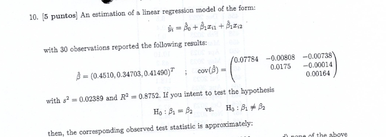
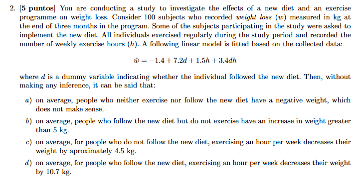
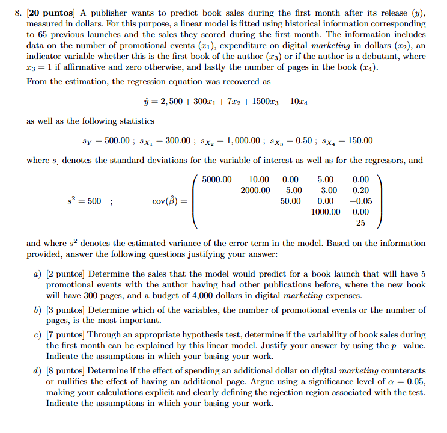

<script type="text/javascript">
// Fix: pandoc converts $...$ to <code>$...$</code>, but MathJax skips <code>.
// This script unwraps math from <code> tags so MathJax can render it.
document.addEventListener('DOMContentLoaded', function() {
  // Wait for remark.js to finish processing slides
  setTimeout(function() {
    document.querySelectorAll('code').forEach(function(el) {
      var text = el.textContent;
      if (/^\\$/.test(text) && /\\$$/.test(text)) {
        var span = document.createElement('span');
        span.textContent = text;
        el.parentNode.replaceChild(span, el);
      }
    });
    // Re-trigger MathJax typesetting
    if (window.MathJax) {
      MathJax.Hub.Queue(["Typeset", MathJax.Hub]);
    }
  }, 1000);
});
</script>
<style type="text/css">
.remark-slide-content {
    font-size: 18px;
    padding: 15px 35px;
}

.small .remark-slide-content, .remark-slide-content.small {
    font-size: 16px;
}

/* Key formula box - purple gradient */
.formula-box {
    background: linear-gradient(135deg, #f0efff 0%, #e8e6ff 100%);
    border-left: 4px solid #43418A;
    border-radius: 8px;
    padding: 10px 15px;
    margin: 8px 0;
    font-size: 0.95em;
}

/* Key takeaway box - green */
.takeaway {
    background: linear-gradient(135deg, #e8f5e9 0%, #c8e6c9 100%);
    border-left: 4px solid #2e7d32;
    border-radius: 8px;
    padding: 8px 12px;
    margin: 8px 0;
    font-size: 0.95em;
    color: #1b5e20;
}
.takeaway strong { color: #2e7d32; }

/* Warning/caution box - orange */
.caution {
    background: linear-gradient(135deg, #fff3e0 0%, #ffe0b2 100%);
    border-left: 4px solid #e65100;
    border-radius: 8px;
    padding: 8px 12px;
    margin: 8px 0;
    font-size: 0.95em;
    color: #bf360c;
}
.caution strong { color: #e65100; }

/* LearnR practice note - blue */
.learnr-note {
    background: linear-gradient(135deg, #e3f2fd 0%, #bbdefb 100%);
    border-left: 4px solid #1565c0;
    border-radius: 8px;
    padding: 7px 11px;
    margin: 7px 0;
    font-size: 0.85em;
    color: #0d47a1;
}

/* Definition/concept box - light purple */
.concept {
    background: #f5f3ff;
    border: 2px solid #43418A;
    border-radius: 10px;
    padding: 10px 14px;
    margin: 8px 0;
}

/* Interpretation box - teal */
.interpret {
    background: linear-gradient(135deg, #e0f2f1 0%, #b2dfdb 100%);
    border-left: 4px solid #00695c;
    border-radius: 8px;
    padding: 8px 12px;
    margin: 8px 0;
    font-size: 0.95em;
    color: #004d40;
}

/* Better table styling */
table {
    border-collapse: collapse;
    width: 100%;
    margin: 10px 0;
    font-size: 0.9em;
}
th {
    background: #43418A;
    color: white;
    padding: 8px 12px;
    text-align: left;
}
td {
    padding: 6px 12px;
    border-bottom: 1px solid #e0e0e0;
}
tr:nth-child(even) { background: #f5f5f5; }

/* Smaller code output */
.remark-code { font-size: 0.85em; }

/* Nice blockquotes */
blockquote {
    border-left: 4px solid #43418A;
    padding: 10px 20px;
    margin: 10px 0;
    background: #fafafa;
    font-style: italic;
    color: #555;
}

/* Section title styling */
.section-title {
    color: #43418A;
    font-size: 1.5em;
    font-weight: 700;
    border-bottom: 3px solid #43418A;
    padding-bottom: 8px;
    margin-bottom: 15px;
}

/* Side-by-side comparison */
.compare-left {
    float: left;
    width: 48%;
    background: #e3f2fd;
    border-radius: 8px;
    padding: 12px;
    margin-right: 2%;
}
.compare-right {
    float: right;
    width: 48%;
    background: #fce4ec;
    border-radius: 8px;
    padding: 12px;
}

/* Clean up footnotes */
.footnote {
    font-size: 0.75em;
    color: #666;
    bottom: 12px;
}
</style>

```{r setup, include=FALSE}
knitr::opts_chunk$set(echo = TRUE,dpi=300)
library(shiny)
library(ggplot2)
library(forecast)
library(plotly)
library(dplyr)
library(igraph)
library(reshape)
library(spData)
library(leaflet)
library(readr)
library(ggplot2)
library(gridExtra)
library(dplyr)
library(hrbrthemes)
library(gridExtra)
library(cowplot)
library(viridis)
library(gapminder)
library(knitr)
library(car)
library(kableExtra)
library(DT)
library(Lock5Data)
library(wooldridge)
library(tidyverse)
library(probstats4econ)
```

```{r xaringan-themer, include=FALSE, warning=FALSE}
library(xaringanthemer)
style_mono_accent(base_color = "#43418A", 
colors = c(
  red = "#f34213",
  purple = "#3e2f5b",
  orange = "#ff8811",
  green = "#136f63",
  blue = "#1E90FF",
  white = "#FFFFFF"
))
```


```{r setup2, include=FALSE}
knitr::opts_chunk$set(echo = FALSE)
library(ggplot2)
library(dplyr)
library(MASS) # for truehist function
load("URG_Sample.Rda")
Sample_urg=Sample_urg[Sample_urg$SEXO!="NO ESPECIFICADO",]
```
---
## Roadmap


### This set of classes
- What is a multiple linear regression


---
### Motivation

- Suppose that you are managing a hospital
- You want to predict how long a patient will stay at the urgent care 
  - You need this information to see how many resources you need (doctors, beds, etc)

--
- You collect the data on 
    - The Duration of the visit
    - Characteristics of the patient
    - What kind of problem the patient came with
    - What type of bed they got
    - How many other patients there are currently at urgent care

--
- If we know these values, can we predict how long patient will stay?

---
### Data


```{r, echo=FALSE}
# Load the DT package
library(DT)


# Display the data table
datatable(Sample_urg,
          fillContainer = FALSE,
          options = list(
            pageLength = 10,
            searching = FALSE,
            initComplete = JS(
              "function(settings, json) {",
              "$(this.api().table().container()).css({'font-size': '12px'});",
              "}"
            )
          ),
          rownames = FALSE
)
```

---

### Multiple linear regression

.concept[
**Multiple linear regression** models $y$ as a linear function of **multiple** predictor variables $x_1, x_2, \ldots, x_k$, rather than just one.
]

--

- Similar to simple linear regression, but with more than one predictor

--

- Since you can use many explanatory variables (Xs) you can usually get much better predictions

---

### Multiple linear regression

- Back to hospital example:

Suppose that the outcome $y_i$ (duration) is a linear function of $x_1$ (Occupancy) and $x_2$ (age)

$$y_i=\beta_0+\beta_1x_{i1}+\beta_2x_{i2}+u_i$$
- $\beta_0$ represents the average value of $y_i$ when $x_1$ and $x_2$ are 0.
- $\beta_1$ represents the change in $y_i$ while changing $x_1$ by one unit and keeping $x_2$ constant
- $\beta_2$ represents the change in $y_i$ while changing $x_2$ by one unit and keeping $x_1$ constant


--
Once I estimated the parameters, I can predict how long a patient will stay. Consider a patient who is 20 years old (age) and there are 5 other people in the urgent care at the same time (occupancy), then predicted stay is:

$$\hat{y}_i=\hat{\beta}_0+\hat{\beta}_1 \cdot 5+\hat{\beta}_2 \cdot 10$$

---
### Example 1

What can predict hourly wage in the US?

--
```{r, echo=FALSE}
# Fit a linear regression model
lm_model <- lm(wage ~ exper+looks+female+married+educ, data = beauty)
# Display the summary of the linear regression model
summary(lm_model)

```

.learnr-note[
**LearnR Practice:** Section 1.1 — Matrix OLS: Predicting Affairs
]

---
### Example 2

What can predict prices of houses in the US?


--
```{r, echo=FALSE}
# Fit a linear regression model
lm_model <- lm(price ~ rooms+baths+age+land, data = hprice3)
# Display the summary of the linear regression model
summary(lm_model)

```

.learnr-note[
**LearnR Practice:** Section 1.1 — Matrix OLS: Predicting Affairs
]

---
### Example 3

Who cares more about looks when it comes to dating: men or women? 
Our speed dating data gives us:

1. How much respondent liked someone (1-10 scale) - variable "like")
2. How attractive they found their date (1-10 scale) - variable "Attractive")
3. The gender of the respondent (M or F) - variable gender

--

```{r, echo=FALSE}

SpeedDating2 <- SpeedDating %>%
  pivot_longer(
    cols = ends_with("M") | ends_with("F"),
    names_to = c(".value", "gender"),
    names_pattern = "(.*)([MF])"
  ) 

# Fit a linear regression model
lm_model <- lm(Like ~ Attractive+Intelligent+Fun+Ambitious+SharedInterests, data = SpeedDating2)
# Display the summary of the linear regression model
summary(lm_model)

```

.learnr-note[
**LearnR Practice:** Section 1.1 — Matrix OLS: Predicting Affairs
]


---
### Multiple linear regression

- With one regressor, relationship was visualized with a line, what about now?

--

100 observations simulated from a regression line:
$$y_i=5+2x_{i1}+1x_{i2}+u_i$$
```{r, warning=FALSE,message=FALSE,fig.height=3, out.width='80%'}

library(plotly)
library(reshape2)

# Simulate your data
set.seed(123)
n <- 100
x1 <- rnorm(n)
x2 <- rnorm(n)
u <- rnorm(n)
y <- 5 + 2 * x1 + x2 + u
my_df <- data.frame(x1 = x1, x2 = x2, y = y)

# Fit a multiple linear regression model
# Load the necessary packages for 3D plotting
lm_model <- lm(y ~ x1 + x2, data = my_df)

# Create a grid of values for x1 and x2
x1_grid <- seq(min(my_df$x1), max(my_df$x1), length.out = 50)
x2_grid <- seq(min(my_df$x2), max(my_df$x2), length.out = 50)
grid_data <- expand.grid(x1 = x1_grid, x2 = x2_grid)

# Predict y values using the regression model
grid_data$y_pred <- predict(lm_model, newdata = grid_data)

# Convert the grid data to a matrix for persp plot
z_matrix <- matrix(grid_data$y_pred, nrow = length(x1_grid), ncol = length(x2_grid), byrow = TRUE)

# Create the base 3D scatter plot (points)
plot_ly(my_df, x = ~x1, y = ~x2, z = ~y, text = ~paste("x1:", round(x1,2), "<br>x2:", round(x2,2), "<br>y:", round(y,2)),
        hoverinfo = 'text',
        type = "scatter3d", mode = "markers", height = 400) %>%
  layout(scene = list(aspectmode = "cube")) %>%

# Add the surface using persp
  add_surface(z = ~z_matrix, x = x1_grid, y = x2_grid, 
        hoverinfo = 'text',
        type = "surface", opacity = 0.6, text = ~paste("x1:", x1_grid, "<br>x2:", x2_grid, "<br>y_pred:", z_matrix))
```

.learnr-note[
**LearnR Practice:** Section 1.1 — Matrix OLS: Predicting Affairs
]

---
### Multiple linear regression

100 observations simulated from a regression line: $$y_i=5+2\underbrace{x_{i}}_{x_{i1}}-1\underbrace{x_i}_{x_{i2}}^2+u_i$$


```{r, warning=FALSE,message=FALSE,fig.height=4, out.width='100%'}
set.seed(123)

# Number of data points
n <- 100

# Generate random values for x1, x, and u
x1 <- rnorm(n)
x <- rnorm(n, mean=1, sd=3)
u <- rnorm(n, sd=10)

# Generate y using the given equation
y <- 5 + 2 * x1 - x^2 + u

# Create a data frame
data <- data.frame(y, x1, x)

# Perform linear regression
lm_model <- lm(y ~ x1 + I(x^2), data=data)

# Print the summary of the regression

# Load the ggplot2 library
library(ggplot2)

# Create a scatter plot with regression line
ggplot(data, aes(x = x, y = y)) +
  geom_point() +
  geom_smooth(method = "lm", formula = y ~ x + I(x^2), se = FALSE, color = "blue") +
  theme_xaringan()

```


---
### Multiple linear regression

Suppose that: 
$$x_1 = \begin{cases}
    1 & \text{if female} \\
    0 & \text{if male}
\end{cases}$$

100 observations simulated from a regression line: $$y_i=5+2x_{i1}-1x_{i2}+u_i$$
```{r, warning=FALSE,message=FALSE,fig.height=3, out.width='100%'}
set.seed(123)

# Number of data points
n <- 100

# Generate random values for x1, x2, and u
x1 <- sample(c(0, 1), n, replace = TRUE)  # Binary variable (0 or 1)
x2 <- rnorm(n)
u <- rnorm(n)

# Generate y using the given equation
y <- 5 + 2 * x1 - x2 + u

# Create a data frame
data <- data.frame(y, x1, x2)

# Load the ggplot2 library
library(ggplot2)

# Separate data for males and females
data_male <- subset(data, x1 == 0)
data_female <- subset(data, x1 == 1)

# Create a scatter plot with parallel regression lines for males and females
plot <- ggplot(data, aes(x = x2, y = y, color = factor(x1))) +
  geom_point() +
  labs( x = "x2",
       y = "y",
       color = "x1") +
  scale_color_manual(values = c("0" = "blue", "1" = "red")) +
  
  # Add parallel regression lines for males and females
  geom_line(data = data, aes(x = x2, y = 5 + 2 * 0 - x2), color = "blue") +
  geom_line(data = data, aes(x = x2, y = 5 + 2 * 1 - x2), color = "red")+
  theme_xaringan()

  
  plot
```

.learnr-note[
**LearnR Practice:** Sections 4.1–4.2 — Categorical Variables: Wages by Marital Status + Gender Pay Gap
]


---
### Multiple linear regression


Now imagine a regression with k variables:

$$y_i=\beta_0+\beta_1x_{i1}+\beta_2x_{i2}+...+\beta_kx_{ik}+u_i$$
- Maybe you are trying to predict customer spending based on what they looked at and $x_{ij}$ represent how long customer $i$ looked at item $j$

--
- Maybe you are trying to predict sales in a store $i$, and $x_{ij}$ represent prices of the products, their competitors' products, how many people live around and how rich are they etc...

--
- We can no longer visualize it (because we can't visualize more than 3 dimensions)

---
class: inverse, center, middle

# Mathematical Formulation

### Matrix Notation, OLS Derivation, and Normal Equations

---
class: small

### Multiple linear regression

We can also write the regression in the vector form:

$$y_i=\beta_0+\beta_1x_{i1}+\beta_2x_{i2}+...+\beta_kx_{ik}+u_i$$
In vector form is: 


$$\mathbf{y}=\mathbf{X\beta}+\mathbf{u}$$

<div class="math">
\[
\underbrace{\begin{bmatrix}
y_1 \\
y_2 \\
\vdots \\
y_n \\ \end{bmatrix}}_{\substack{\mathbf{y} \\ n \times 1}}
=
\underbrace{\begin{bmatrix}
1 & x_{11} & x_{12} & ... & x_{1k} \\
1 & x_{21} & x_{22} & ... & x_{2k}  \\
\vdots & \vdots & \vdots & ....& \vdots \\
1 & x_{n1} & x_{n2} & ... & x_{nk}  &  \end{bmatrix}}_{\substack{\mathbf{X} \\ n \times (k+1)}}

\underbrace{\begin{bmatrix}
\beta_0 \\
\beta_1 \\
\vdots \\
\beta_k  \\ \end{bmatrix}}_{\substack{\mathbf{\beta} \\ (k+1) \times 1}}
+
\underbrace{\begin{bmatrix}
u_1 \\
u_2 \\
\vdots \\
u_n  \\ \end{bmatrix}}_{\substack{\mathbf{u} \\ n \times 1}}
\]
</div>

.learnr-note[
**LearnR Practice:** Section 1.1 — Matrix OLS: Predicting Affairs

**Interactive visualization:** See this formula in action step-by-step → [krzysztofzaremba.github.io/matrix-intuition](https://krzysztofzaremba.github.io/matrix-intuition/)
]

---
class: small

### Full Rank

Important Assumption: **X is full rank** 
- Has same rank as the number of parameters: $p=k+1$
- Also known as: no perfect multicollinearity

--
- .blue[Technically]: columns of X should be linearly independent

--
- .blue[Intuitively]: none of the variables are perfectly correlated. If they are perfectly correlated, then we don't need one of the columns because we can perfectly predict one column with information from another column.

- Suppose that one column is income in USD, and the second one is income measured in Pesos. They are perfectly correlated. Once we know income in USD, income in Pesos does not bring any additional information. We would not be able to estimate the effect of both income in USD and income in Pesos at the same time. 

<div class="math">
\[
\begin{array}{cc}
\text{Full Rank Matrix:} & \text{Matrix Not of Full Rank:} \\
\left[\begin{array}{ccc}
1 & 2 & 3 \\
4 & 5 & 6 \\
7 & 8 & 10
\end{array}\right]
&
\left[\begin{array}{ccc}
1 & 2 & 4 \\
4 & 5 & 10 \\
7 & 8 & 16
\end{array}\right]
\end{array}
\]
</div>


---
### Multiple linear regression

**Goal:**
- Estimate the vector of parameters $\mathbf{\beta}$


**Procedure**
- Find 
<div class="math">
\[
\mathbf{b}=\begin{bmatrix}
b_0 \\
b_1 \\
\vdots \\
b_k  \\ \end{bmatrix}
\]
</div>

- Which minimizes the squared errors in the problem: 

$$y_i=b_0+b_1x_{i1}+b_2x_{i2}+...+b_kx_{ik}+e_i$$
- That is minimize 

$$\small SSE=\sum_ie_i^2=\sum_i(y_i-\hat{y}_i)^2=\mathbf{e}^{\top}\mathbf{e}=(\mathbf{y-Xb})^{\top}(\mathbf{y-Xb})$$
---
### Multiple linear regression

Taking partial derivatives of SSE with respect to each $b_j$ and setting them to zero leads to the **normal equations**:

$$\mathbf{X^{\top}X\hat{\beta}} =\mathbf{X^{\top}y}$$

--

By expanding and differentiating in matrix form, we can show that minimizing:

$$SSE(b)=(\mathbf{y-Xb})^{\top}(\mathbf{y-Xb})$$

yields the OLS estimator:

.formula-box[
$$\boxed{\mathbf{\hat{\beta}} =\mathbf{(X^{\top}X)^{-1}X^{\top}y}}$$
]

--

.takeaway[
**Key Takeaway:** OLS finds the coefficients that minimize the sum of squared errors. The formula accounts for correlations between all X variables simultaneously.
]


.learnr-note[
**LearnR Practice:** Section 1.1 — Matrix OLS: Predicting Affairs
]


---
### Multiple linear regression

**What do $\mathbf{X^{\top}X}$ and $\mathbf{X^{\top}y}$ contain?**

- $\mathbf{X^{\top}X}$ is a $(k+1) \times (k+1)$ matrix that captures the **relationships between X variables** (sums of squares and cross-products)
- $\mathbf{X^{\top}y}$ is a $(k+1) \times 1$ vector that captures the **relationships between X and y**

--

For example, with two regressors ($k=2$):

$$\underbrace{\begin{bmatrix}
n & \sum x_{i1} & \sum x_{i2} \\
\sum x_{i1} & \sum x_{i1}^2 & \sum x_{i1}x_{i2} \\
\sum x_{i2} & \sum x_{i1}x_{i2} & \sum x_{i2}^2
\end{bmatrix}}_{\mathbf{X^{\top}X}}
\underbrace{\begin{bmatrix}
\hat{\beta}_0 \\
\hat{\beta}_1 \\
\hat{\beta}_2
\end{bmatrix}}_{\hat{\beta}}
=
\underbrace{\begin{bmatrix}
\sum y_i \\
\sum x_{i1}y_i \\
\sum x_{i2}y_i
\end{bmatrix}}_{\mathbf{X^{\top}y}}$$

The solution is: $\hat{\beta} = (\mathbf{X^{\top}X})^{-1}\mathbf{X^{\top}y}$

.footnote[
For $k$ regressors the pattern extends with additional rows/columns of cross-products $\sum x_{ij}x_{il}$.
See it animated: [matrix-intuition](https://krzysztofzaremba.github.io/matrix-intuition/)
]


---
### Predictions
 
To make predictions based on the estimated regressors we use:

$$\hat{y}_i=\hat{\beta}_0+\hat{\beta}_1x_{i1}+\hat{\beta}_2x_{i2}+...+\hat{\beta}_kx_{ik}$$ 
Or in the vector form:


$$\mathbf{\hat{y}}=\mathbf{X\hat{\beta}}=\mathbf{X\mathbf{(X^{\top}X)}^{-1}\mathbf{X^{\top}y}}=\mathbf{Hy}$$

Where $\mathbf{H}=\mathbf{X(X^{\top}X)}^{-1}\mathbf{X^{\top}}$ is called a hat matrix.

.learnr-note[
**LearnR Practice:** Section 1.1 — Matrix OLS: Predicting Affairs
]

---
### Residuals

To get residuals, we calculate: 

$$e_i=y_i-\hat{y}_i=y_i-(\hat{\beta}_0+\hat{\beta}_1x_{i1}+\hat{\beta}_2x_{i2}+...+\hat{\beta}_kx_{ik})$$ 

Or in the vector form:
$$\mathbf{e}=\mathbf{y-\hat{y}}=y-\mathbf{X\hat{\beta}}=\mathbf{y}-\mathbf{X\mathbf{(X^{\top}X)}^{-1}\mathbf{X^{\top}y}}=\mathbf{(I-H)y}$$
---

### Summary

- We are trying to find $\beta$s which minimize the prediction error
- It turns out that we get minimal errors when we set $\beta$ to be: $\hat{\beta}=(X^{\top}X)^{-1}X^{\top}y$
- If we have just one regressors, we get back the same formula as we already derived


---
class: small

#### Example with numbers
 What's the impact of hours studied and hours slept on the exam score?

$$\small \begin{array}{|c|c|c|c|}
\hline
\text{Student} & \text{Hours Studied (}x_1\text{)} & \text{Hours Slept (}x_2\text{)} & \text{Exam Score (}y\text{)} \\
\hline
1 & 3 & 8 & 80 \\
2 & 4 & 7 & 85 \\
3 & 6 & 6 & 92 \\
4 & 5 & 7 & 88 \\
\hline
\end{array}$$

--

In matrix form:

$$\small X = \begin{bmatrix}
1 & 3 & 8 \\
1 & 4 & 7 \\
1 & 6 & 6 \\
1 & 5 & 7 \\
\end{bmatrix} \qquad
y = \begin{bmatrix}
80 \\
85 \\
92 \\
88 \\
\end{bmatrix}$$

---
## What these matrices mean and do?!

.concept[
**The problem:** We want to know the effect of sleep on exam scores. But students who sleep more also tend to study less. If we just compare students with different sleep hours, we're also comparing students with different study hours!
]

--

**The matrix solution:**

1. $X^{\top}X$ measures how all predictors relate to each other (including their correlations)
2. $(X^{\top}X)^{-1}$ "removes" these correlations -- it adjusts for the fact that sleep and study hours are tangled together
3. $(X^{\top}X)^{-1}X^{\top}y$ gives each predictor its **own, isolated** effect

--

Think of it like this: the inverse "untangles" the predictors so each coefficient reflects **only its own contribution**, holding everything else constant.

---
class: small

#### Example with numbers

Multiply $X^{\top}$ by $X$:

$$X^{\top}X = 
\begin{bmatrix}
1 & 1 & 1 & 1 \\
3 & 4 & 6 & 5 \\
8 & 7 & 6 & 7 \\
\end{bmatrix}
\begin{bmatrix}
1 & 3 & 8 \\
1 & 4 & 7 \\
1 & 6 & 6 \\
1 & 5 & 7 \\
\end{bmatrix}=
\begin{bmatrix}
4 & 18 & 28 \\
18 & 86 & 123 \\
28 & 123 & 198 \\
\end{bmatrix}$$

Find the inverse $(X^{\top}X)^{-1}$

$$(X^{\top}X)^{-1} = 
\begin{bmatrix}
474.75 & -30 & -48.5 \\
-30 & 2 & 3 \\
-48.5 & 3 & 5 \\
\end{bmatrix}$$

---
class: small

#### Example with numbers

Next let's find $X^{\top}y$

$$X^{\top}y=
\begin{bmatrix}
1 & 1 & 1 & 1 \\
3 & 4 & 6 & 5 \\
8 & 7 & 6 & 7 \\
\end{bmatrix}
\begin{bmatrix}
80 \\
85 \\
92 \\
88 \\
\end{bmatrix}=
\begin{bmatrix}
345 \\
1572 \\
2403 \\
\end{bmatrix}$$
So, our coefficients are:


$$\beta=\begin{bmatrix}
\hat{\beta}_0 \\
\hat{\beta}_1 \\
\hat{\beta}_2 \\
\end{bmatrix} =
 \underbrace{\begin{bmatrix}
474.75 & -30 & -48.5 \\
-30 & 2 & 3 \\
-48.5 & 3 & 5 \\
\end{bmatrix}}_{(X^{\top}X)^{-1}} \underbrace{\begin{bmatrix}
345 \\
1572 \\
2403 \\
\end{bmatrix}}_{X^{\top}y}=
\begin{bmatrix}
83.25 \\
3 \\
-1.5 \\
\end{bmatrix}$$


--

.interpret[
**Interpretation:**
- $\hat{\beta}_0 = 83.25$: predicted score with 0 hours of sleep and 0 of studying
- $\hat{\beta}_1 = 3$: each additional hour of studying (holding sleep constant) increases score by 3 points
- $\hat{\beta}_2 = -1.5$: each additional hour of sleep (holding study constant) decreases score by 1.5 points
]


---
class: small

#### Example with numbers

We can find predicted values:
$$\hat{y}=X\hat{\beta}=
\begin{bmatrix}
1 & 3 & 8 \\
1 & 4 & 7 \\
1 & 6 & 6 \\
1 & 5 & 7 \\
\end{bmatrix}\begin{bmatrix}
83.25 \\
3 \\
-1.5 \\
\end{bmatrix}=
\begin{bmatrix}
80.25 \\
84.75 \\
92.25 \\
87.75
\\
\end{bmatrix}$$
And the residuals:
$$e=y-\hat{y}=y-X\hat{\beta}=
\begin{bmatrix}
80 \\
85 \\
92 \\
88 \\
\end{bmatrix}-
\begin{bmatrix}
80.25 \\
84.75 \\
92.25 \\
87.75
\end{bmatrix}=
\begin{bmatrix}
-0.25 \\
0.25 \\
-0.25 \\
0.25
\end{bmatrix}$$


---
## What did we just do?

1. Organized data into matrix $\mathbf{X}$ and vector $\mathbf{y}$
2. Computed $\mathbf{X^{\top}X}$ (captures relationships between X variables)
3. Inverted it: $(\mathbf{X^{\top}X})^{-1}$ (adjusts for correlations)
4. Computed $\mathbf{X^{\top}y}$ (captures relationships between X and y)
5. Multiplied to get $\hat{\beta} = (\mathbf{X^{\top}X})^{-1}\mathbf{X^{\top}y}$

--

Then we used $\hat{\beta}$ to compute predictions $\hat{y}=X\hat{\beta}$ and residuals $e=y-\hat{y}$.


---
#### Example from data: 
```{r, echo=TRUE}
# Fit a linear regression model
lm_model <- lm(Duration ~ Occupancy+EDAD, data = Sample_urg)
# Display the summary of the linear regression model
summary(lm_model)

```

.learnr-note[
**LearnR Practice:** Section 1.1 — Matrix OLS: Predicting Affairs
]

---

### Practice

Predict how long a patient will stay if there 10 other patients in the hospital and the patient is 50 years old.

---

### Correlations vs Coefficients

Note, that $x_1$ and $x_2$ can both have positive correlation with $y_i$, but different coefficients!

- Suppose $x_1$ is study hours, $x_2$ is coffee cups drunk by a student, and $y$ is student's score on the exam.


```{r, warning=FALSE,message=FALSE,fig.height=3, out.width='100%'}
library(GGally)

# Create a dataset
set.seed(123)
n <- 100
x1 <- runif(n, 0, 10)  # hours spent studying
x2 <- x1 + rnorm(n, 0, 2)  # cups of coffee, correlated with study hours
y <- 3 + 2*x1 + rnorm(n, 0, 2)  # exam score

# Create a data frame
data <- data.frame(x1, x2, y)

# Create a matrix of scatterplots
ggpairs(data)+theme_xaringan()

```

---

### Correlations vs Coefficients

```{r, warning=FALSE,message=FALSE,fig.height=3, out.width='80%'}
# Fit a linear regression model
fit <- lm(y ~ x1 + x2, data)
# Display the summary of the linear regression model
summary(fit)

```

--
- Why coffee has 0 impact?

--
- Because it only helps to study longer, but comparing students who study the same amount, drinking more coffee is not better.

.learnr-note[
**LearnR Practice:** Sections 2.1–2.2 — Omitted Variables: Wages, Education & IQ + CEO Pay Beyond ROE
]

---
### More realistic example from the data: 

Let’s explore a simple linear regression using U.S. survey data. We’ll regress hourly wage (in cents) on years of education.

```{r, echo=TRUE}
# Fit a linear regression model
lm_model <- lm(wage ~ educ, data = card)
# Display the summary of the linear regression model
summary(lm_model)

```
---
### More realistic example from the data: 
Now let’s include IQ as an additional predictor:
The coefficient on education  decreases. Why?
```{r, echo=TRUE}
# Fit a linear regression model
# Fit a linear regression model
lm_model <- lm(wage ~ educ+IQ, data = card)
# Display the summary of the linear regression model
summary(lm_model)


```

---
###  Why Does the Coefficient Change?

- In the first model, education captures both its own effect and part of IQ’s effect on wage, because education and IQ are positively correlated.
  - We're comparing people with different education levels, who also tend to differ in IQ.
- In the second model, we control for IQ explicitly.
  - Now, we are comparing people with different education levels, but with the same IQ level (holding IQ fixed).
- Result: The education coefficient shrinks because it no longer absorbs IQ’s influence.
- Controlling helps us to separate different effects

.learnr-note[
**LearnR Practice:** Sections 2.1–2.2 — Omitted Variables: Wages, Education & IQ + CEO Pay Beyond ROE
]

---
class: inverse, center, middle

# Statistical Properties of OLS

### Unbiasedness, Variance, and Gauss-Markov

---
### OLS Properties: Unbiasedness

- As usual, we asked whether it's unbiased and what is its variance.

--

- **Unbiased**:

<div class="math">
\[\small
\begin{align*}
E(\hat{\beta}) & =E(\mathbf{(X^{\top}X)^{-1}X^{\top}y})=E(\mathbf{(X^{\top}X)^{-1}X^{\top}(X\beta+u)})) \\
& = E(\mathbf{(X^{\top}X)^{-1}X^{\top}(X\beta+u)}))=E(\mathbf{(X^{\top}X)^{-1}X^{\top}X\beta})+E(\mathbf{(X^{\top}X)^{-1}X^{\top}u}) \\
& = \beta+\mathbf{(X^{\top}X)^{-1}X^{\top}E(u)}=\beta+0=\beta
\end{align*}
\]
</div>

Where $\small E(\mathbf{(X^{\top}X)^{-1}X^{\top}u})=0$ if $\small E(u)=0$ (our usual assumption).

---
### OLS Properties: Variance

The variance-covariance matrix of $\hat{\beta}$ is:

$$\scriptsize Var(\hat{\beta})=Cov(\hat{\beta})=\underbrace{\begin{bmatrix}
var(\hat{\beta_0}) & cov(\hat{\beta_0}, \hat{\beta_1}) & \cdots & cov(\hat{\beta_0}, \hat{\beta_k}) \\
cov(\hat{\beta_1}, \hat{\beta_0}) & var(\hat{\beta_1}) & \cdots & cov(\hat{\beta_1}, \hat{\beta_k})  \\
\vdots & \vdots & \ddots &  \vdots \\
cov(\hat{\beta_k}, \hat{\beta_0}) & cov(\hat{\beta_k}, \hat{\beta_1}) & \cdots & var(\hat{\beta_k}) \end{bmatrix}}_{ (k+1) \times (k+1)}$$
- Variance of single parameters on the diagonal, covariances off the diagonal.


---

## Example




---
class: small

### Variance: Derivation

Since $\hat{\beta} - \beta = (\mathbf{X^{\top}X})^{-1}\mathbf{X^{\top}u}$, and under our assumption $E(\mathbf{uu^{\top}})=\sigma^2 I$:

$$\small var(\hat{\beta}) = E[(\hat{\beta}-\beta)(\hat{\beta}-\beta)^{\top}] = (X^{\top}X)^{-1}X^{\top}\underbrace{E[\mathbf{uu^{\top}}]}_{\sigma^2 I}X(X^{\top}X)^{-1}$$

.formula-box[
$$\boxed{var(\hat{\beta}) = \sigma^2(X^{\top}X)^{-1}}$$
]

---

### Variance: Interpretation

- For a single coefficient: $var(\hat{\beta}_k)=\sigma^2(X^{\top}X)^{-1}_{k+1,k+1}$

- $(X^{\top}X)^{-1}_{k+1,k+1}$ is the element in row $k+1$, column $k+1$ of $(X^{\top}X)^{-1}$. First one is the intercept!

.takeaway[
**Key Takeaway:** The variance of each coefficient depends on the error variance $\sigma^2$ and on how correlated the regressors are (captured in $(X^{\top}X)^{-1}$).
]

.learnr-note[
**LearnR Practice:** Sections 3.1–3.2 — Variance-Covariance: Affairs Model + CEO Salary VCOV
]

---
### Example:

$$\small\text{cov}(\hat{\beta})=\underbrace{0.02389}_{\sigma^2} \times \underbrace{\begin{bmatrix}
3.2583 & -0.3382 & -0.3089 \\
-0.3382 & 0.7325 & -0.0059 \\
-0.3089 & -0.0059 & 0.0686
\end{bmatrix}}_{(X^{\top}X)^{-1}}=
\begin{bmatrix}
0.07784 & -0.00808 & -0.00738 \\
-0.00808 & 0.0175 & -0.00014 \\
-0.00738 & -0.00014 & 0.00164
\end{bmatrix}$$

--
Example:

$var(\hat{\beta}_1)=0.02389 \times 0.7325=0.0175$
$cov(\hat{\beta}_1,\hat{\beta}_0)=0.02389 \times -0.3382=-0.00808$

---
### Variance

- Where the hell do we get the $\sigma^2$ from?!


--
- Same as before: 

$$\hat{\sigma}^2=\frac{\sum_i e_i^2}{n-p}$$
- Where $e_i$ is fitted residual and $p$ is number of parameters $p=k+1$
- k is number of variables
- +1 because of intercept
- This is called mean squared error as well

--

The easiest way to compute this sum is:

$$\sum_i e_i^2=\mathbf{e^{\top}e}=(\mathbf{y-X\hat{\beta}})^{\top}(\mathbf{y-X\hat{\beta}})=\mathbf{y^{\top}y-\hat{\beta}^{\top}X^{\top}y}$$

---
class: small

#### Gauss Markov Theorem (Again)

.concept[
**Gauss-Markov Theorem:** Under the assumptions:
- $E(u_i)=0$, $\;var(u_i)=\sigma^2$, $\;cov(u_i,u_j)=0$, $\;X$ is full rank

OLS is **BLUE**: .blue[Best, Linear, Unbiased Estimator] -- it has the lowest variance among all linear and unbiased estimators.

**No normality assumption needed!**
]

--

- What's a linear estimator?
  - It's an estimator where $\beta$ coefficients are linear functions of outcomes
  - Anything of the form $b=Cy$ where C is p x n matrix.
  - So $b_1=c_{11}y_1+c_{12}y_2+...+c_{13}y_3$
  - Example $b_1=\frac{1}{n}y_1+...+\frac{1}{n}y_n$

--

- How is OLS linear?
  $\hat{\beta}=Cy=\underbrace{(X^{\top}X)^{-1}X^{\top}}_{C}y$

.learnr-note[
**LearnR Practice:** Sections 3.1–3.2 — Variance-Covariance: Affairs Model + CEO Salary VCOV
]

---
class: inverse, center, middle

# Categorical Variables

### Dummy Variables and Their Interpretation

---

### Categorical Variables in a Regression

- Suppose we want to learn whether mode of work affects workers productivity.
- Each worker can be in one of these 3 categories:
  - Fully at the office
  - Fully remote
  - Hybrid

```{r, echo=FALSE}
# Load the DT package
library(DT)

workers <- 100  # Number of workers
WorkMode <- factor(sample(c("Fully at the office", "Fully remote", "Hybrid"), 
                         workers, replace = TRUE),
                   levels = c("Fully at the office", "Fully remote", "Hybrid"))
Productivity <- round(runif(workers, 70, 130))  # Random productivity scores between 70 and 130
WorkerID=1:100

d=data.frame(WorkerID, Productivity, WorkMode)


# Display the data table
datatable(d,
          fillContainer = FALSE,
          options = list(
            pageLength = 8,
            searching = FALSE,
            initComplete = JS(
              "function(settings, json) {",
              "$(this.api().table().container()).css({'font-size': '12px'});",
              "}"
            )
          ),
          rownames = FALSE
)
```

---

- How do we estimate the impact of categorical variable?
- We turn it into a series of binary variables (or indicator variables)!

$$D_{i, Remote}=\begin{cases}
1 & WorkMode_i=Fully Remote \\
0 & otherwise
\end{cases}$$

$$D_{i,Hybrid}=\begin{cases}
1 & WorkMode_i=Hybrid\\
0 & otherwise
\end{cases}$$

```{r, echo=FALSE}
# Load the DT package
# Your existing code
library(DT)

workers <- 100  # Number of workers
WorkMode <- factor(sample(c("Fully at the office", "Fully remote", "Hybrid"), 
                         workers, replace = TRUE),
                   levels = c("Fully at the office", "Fully remote", "Hybrid"))
Productivity <- round(runif(workers, 70, 130))  # Random productivity scores between 70 and 130
WorkerID = 1:100

d = data.frame(WorkerID, Productivity, WorkMode)

# Create dummy variables for WorkMode
dummy_vars <- model.matrix(~ WorkMode - 1, data = d)

# Convert the matrix of dummy variables to a data frame
dummy_df <- data.frame(dummy_vars)

# Combine the dummy variables with your original data
d <- cbind(d, dummy_df)

# Display the updated data table with the dummy variables
datatable(d,
          fillContainer = FALSE,
          options = list(
            pageLength = 6,
            searching = FALSE,
            initComplete = JS(
              "function(settings, json) {",
              "$(this.api().table().container()).css({'font-size': '12px'});",
              "}"
            )
          ),
          rownames = FALSE
)
```

--
- For each person, only one of these dummies is equal to 1!

---
### Adding Dummies to a Regression

- We will add these dummies into a regression, but not all of them!

- If we have m categories, we will add m-1 dummies. Why?

$$y_i=\beta_0+\beta_1D_{i1}+\beta_2D_{i2}+...+\beta_{m-1}D_{im-1}+u_i$$

- In our Example:

$$y_i=\beta_0+\beta_1D_{i,Hybrid}+\beta_2D_{i,Remote}+u_i$$

---
### Why Not All Dummies?

.caution[
**Dummy Variable Trap:** Including all $m$ dummies would make X not full rank! Always omit one category.
]

<div class="math">
\[
\begin{array}{cc}
\text{Full Rank Matrix:} & \text{Matrix Not of Full Rank:} \\
\left[\begin{array}{ccc}
1 & 1 & 0 \\
1 & 0 & 0 \\
1 & 0 & 1
\end{array}\right]
&
\left[\begin{array}{cccc}
1 & 1 & 0 & 0\\
1 & 0 & 0 & 1\\
1 & 0 & 1 & 0
\end{array}\right]
\end{array}
\]
</div>

--

- Intuitively, if I know the values of $D_{i,Hybrid}$ and $D_{i,Remote}$, I know the value of $D_{i,Office}$
- Ex: if they don't work hybrid and don't work remote, I know they work at the office
- So including it does not bring any new information

---


- R automatically transforms categorical variables to dummies and excludes one of them
 

```{r, echo=TRUE}
# Fit a linear regression model
lm_model <- lm(Productivity ~ WorkMode, data = d)
# Display the summary of the linear regression model
summary(lm_model)

```

.learnr-note[
**LearnR Practice:** Sections 4.1–4.2 — Categorical Variables: Wages by Marital Status + Gender Pay Gap
]

---

### Interpretation of Coefficients


- Coefficient on a dummy $D_1$ tells us by how much $y$ changes when we change category from the excluded one to the category 1.

.interpret[
- Excluded category is: work fully at the office -- this is our comparison group
- $\hat{\beta}_{hybrid}=6.184$: employees working in hybrid mode have on average 6.184 higher productivity score compared to the ones working at the office
- $\hat{\beta}_{remote}=-7.256$: employees working fully remotely have on average 7.256 lower productivity score compared to the ones working at the office
- The t-test on these coefficients tells us whether these differences are significant!
]

- Bottom line: the coefficients on the dummies show the average difference between $y$ in that category compared to the excluded category (holding everything else unchanged)

---

### Example

Suppose we have a categorical variable representing education level. We run a regression of income on the education level. Interpret the coefficients. 

```{r, echo=FALSE}
# Load the DT package
# Your existing code
library(DT)

workers <- 100  # Number of workers
Education <- factor(sample(c("High School or less", "PhD", "Master", "Bachelor"), 
                         workers, replace = TRUE),
                   levels = c("High School or less", "PhD", "Master", "Bachelor"))
Income <- round(runif(workers, 50000, 100000))  # Random productivity scores between 70 and 130
Income[Education!="High School or less"]=Income[Education!="High School or less"]+10000
Income[Education=="Master"]=Income[Education=="Master"]+10000


WorkerID = 1:100

d = data.frame(WorkerID, Income, Education)


# Display the updated data table with the dummy variables
datatable(d,
          fillContainer = FALSE,
          options = list(
            pageLength = 6,
            searching = FALSE,
            initComplete = JS(
              "function(settings, json) {",
              "$(this.api().table().container()).css({'font-size': '12px'});",
              "}"
            )
          ),
          rownames = FALSE
)
```

---

```{r, echo=TRUE}
# Fit a linear regression model
lm_model <- lm(Income ~ Education, data = d)
# Display the summary of the linear regression model
summary(lm_model)

```

.learnr-note[
**LearnR Practice:** Sections 4.1–4.2 — Categorical Variables: Wages by Marital Status + Gender Pay Gap
]

---
class: inverse, center, middle

# Interaction Terms

### When the Effect of One Variable Depends on Another

---
### Interactions

Consider a regression:

$$\text{Purchases}_i=\beta_0+\beta_1\text{TikTok ads}_i+\beta_2\text{Age<25}_i+u_i $$
- Where tiktok ads is how much the company spends on tiktok ads
- Age<25 is a dummy variable that is 1 if the person is younger than 25
- Purchases is how much person i spent on clothes from a company.


```{r, warning=FALSE,message=FALSE, echo=FALSE}
set.seed(123) # for reproducibility
data <- data.frame(
  tiktok_ad_spend = runif(200, 0, 500), # random ad spending between $50 and $500
  young = sample(0:1, 200, replace = TRUE) # randomly assign age groups
)

# Generate sales based on the model with interaction
beta_0 <- 150
beta_1 <- 0.2
beta_2 <- 40
beta_3 <- 0.7
data$sales <- with(data, beta_0 + beta_1 * tiktok_ad_spend + beta_2 * young + beta_3 * tiktok_ad_spend * young + rnorm(200, sd = 40))
data$young=as.character(data$young)
model <- lm(sales ~ tiktok_ad_spend +young, data = data)
data$predicted_sales <- predict(model, newdata = data)

```

```{r, warning=FALSE,message=FALSE,fig.height=3, out.width='100%'}

# Load the ggplot2 library
library(ggplot2)
library(plotly)

# Create a scatter plot with regression line
ggplot(data, aes(x = tiktok_ad_spend, y = sales, color=young) ) +
  geom_line(aes(y = predicted_sales), size = 1) +
  geom_point() +
  theme_xaringan()


```


---
### Interactions


```{r, echo=FALSE}
# Fit a linear regression model
summary(model)

```


---
### Interactions

- Do ads on tik tok affect in the same way older and younger people?
- In other words: one additional dollar on tik-tok ads increases purchases more if you are young?

--
- We want allow the coefficient on ads to differ by age group.

```{r, warning=FALSE,message=FALSE,fig.height=3, out.width='100%'}

# Load the ggplot2 library
library(ggplot2)
library(plotly)

model <- lm(sales ~ tiktok_ad_spend*young, data = data)
data$predicted_sales <- predict(model, newdata = data)

# Create a scatter plot with regression line
ggplot(data, aes(x = tiktok_ad_spend, y = sales, color=young) ) +
  geom_line(aes(y = predicted_sales), size = 1) +
  geom_point() +
  theme_xaringan()


```

---
class: small

### Interactions

- Run the regression:

$$\text{Purchases}_i=\beta_0+\beta_1\text{TikTok ads}_i+\beta_2\text{Age<25}_i+\beta_3\text{TikTok ads}_i \cdot \text{Age<25}_i+u_i $$


--
- What's the coefficient on ads when you are older $Age<25_i=0$?

$$\begin{align*}
& \text{Purchases}_i=\beta_0+\beta_1\text{TikTok ads}_i+\beta_2 \cdot 0+\beta_3\text{TikTok ads}_i \cdot 0 +u_i \\
& \text{Purchases}_i=\beta_0+\beta_1\text{TikTok ads}_i+u_i
\end{align*}$$


--

- What's the coefficient on ads when you are younger $Age<25_i=1$?

$$\begin{align*}
& \text{Purchases}_i=\beta_0+\beta_1\text{TikTok ads}_i+\beta_2 \cdot 1+\beta_3\text{TikTok ads}_i \cdot 1 +u_i \\
& \text{Purchases}_i=\beta_0+\beta_2+(\beta_1+\beta_3)\text{TikTok ads}_i+u_i
\end{align*}$$

---
class: small

### Interactions: Interpretation

We can estimate $\beta_3$ and it will tell us by how much bigger is the coefficient on ads for young compared to the coefficient on ads for old.

- $\beta_1$ is the slope for old
- $\beta_1+\beta_3$ is the slope for young
- $\beta_3$ is the difference in slopes, which we can test like other coefficients

---

```{r, echo=FALSE}
summary(model)

```

.interpret[
**Interpretation:**
- One additional dollar on ads increases purchases among old by 0.222 dollars
- One additional dollar on ads increases purchases among young by 0.222+0.706=0.928 dollars
]

.learnr-note[
**LearnR Practice:** Sections 5.3–5.4 — Interaction: Education by Race + Gender Gap by Education
]

---
class: small

### Interactions

.concept[
**Interaction:** The effect of one variable **depends on** another.

Example: The effect of temperature on ice cream sales depends on whether it's a weekday or weekend.
- Weekday: each degree adds 5 sales
- Weekend: each degree adds 15 sales
- The **interaction coefficient** $\beta_3 = 10$ captures this difference
]

--

**General form:**

$$y_i=\beta_0+\beta_1x_{i1}+\beta_2x_{i2}+\beta_3 x_{i1} \cdot x_{i2}+u_i$$

Equivalently: $y_i=\beta_0+(\beta_1+\beta_3x_{i2})x_{i1}+\beta_2x_{i2}+u_i$

--

- $\beta_3$ tells us: if I increase $x_{i2}$ by one, by how much does the effect of $x_{i1}$ change?

**Marginal effect:** $\frac{\partial y}{\partial x_1} = \beta_1 + \beta_3 x_2$ -- the slope of $x_1$ depends on $x_2$!

--
- Suppose $y$ is mortality, $x_1$ is temperature, $x_2$ is age
- What would you expect $\beta_3$ to be?

.learnr-note[
**LearnR Practice:** Sections 5.1–5.4 — Interactions
]

---

### Interactions

Exam example


---

### Interactions

- Suppose you want to know who benefits the most from working from home. You collect survey data for each employee on the job satisfaction, whether they work in the office or from home, and the distance between the office and home

--

- Who do you think benefits most from working from home?

--
- How would you test this?

--

$$\text{Satisfaction}_i=\beta_0+\beta_1\text{WFH}_i+\beta_2\text{Distance}_i+\beta_3\text{WFH}_i \cdot \text{Distance}_i +u_i$$


--
- What's the interpretation of $\beta_3$?

--

- By how much the effect of working from home on satisfaction changes when we increase distance by one unit (km)

--

- Which sign do you expect $\beta_3$ to have?


---
### Example

When choosing a partner, do women or men care more about physical attractiveness?

--

```{r, echo=FALSE}

SpeedDating2 <- SpeedDating %>%
  pivot_longer(
    cols = ends_with("M") | ends_with("F"),
    names_to = c(".value", "gender"),
    names_pattern = "(.*)([MF])"
  ) 

# Fit a linear regression model
lm_model <- lm(Like ~ Attractive*gender, data = SpeedDating2)
# Display the summary of the linear regression model
summary(lm_model)

```

.learnr-note[
**LearnR Practice:** Sections 5.1–5.2 — Interaction: House Size x Year Built + Experience x Tenure
]

---
class: inverse, center, middle

# Model Fit

### R-squared and Adjusted R-squared

---
class: small

### Goodness of fit

.concept[
**$R^2$ (R-squared)** measures the proportion of variation in $y$ explained by the model:

$$\small R^2=1-\frac{\sum(y_i-\hat{y}_i)^2}{\sum(y_i-\bar{y}_i)^2}$$

]

--

- However, there is one problem with it.
  - Even if we add variables unrelated to $y$, the $R^2$ would typically still increase by a bit

--
  - Even if in population there is 0 relationship with this variable, our sample is small so we will  never get exactly 0 relationship

--
  - Sampling noise will make coefficient slightly positive or negative

--
  - So the increase in $R^2$ will reflect that noise in our sample

--
  - The more coefficients we include, the higher $R^2$
  - We can adjust it, by accounting for the number of parameters used

---
class: small

### Adjusted $R^2$

.concept[
**Adjusted $R^2$** penalizes for adding more regressors:

$$\small R_{Adj}^2=1-\frac{\sum(y_i-\hat{y}_i)^2/(n-p)}{\sum(y_i-\bar{y}_i)^2/(n-1)}$$

]

--

.caution[
**Warning:** $R^2$ **always increases** when you add more variables -- even irrelevant ones! Use Adjusted $R^2$ instead when comparing models with different numbers of regressors.
]

---

```{r, echo=FALSE}
# Fit a linear regression model

lm_model <- lm(Duration ~ Occupancy+EDAD, data = Sample_urg[Sample_urg$SEXO!="NO ESPECIFICADO",])
# Display the summary of the linear regression model
summary(lm_model)

```

---

```{r, echo=FALSE}
# Fit a linear regression model
set.seed(126)
Sample_urg$Random_var<- rnorm(nrow(Sample_urg), 5,30)
lm_model <- lm(Duration ~ Occupancy+EDAD+Random_var, data = Sample_urg[Sample_urg$SEXO!="NO ESPECIFICADO",])
# Display the summary of the linear regression model
summary(lm_model)

```
- Adding random variable increased $R^2$ but decreased $R^2_{Adj}$

.learnr-note[
**LearnR Practice:** Sections 6.1–6.2 — R-squared: Student Performance + Baseball Salaries
]

---
class: inverse, center, middle

# Statistical Inference

### Hypothesis Tests, Confidence Intervals, and ANOVA

---

### Inference

- Let's add the assumption that errors are normally distributed:

$$ \mathbf{u} \sim N(0,\sigma I) $$
Which means that: 

$$y \sim N(X\beta,\sigma I) $$

- With inference we can:

  - Do hypothesis testing on single coefficients, ex: $H_0: \beta_2=0$
  - Find confidence intervals for a single coefficients
  - Do hypothesis testing on multiple coefficients: ex: $H_0: \beta_1=\beta_2$


---
### Test for a Single Coefficient

Under the above assumptions:

$$\hat{\beta}\sim N(\beta, \sigma\sqrt{(X^{\top}X)^{-1}})$$
And 

$$\hat{\beta_j}\sim N(\beta_j, \sigma\sqrt{(X^{\top}X)^{-1}_{j+1,j+1}})$$

--

Normalizing we get that:

$$\frac{\hat{\beta}_j-\beta_j}{s\sqrt{(X^{\top}X)^{-1}_{j+1,j+1}}} \sim t_{n-p}$$
- This test statistic has student t distribution with n-p degrees of freedom
  - Because the $\frac{s^2(n-p)}{\sigma^2} \sim \chi_{n-p}$
- Where p is the number of parameters (coefficients)
- $p=k+1$: k regressors and 1 intercept

---
### Test for a single coefficient

Suppose:
- $H_0: \beta_j=\beta_{j0}$
- $H_A: \beta_j \neq \beta_{j0}$

Then, we use test statistic:

$$t_{test}=\frac{\hat{\beta}_j-\beta_{j0}}{s\sqrt{(X^{\top}X)^{-1}_{j+1,j+1}}}$$
And we reject if $t_{test}>t_{\alpha/2,n-p}$ or $t_{test}<-t_{\alpha/2,n-p}$

Where $t_{\alpha/2,n-p}$ is $1-\alpha/2$ quantile of student t with n-p degrees of freedom

--

**NOTE:** This is a test for $\beta_j$ given all other regressors. It's not the same as the test statistic with only one regressor!
---
### Example

Suppose:
- $H_0: \beta_{Age}=0$
- $H_A: \beta_{Age} \neq 0$

```{r, echo=FALSE}
# Fit a linear regression model
lm_model <- lm(Duration ~ Occupancy+EDAD, data = Sample_urg)
# Display the summary of the linear regression model
summary(lm_model)

```

.learnr-note[
**LearnR Practice:** Sections 7.1–7.4 — Hypothesis Testing + Sections 8.1–8.2 — Confidence Intervals
]

---
class: small

### Confidence Interval for a Single Coefficient

We can also use this distribution to construct confidence intervals: 

An interval for $\beta_j$ with confidence level $1-\alpha$ is:

$$\small\begin{align*}
CI_{1-\alpha} & =\{\hat{\beta_j}-t_{\alpha/2,n-p}SE(\hat{\beta}_j),\;\hat{\beta_j}+t_{\alpha/2,n-p}SE(\hat{\beta}_j)\} \\
& =\{\hat{\beta_j}-t_{\alpha/2,n-p}s\sqrt{(X^{\top}X)^{-1}_{j+1,j+1}},\;\hat{\beta_j}+t_{\alpha/2,n-p}s\sqrt{(X^{\top}X)^{-1}_{j+1,j+1}}\}
\end{align*}$$


--

**Interpretation:**
- We are $1-\alpha$ % confident that the true parameter is within this CI
- If we take repeated samples, $1-\alpha$ %  of such constructed confidence intervals would contain true $\beta$

---

### Example:

For our age coefficient we had:
- $\hat{\beta}_{Age}=0.206$
- $SE(\hat{\beta})=0.067$
- Our $n=5000$ so we can use normal approximation

--

So 95% CI for $\beta_{Age}$ is:

$$\begin{align*}
CI_{1-\alpha} & =\{\hat{\beta_j}-t_{\alpha/2,n-p}SE(\hat{\beta}_j),\hat{\beta_j}+t_{\alpha/2,n-p}SE(\hat{\beta}_j)\} \\
& =\{0.206-1.96 \times 0.067,0.206+1.96 \times 0.067\} \\
& =\{0.075,0.337\} 
\end{align*}$$

--
- Note that the CI does not contain 0
- What does it imply for hypothesis testing with $H_0: \beta_{age}=0$?

.learnr-note[
**LearnR Practice:** Sections 7.1–7.4 — Hypothesis Testing + Sections 8.1–8.2 — Confidence Intervals
]

---
### CI for Mean vs. PI for New Observation

Given $\mathbf{x_0}$, prediction: $\hat{y}_0=\mathbf{x_0^{\top}}\hat{\beta}$

.pull-left[
**CI for mean response:**

.formula-box[
$$\scriptsize CI=\hat{y}_0\pm t_{n-p,\frac{\alpha}{2}}\hat{\sigma}\sqrt{\mathbf{x_0^{\top}}(\mathbf{X^{\top}X})^{-1}\mathbf{x_0}}$$
]

- Only uncertainty from estimating $\beta$
]

.pull-right[
**PI for new observation:**

.formula-box[
$$\scriptsize PI=\hat{y}_0\pm t_{n-p,\frac{\alpha}{2}}\hat{\sigma}\sqrt{1+\mathbf{x_0^{\top}}(\mathbf{X^{\top}X})^{-1}\mathbf{x_0}}$$
]

- Uncertainty from $\beta$ **plus** individual error $u_i$
]

--

.caution[
**Key difference:** PI has an extra "1 +" inside the square root -- individual outcomes vary around the mean.
]

---
### Example

```{r, echo = FALSE, message=FALSE, warning=FALSE}
lm_model <- lm(Duration ~ Occupancy+EDAD, data = Sample_urg)
X <- model.matrix(lm_model)
XTX <- t(X) %*% X
# Calculate (X^{\top}X)^-1
XTX_inv <- solve(XTX)
```

What's the 95% CI for average wait time when there is 10 people at the Urgent Care $x_{Occupancy}=10$ for a person who is of age 52  $x_{age}=52$ ?

- What do we need to answer this question?


  - $\hat{\beta}=\{\hat{\beta_0}, \hat{\beta}_{Occupancy}, \hat{\beta}_{age}\}=\{23.236, 3.7, 0.2\}$


  - $\hat{\sigma}=98.97$

  - $(X^{\top}X)^{-1}=$

```{r, echo = FALSE, message=FALSE, warning=FALSE}
print(XTX_inv)
```

---
### Example

- Prediction: $\hat{y_0}=23.236 \times 1+3.7 \times 10+0.2 \times 52=70.636$

--

- $\sqrt{\mathbf{x_0^{\top}}(\mathbf{X^{\top}X})^{-1}\mathbf{x_0}}=\sqrt{[1, 10, 52](\mathbf{X^{\top}X})^{-1}[1, 10, 52]^{\top}}=0.021$

- Standard Deviation: $SE(\hat{y_0})=\sqrt{\sigma^2\mathbf{x_0^{\top}}(\mathbf{X^{\top}X})^{-1}\mathbf{x_0}}=2.07837$

--
$$CI_{95}=\{70.636 \pm 1.96 \times 2.07837\} \approx \{67, 75\}$$
---
### Example

Or simply in R:

```{r, echo = TRUE}
lm_model <- lm(Duration ~ Occupancy+EDAD, data = Sample_urg)
new_data<- data.frame(Occupancy= c(10), EDAD=52)
predict(lm_model, newdata = new_data, interval = "confidence", level = 0.95, se.fit=TRUE)
```

.learnr-note[
**LearnR Practice:** Sections 8.3–8.6 — Prediction Intervals (Student Scores, House Prices)
]

---
class: small

### Testing for the significance of the regression

- Does our model help to explain any variation in $y_i$?

- $\small H_0: \beta_1=\beta_2=...\beta_k=0$
- $\small H_A: \beta_j \neq 0$ for at least one $j$
--

- It's the same procedure as before!
  - **Explained variation** should be large compared to **unexplained variation** if the model works
--

- We can again do the decomposition in SST, SSR, and SSE:
  - $SS_T$ is total sum of squares $\sum_i(y_i-\bar{y})^2$, .blue[n-1 DoF]
  - $SS_R$ is regression sum of squares $\sum_i(\hat{y_i}-\bar{y})^2$, .blue[k DoF]
  - $SS_E$ is residual error sum of squares $\sum_i(y_i-\hat{y_i})^2$, .blue[n-k-1 DoF]

```{r, results = "asis", echo = FALSE, message = FALSE}
library(knitr)

tex2markdown <- function(texstring) {
  writeLines(text = texstring,
             con = myfile <- tempfile(fileext = ".tex"))
  texfile <- pandoc(input = myfile, format = "html")
  cat(readLines(texfile), sep = "\n")
  unlink(c(myfile, texfile))
}

textable <- "
\\begin{table}[ht]
\\centering
\\begin{tabular}{lccc}
\\toprule
Source & Sum of Squares & Degrees of Freedom & DoF  \\\\
\\midrule
Regression & 13557462 & 2 & k  \\\\
Residual Error & 48947909 & 4995 & n-k-1  \\\\
Total & 62505371 & 4997 & n-1 \\\\
\\bottomrule
\\end{tabular}
\\end{table}

"

tex2markdown(textable)
```

---
### Testing for the significance of the regression

F-stat and its distribution under the null

.formula-box[
$$F_{stat}=\frac{SSR/(k)}{SSE/(n-k-1)} \sim \underbrace{F_{k,n-k-1}}_{\text{Dist under } H_0}$$
]
---
class: small

### Testing for the significance of the regression

Alternative way to think about it:

- $\small H_0: y=\beta_0+u$ restricted model ( $x_1$ and $x_2$ don't matter)
- $\small H_A: y=\beta_0+\beta_1x_{1}+\beta_2x_{2}+u$

If $H_A$ is true, unrestricted model should explain more of $y$

$$\small F_{stat}=\frac{SSR/(k)}{SSE/(n-k-1)}=\frac{\frac{\overbrace{SSR_{H_A}-SSR_{H_0}}^{\text{Extra SS}}}{k-k_0}}{\frac{SSE_{H_A}}{n-k-1}}=\frac{\frac{\overbrace{SSE_{H_0}-SSE_{H_A}}^{\text{Extra SS}}}{k-k_0}}{\frac{SSE_{H_A}}{n-k-1}}$$
--

- $\small SSR_{H_A}$ is the regression sum of square from unrestricted model with $\small k$ degrees of freedom (2)
- $\small SSR_{H_0}$ is the regression sum of squares from the restricted model with $\small k_0$ degrees of freedom (0) - it's the number of regressors in restricted model
- $\small SSE_{H_A}$ is the residual sum of squares in the unrestricted model

---
### Testing for the significance of the regression

```{r, echo = TRUE, message = FALSE}

linearHypothesis(lm_model, c("Occupancy=0", "EDAD=0"))

```

.learnr-note[
**LearnR Practice:** Sections 9.1–9.2 — ANOVA: Fast Food Prices + Player Stats & Salary
]

---
## Example


---
### ANOVA Decision Rule

- **F large**: regression explains more than noise --> reject $H_0$
- **F small**: regression doesn't help much --> fail to reject $H_0$

--

**Rule:** Reject $H_0$ if $F > F_{1-\alpha, k, n-k-1}$ (use `qf(1-alpha, k, n-k-1)` in R)

--

.takeaway[
**Key Takeaway:** The F-test compares the variance explained by the model to the variance left unexplained. If the ratio is large enough, the model is statistically significant.
]


.learnr-note[
**LearnR Practice:** Sections 9.1–9.2 — ANOVA: Fast Food Prices + Player Stats & Salary
]

---
class: small

### Testing for multiple coefficients

A cool thing about the regression is that we can test relationships between the coefficients:

**For example**:
- Is the impact of additional year of education the same as impact of additional year of work experience in a regression:

$$income_i=\beta_0+\beta_1\text{education}_i+\beta_2\text{experience}_i+u_i$$

- That corresponds to null hypothesis $H_0: \beta_1=\beta_2$ or $H_0: \beta_1-\beta_2=0$

**Another Example**:
- Suppose that employees can go through a sales training, and/or get a better office (these are binary variables). We want to evaluate impact of these measures on their sales:

$$Sales_i=\beta_0+\beta_1\text{training}_i+\beta_2\text{office}_i+u_i$$
- We wonder if giving an employee both of them would increase sales by more than 100: 
$H_A: \beta_1+\beta_2>100$


---
class: small

### Relationships between coefficients

Suppose we have a model:

$$y=\beta_0+\beta_1x_1+\beta_2x_2+...\beta_kx_k+u$$
--

- We want to test if the difference between impact of $x_1$ and $x_2$ is equal to c

**Hypothesis**
- $H_0: \beta_1-\beta_2=c$
- $H_A: \beta_1-\beta_2\neq c$

--
 - Special case: $c=0$ => testing equality $\beta_1=\beta_2$

--

**Test statistic and its distribution under the null**

$$\small T_{test}=\frac{\hat{\beta_1}-\hat{\beta_2}-c}{SE(\hat{\beta_1}-\hat{\beta_2})}=\frac{\hat{\beta_1}-\hat{\beta_2}-c}{\sqrt{var(\hat{\beta_1})+var(\hat{\beta_2})-2cov(\hat{\beta_1},\hat{\beta_2})}}\sim t_{n-k-1}$$
- Calculate p-value as $2P(t_{n-k-1}>|T_{test}|)$

---
class: small

### Relationships between coefficients

- In the same way we can test whether one coefficient is larger than another by some amount

**Hypothesis**
- $H_0: \beta_1-\beta_2=c$
- $H_A: \beta_1-\beta_2> c$
--

 - Special case: $c=0$ => testing inequality $\beta_1>\beta_2$

--

**Test statistic and its distribution under the null**

$$\small T_{test}=\frac{\hat{\beta_1}-\hat{\beta_2}-c}{SE(\hat{\beta_1}-\hat{\beta_2})}=\frac{\hat{\beta_1}-\hat{\beta_2}-c}{\sqrt{var(\hat{\beta_1})+var(\hat{\beta_2})-2cov(\hat{\beta_1},\hat{\beta_2})}}\sim t_{n-k-1}$$
--

- Calculate p-value as $P(t_{n-k-1}>T_{test})$
--

- If alternative is $H_A: \beta_1-\beta_2 < c$, then $P(t_{n-k-1}<T_{test})$


---
### Example

- Test if one more person at the hospital has larger effect than being one year older

```{r, echo = FALSE, message = FALSE}
m1=lm(formula = Duration ~ Occupancy + EDAD + SEXO, data = Sample_urg)
m1
vcov_matrix <- vcov(m1)
vcov_matrix
```

---
### Example

- Hypotheses:
  - $H_0: \beta_{O}=\beta_{A}$
  - $H_A: \beta_{O}>\beta_{A}$
--

- Calculate the test statistic

$$\small T_{test}=\frac{\beta_{O}-\beta_{A}}{\sqrt{var(\hat{\beta_O})+var(\hat{\beta_A})-2cov(\hat{\beta_O},\hat{\beta_A})}}=\frac{3.6803- 0.2047}{\sqrt{0.01+0.0045-2 \times (-0.00054)}}=27.84$$

--

- Calculate p-value

$P\text{-value}=P(t_{n-k-1}>T_{test})=P(t_{4994}>27.84) \approx0$


--

Conclusion

- we reject that impact of one more year is smaller or equal to the impact of one more person

.learnr-note[
**LearnR Practice:** Section 10.1 — Coefficient Equality: Spouse Education & Income
]

---
class: small

### Sum of coefficients

Suppose we have a model:

$$y=\beta_0+\beta_1x_1+\beta_2x_2+...\beta_kx_k+u$$
--

- We want to test if the sum of impact of $x_1$ and $x_2$ is equal to c

**Hypothesis**
- $H_0: \beta_1+\beta_2=c$
- $H_A: \beta_1+\beta_2\neq c$

--

**Test statistic and its distribution under the null**

$$\small T_{test}=\frac{\hat{\beta_1}+\hat{\beta_2}-c}{SE(\hat{\beta_1}+\hat{\beta_2})}=\frac{\hat{\beta_1}+\hat{\beta_2}-c}{\sqrt{var(\hat{\beta_1})+var(\hat{\beta_2})+2cov(\hat{\beta_1},\hat{\beta_2})}}\sim t_{n-k-1}$$
--

- Calculate p-value as $2P(|t_{n-k-1}|>T_{test})$

- If $H_A: \beta_1+\beta_2 < c$, then $P(t_{n-k-1}<T_{test})$
- If $H_A: \beta_1+\beta_2 > c$, then $P(t_{n-k-1}>T_{test})$

---
### Example

- Test if the total impact of increasing Occupancy by one person and being male is larger than 17


```{r, echo = FALSE, message = FALSE}
m1=lm(formula = Duration ~ Occupancy + EDAD + SEXO, data = Sample_urg)
m1
vcov_matrix <- vcov(m1)
vcov_matrix
```

.learnr-note[
**LearnR Practice:** Section 10.1 — Coefficient Equality: Spouse Education & Income
]


---

### Standardized Coefficients

- Coefficients depend on the units of measurement of the $x$
- Since $x$ can have different units or magnitudes, we can't directly compare them


--

**Example:**

$$\text{ecobici trips}_i=\beta_0+\beta_1\text{temperature}_i+\beta_2\text{pollution}_i+u_i$$

--

- It doesn't make sense to compare $\beta_1$ to $\beta_2$ to see what has bigger effect
- These variables have very different magnitudes
  -  Increasing temperature by one unit (1 degree Celsius) is different than increasing pollution by one unit (1 μg/m3)

--
- To make them directly comparable, we want to make them unitless (standardized)
- Does increasing temperature by .blue[one standard deviation] have the same effect as increasing pollution by .blue[one standard deviation]?


---
### Standardized coefficients

Basically, we standardize all the variables and run the regression:

$$\frac{y_i-\bar{y}}{s_y}=\gamma_1\frac{x_{i1}-\bar{x}_{1}}{s_{x_1}}+\gamma_2\frac{x_{i2}-\bar{x}_2}{s_{x_2}}+...+\gamma_k\frac{x_{ik}-\bar{x}_k}{s_{x_k}}+u_i$$
So then $\gamma_k$ measures the impact of one standard deviation increase of $x_k$ on standard deviation in y


--

But there is a short cut to calculate these standard coefficients 

$$\gamma_k=\beta_k\frac{s_{x_k}}{s_y}$$


---

### Example

Urgent Care duration example:

- $s_y=111.82$
- $s_{Age}=20.82$
- $s_{Occupancy}=13.921$


--

We calculated that $\hat{\beta}_{Age}=0.206$ and $\hat{\beta}_{Occupancy}=3.703$

--

**Standardized coefficients**

$$\begin{align*} 
& \hat{\gamma}_{Age}  =\hat{\beta}_{Age}\frac{s_{Age}}{s_{y}}=0.206\frac{20.82}{111.82}=0.0383 \\
&\hat{\gamma}_{Occupancy} =\hat{\beta}_{Occupancy}\frac{s_{Occupancy}}{s_y}=3.703\frac{13.921}{111.82}=0.461
\end{align*}$$

.learnr-note[
**LearnR Practice:** Sections 6.1–6.2 — R-squared: Student Performance + Baseball Salaries
]

---
```{r, echo=FALSE, out.width="85%"}

```


---


