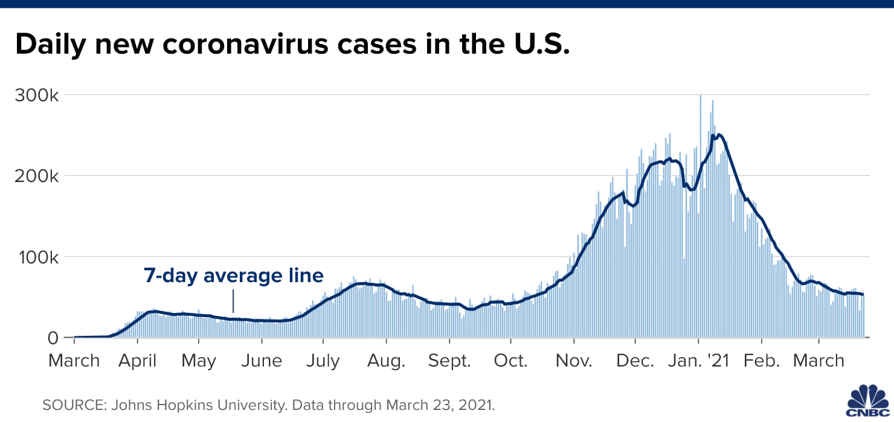

###Roadmap:

1. Components of time series
2. Patterns of correlation in time series
3. Simple forecasting methods
4. Evaluating forecasts
5. Time series decomposition
6. Forecasting with time series decomposition 


---
### Example 
- Suppose you wonder if you should go into the wedding business.
- You need to predict whether there is potential for work
- So you look at evolution in the number of weddings across years

#### Heterosexual Marriages in Mexico
```{r, warning=FALSE, fig.height=3, out.width='100%', message=FALSE}
HT$Month=make_yearmonth(year = HT$ANIO_REGIS, month =  HT$MES_REGIS)
SS$Month=make_yearmonth(year = SS$ANIO_REGIS, month =  SS$MES_REGIS)
HT=as_tsibble(HT, index=Month)
SS=as_tsibble(SS, index=Month)
autoplot(HT, M)

```

--

What patterns can you identify in that time series?
---
### Same Sex Marriages in Mexico 

```{r, warning=FALSE, fig.height=4, out.width='100%', message=FALSE}
autoplot(SS, M)

```

--
Going into gay marriage business is probably a better idea!

---
### Components

1. **Trend** - long term change in the level of data, positive or negative.
  - If flat, we call the data stationary
  - Formally, the mean, variance, and autocorrelation does not depend on time

---

### Heterosexual Marriages in Mexico

```{r, warning=FALSE, fig.height=4, out.width='100%', message=FALSE}
autoplot(HT, M)

```


---
### Components

1. **Trend** - long term change in the level of data, positive or negative.
  - If flat, we call the data stationary
  - Formally, the mean, variance, and autocorrelation does not depend on time

2. **Seasonal pattern**: Variation in level that repeats at the same time each period
  - If there is seasonality, data is not stationary

---

### Heterosexual Marriages in Mexico

```{r, warning=FALSE, fig.height=4, out.width='100%', message=FALSE}
autoplot(HT, M)

```


---
### Components

1. **Trend**: Long term change in the level of data, positive or negative.
  - If flat, we call the data stationary
  - Formally, the mean, variance, and autocorrelation does not depend on time

2. **Seasonal pattern**: Variation in level that repeats at the same time each period
  - If there is seasonality, data is not stationary

3. **Cyclical pattern**: Wavelike upward and downward movements along the trend. Not always the same length, not always the same time of year
  - Different from seasonality which always happens at the same time and has same length
  - Often related to business cycles

---


### Heterosexual Marriages in Mexico

```{r, warning=FALSE, fig.height=4, out.width='100%', message=FALSE}
autoplot(HT, M)

```


---
### Components

1. **Trend**: Long term change in the level of data, positive or negative.
  - If flat, we call the data stationary
  - Formally, the mean, variance, and autocorrelation does not depend on time

2. **Seasonal pattern**: Variation in level that repeats at the same time each period
  - If there is seasonality, data is not stationary

3. **Cyclical pattern**: Wavelike upward and downward movements along the trend. Not always the same length, not always the same time of year
  - Different from seasonality which always happens at the same time and has same length
  - Often related to business cycles

4. **Random components**:  Can't be attributed to other parts of the model. The most difficult to predict 

---

### Heterosexual Marriages in Mexico

```{r, warning=FALSE, fig.height=4, out.width='100%', message=FALSE}
autoplot(HT, M)

```


---
### Some other examples

```{r, warning=FALSE, fig.height=4, out.width='100%', message=FALSE}
PBS %>%
filter(ATC2 == "A10") %>%
summarise(total_cost = sum(Cost)) %>%
mutate(total_cost = total_cost / 1e6) -> a10

autoplot(a10, total_cost) +
  labs(y = "$ (millions)",
       title = "Australian antidiabetic drug sales")

```


---

```{r, warning=FALSE, fig.height=4, out.width='100%', message=FALSE}
aus_production %>%
filter(year(Quarter) >= 1980) %>%
autoplot(Electricity) +
labs(y = "GWh", title = "Australian electricity production")
```

---

```{r, warning=FALSE, fig.height=4, out.width='100%', message=FALSE}
aus_production %>%
autoplot(Bricks) +
labs(y = "million units", title = "Australian clay brick production")
```


---

```{r, warning=FALSE, fig.height=4, out.width='100%', message=FALSE}
gafa_stock %>%
filter(Symbol == "AMZN", year(Date) >= 2018) %>%
autoplot(Close) +
labs(y = "$US", title = "Amazon closing stock price")

```


---
### Autocorrelation

- Can past values predict future values?

--
- Yes, if they are correlated 

--
- We will measure **Autocorrelation**: 
    - Are values in previous period correlated with values in the next period?
    - So between $y_t$ and $y_{t-1}$, or $y_t$ and $y_{t-2}$ etc
    
$$\hat{\rho}_k=\frac{\sum^{n}_{t=k+1}(y_{t}-\bar{y})(y_{t-k}-\bar{y})}{\sum^{n}_{t=1}(y_t-\bar{y})^2}$$
```{r, warning=FALSE, fig.height=3, out.width='100%', message=FALSE}
HT=ungroup(HT)
HT[,c("Month","M")] %>%
  mutate(
    Lag1_M = lag(M, order_by = Month),
    Lag2_M = lag(M, order_by = Month, n = 2),
    Lag3_M = lag(M, order_by = Month, n = 3)
  ) 
```

---
We can calculate the values for marriage data:

```{r, warning=FALSE, fig.height=3, out.width='100%', message=FALSE}
p=HT|>ACF(M)
kable(t(p)[,1:6])
```

And plot the Autocorrelation Function (ACF) on a correlogram:

```{r, warning=FALSE, fig.height=3, out.width='100%', message=FALSE}
HT|>ACF(M)|>autoplot()

```

- Why high values at 12 and 24 lag?

---
### Some other examples:

```{r, warning=FALSE, fig.height=2.5, out.width='100%', message=FALSE}
retail <- us_employment %>%
filter(Title == "Retail Trade", year(Month) >= 1980)
v=retail %>% autoplot(Employed)
w=retail %>%
ACF(Employed, lag_max = 48) %>%
autoplot()
v
w
```

- If there is a trend there will be positive autocorrelation

---

```{r, warning=FALSE, fig.height=2.5, out.width='100%', message=FALSE}
google_2015 <- gafa_stock %>%
filter(Symbol == "GOOG", year(Date) == 2015) 
v=google_2015 %>%autoplot()

w=google_2015 %>%
ACF(Close, lag_max = 100) %>%
autoplot()

v
w

```

- Shock persists for a long time
- If stationary, shocks should not persist, autocorrelation should decay quickly to 0


---

```{r, fig.height=6, fig.width=12, echo=FALSE, warning=FALSE, out.width="15cm"}
cowtemp <- as_tsibble(fma::cowtemp)
USAccDeaths <- as_tsibble(USAccDeaths)
AirPassengers <- as_tsibble(AirPassengers)
mink <- as_tsibble(fma::mink)
tp1 <- autoplot(cowtemp, value) +
  labs(x = "", y = "chirps per minute", title = "1. Daily temperature of cow")
tp2 <- autoplot(USAccDeaths, value) +
  labs(x = "", y = "thousands", title = "2. Monthly accidental deaths")
tp3 <- autoplot(AirPassengers, value) +
  labs(x = "", y = "thousands", title = "3. Monthly air passengers")
tp4 <- autoplot(mink, value) +
  labs(x = "", y = "thousands", title = "4. Annual mink trappings")
acfb <- ACF(cowtemp, value) %>% autoplot() +
  labs(x="", title="B") + ylim(-0.4,1)
acfa <- ACF(USAccDeaths, value) %>% autoplot() +
  labs(x = "", title = "A") + ylim(-0.4,1)
acfd <- ACF(AirPassengers, value) %>% autoplot() +
  labs(x = "", title = "D") + ylim(-0.4,1)
acfc <- ACF(mink, value) %>% autoplot() +
  labs(x = "", title ="C") + ylim(-0.4,1)
 plot_grid(tp1, tp2, tp3, tp4,acfa, acfb , acfc , acfd, ncol = 4)
 

```


---
### Autocorrelation

- How do we know that the correlation is significant and not just sampling randomness?
- Test:

  - $H_0: \rho_k=0$ or data is white noise
  - $H_A: \rho_k\neq 0$

--
- What is **White Noise**?

```{r, warning=FALSE, fig.height=3, out.width='100%', message=FALSE}
set.seed(30)
y <- ts(rnorm(50))
autoplot(y) + ggtitle("White noise")

```
**White noise** data is uncorrelated across time, with zero mean and constant variance
  - It is stationary!

---
### White Noise

Autocorrelation of white noise
```{r, warning=FALSE, fig.height=4, out.width='100%', message=FALSE}
ggAcf(y)
```


---
### Test

- Intuitively:
  1. We will calculate test statistic 
  2. Figure out how likely to obtain such value if data was White Noise
  
--
- If test statistic is big, it's unlikely to come from White Noise, so we reject null

$$t_{test}=\frac{\hat{\rho}_k-0}{1/\sqrt{n-k}}$$

- Compare it to t distribution with $t_{n-k}$ degrees of freedom 

--
- Rule of thumb for larger datasets: reject at 95% if:

$$|\hat{\rho}_k|>\frac{2}{\sqrt{n}}$$
- Practice: final fall 2023, b


---
### Confidence bands

- We can compute confidence bands such that if $\hat{\rho}_k$ is within these bands, it's not significant. 

- In our data on straight marriage, n=360

- If data is white noise, autocorrelations should not cross 0.1054

```{r, warning=FALSE, fig.height=2.5, out.width='100%', message=FALSE}
HT|>ACF(M)|>autoplot()

```

- The more observation you have, the better you are at detecting autocorrelation
---
### Gay marriages

```{r, warning=FALSE, fig.height=3, out.width='100%', message=FALSE}
SS|>ACF(M)|>autoplot()

```

--
- Is there a way to transform the data, so it's stationary?

---
### First differencing

- Take the first differences

$$\Delta y_t=y_t-y_{t-1}$$
- First differences approximate how much data growth in each period
- If trend is linear, this variable should have more or less constant mean

---
### First differencing

```{r, warning=FALSE, fig.height=3, out.width='100%', message=FALSE}
SS=ungroup(SS)
SS[,c("Month","M")] %>%
  mutate(Diff_M = difference(M))
```

---


Is transform data stationary?
```{r, warning=FALSE, fig.height=3, out.width='100%', message=FALSE}
SS|>autoplot(difference(M))

```

--
- Does it have constant mean?

--
- What about constant variance?

--
- What about autocorrelation?

---
```{r, warning=FALSE, fig.height=4, out.width='100%', message=FALSE}
SS|>ACF(difference(M))|>autoplot()
```


---

### Simple forecasting methods

**Naive Model**

The simplest way to forecast is to assume that it will be the same as previous period

- One step forecast: $\hat{y}_{T+1|T}=y_T$ 

--
- h-step forecast: $\hat{y}_{T+h|T}=y_T$ 

```{r, warning=FALSE, fig.height=3, out.width='100%', message=FALSE}
library(fable)
library(tsibbledata)
HT %>%
  model(NAIVE(M)) %>%
  forecast(h = 24) %>%
  autoplot(HT, level=NULL)


```


---
### Simple forecasting methods

What is the confidence interval for such prediction?

- We need to know the variance of the forecast error

--
- What is **Forecast Error**? 

$$e_t=y_{T+h}-\hat{y}_{T+h|T}$$
--

- It's the difference between what we forecasted based on our model and what actually happened once we observe this data point
- Also known as out-of-sample error, because the forecasted point was not in the estimation sample
- We only used observations up to point T when estimating this model!

--
- Different from **Fitted Residuals**!

$$u_t=y_{t}-\hat{y}_{t}$$
These are fitted residuals for observations that we used in estimation. 

---

```{r, warning=FALSE, fig.height=3, out.width='100%', message=FALSE}
# Load necessary libraries
library(ggplot2)
library(plotly)

# Generate a time series dataset with a trend
set.seed(1223)
n <- 61
trend <- 0.1 * (1:n)
noise <- rnorm(n, mean = 0, sd = 1)
ts_data <- trend + noise

# Define estimation sample (all but last observation)
estimation_sample <- ts_data[1:(n - 1)]
prediction_sample <- ts_data[n]

# Fit a linear model to the estimation sample
time_index <- 1:(n - 1)
model <- lm(estimation_sample ~ time_index)

# Predict the next value
predicted_value <- predict(model, newdata = data.frame(time_index = n))
forecast_error <- prediction_sample - predicted_value

# Create a data frame for plotting
plot_df <- data.frame(
  Time = 1:n,
  Observed = ts_data,
  Sample = c(rep("Estimation Sample", n - 1), "Out-of-Sample"),
  Fitted = c(fitted(model), predicted_value)
)

# Create the plot using ggplot2
p <- ggplot(plot_df, aes(x = Time)) +
  geom_line(aes(y = Fitted, color = "Fitted Model"), size = 1) +
  geom_point(aes(y = Observed, color = Sample), size = 2) +
  geom_vline(xintercept = n - 0.5, linetype = "dashed", color = "red") +
  scale_x_continuous(limits = c(0, n + 10)) +  # Add extra margin
  labs(title = "Residuals vs Forecast Errors",
       x = "Time", y = "Value",
       color = "Legend", shape = "Sample Type") +
  scale_color_manual(values = c("Observed" = "grey", 
                                "Fitted Model" = "blue",
                                "Estimation Sample" = "black", 
                                "Out-of-Sample" = "orange")) +
  theme_minimal()

# Convert ggplot2 plot to plotly object for interactivity
ggplotly(p,
        width = 800,   # Adjust the width according to your preference
        height = 500)
```


---


```{r, warning=FALSE, fig.height=3, out.width='100%', message=FALSE}
# Load necessary libraries
library(ggplot2)
library(plotly)

# Generate a time series dataset with a trend
set.seed(1223)
n <- 61
trend <- 0.1 * (1:n)
noise <- rnorm(n, mean = 0, sd = 1)
ts_data <- trend + noise

# Define estimation sample (up to t = 30)
estimation_end <- 59
estimation_sample <- ts_data[1:estimation_end]
out_of_sample <- ts_data[(estimation_end + 1):n]

# Fit a linear model to the estimation sample
time_index <- 1:estimation_end
model <- lm(estimation_sample ~ time_index)

# Predict values for the remaining out-of-sample period
predicted_values <- predict(model, newdata = data.frame(time_index = (estimation_end + 1):n))
observed_values <- out_of_sample
forecast_errors <- observed_values - predicted_values

# Create a data frame for plotting
plot_df <- data.frame(
  Time = 1:n,
  Observed = ts_data,
  Sample = c(rep("Estimation Sample", estimation_end), rep("Out-of-Sample", n - estimation_end)),
  Fitted = c(fitted(model), predicted_values)
)

# Create the plot using ggplot2
p <- ggplot(plot_df, aes(x = Time)) +
  geom_line(aes(y = Fitted, color = "Fitted Model"), size = 1) +
  geom_point(aes(y = Observed, color = Sample), size = 2) +
  geom_vline(xintercept = estimation_end + 0.5, linetype = "dashed", color = "red") +
  scale_x_continuous(limits = c(0, n + 10)) +  # Add extra margin
  labs(title = "Residuals vs Forecast Errors",
       x = "Time", y = "Value",
       color = "Legend") +
  scale_color_manual(values = c("Fitted Model" = "blue",
                                "Estimation Sample" = "black", 
                                "Out-of-Sample" = "orange")) +
  theme_minimal()
# Convert ggplot2 plot to plotly object for interactivity
ggplotly(p,
        width = 800,   # Adjust the width according to your preference
        height = 500)
```


---


```{r, warning=FALSE, fig.height=3, out.width='100%', message=FALSE}
# Load necessary libraries
library(ggplot2)
library(plotly)

# Generate a time series dataset with a trend
set.seed(1223)
n <- 61
trend <- 0.1 * (1:n)
noise <- rnorm(n, mean = 0, sd = 1)
ts_data <- trend + noise

# Define estimation sample (up to t = 30)
estimation_end <- 58
estimation_sample <- ts_data[1:estimation_end]
out_of_sample <- ts_data[(estimation_end + 1):n]

# Fit a linear model to the estimation sample
time_index <- 1:estimation_end
model <- lm(estimation_sample ~ time_index)

# Predict values for the remaining out-of-sample period
predicted_values <- predict(model, newdata = data.frame(time_index = (estimation_end + 1):n))
observed_values <- out_of_sample
forecast_errors <- observed_values - predicted_values

# Create a data frame for plotting
plot_df <- data.frame(
  Time = 1:n,
  Observed = ts_data,
  Sample = c(rep("Estimation Sample", estimation_end), rep("Out-of-Sample", n - estimation_end)),
  Fitted = c(fitted(model), predicted_values)
)

# Create the plot using ggplot2
p <- ggplot(plot_df, aes(x = Time)) +
  geom_line(aes(y = Fitted, color = "Fitted Model"), size = 1) +
  geom_point(aes(y = Observed, color = Sample), size = 2) +
  geom_vline(xintercept = estimation_end + 0.5, linetype = "dashed", color = "red") +
  scale_x_continuous(limits = c(0, n + 10)) +  # Add extra margin
  labs(title = "Residuals vs Forecast Errors",
       x = "Time", y = "Value",
       color = "Legend") +
  scale_color_manual(values = c("Fitted Model" = "blue",
                                "Estimation Sample" = "black", 
                                "Out-of-Sample" = "orange")) +
  theme_minimal()
# Convert ggplot2 plot to plotly object for interactivity
ggplotly(p,
        width = 800,   # Adjust the width according to your preference
        height = 500)
```


---


```{r, warning=FALSE, fig.height=3, out.width='100%', message=FALSE}
# Load necessary libraries
library(ggplot2)
library(plotly)

# Generate a time series dataset with a trend
set.seed(1223)
n <- 61
trend <- 0.1 * (1:n)
noise <- rnorm(n, mean = 0, sd = 1)
ts_data <- trend + noise

# Define estimation sample (up to t = 30)
estimation_end <- 57
estimation_sample <- ts_data[1:estimation_end]
out_of_sample <- ts_data[(estimation_end + 1):n]

# Fit a linear model to the estimation sample
time_index <- 1:estimation_end
model <- lm(estimation_sample ~ time_index)

# Predict values for the remaining out-of-sample period
predicted_values <- predict(model, newdata = data.frame(time_index = (estimation_end + 1):n))
observed_values <- out_of_sample
forecast_errors <- observed_values - predicted_values

# Create a data frame for plotting
plot_df <- data.frame(
  Time = 1:n,
  Observed = ts_data,
  Sample = c(rep("Estimation Sample", estimation_end), rep("Out-of-Sample", n - estimation_end)),
  Fitted = c(fitted(model), predicted_values)
)

# Create the plot using ggplot2
p <- ggplot(plot_df, aes(x = Time)) +
  geom_line(aes(y = Fitted, color = "Fitted Model"), size = 1) +
  geom_point(aes(y = Observed, color = Sample), size = 2) +
  geom_vline(xintercept = estimation_end + 0.5, linetype = "dashed", color = "red") +
  scale_x_continuous(limits = c(0, n + 10)) +  # Add extra margin
  labs(title = "Residuals vs Forecast Errors",
       x = "Time", y = "Value",
       color = "Legend") +
  scale_color_manual(values = c("Fitted Model" = "blue",
                                "Estimation Sample" = "black", 
                                "Out-of-Sample" = "orange")) +
  theme_minimal()
# Convert ggplot2 plot to plotly object for interactivity
ggplotly(p,
        width = 800,   # Adjust the width according to your preference
        height = 500)
```


---


```{r, warning=FALSE, fig.height=3, out.width='100%', message=FALSE}
# Load necessary libraries
library(ggplot2)
library(plotly)

# Generate a time series dataset with a trend
set.seed(1223)
n <- 61
trend <- 0.1 * (1:n)
noise <- rnorm(n, mean = 0, sd = 1)
ts_data <- trend + noise

# Define estimation sample (up to t = 30)
estimation_end <- 56
estimation_sample <- ts_data[1:estimation_end]
out_of_sample <- ts_data[(estimation_end + 1):n]

# Fit a linear model to the estimation sample
time_index <- 1:estimation_end
model <- lm(estimation_sample ~ time_index)

# Predict values for the remaining out-of-sample period
predicted_values <- predict(model, newdata = data.frame(time_index = (estimation_end + 1):n))
observed_values <- out_of_sample
forecast_errors <- observed_values - predicted_values

# Create a data frame for plotting
plot_df <- data.frame(
  Time = 1:n,
  Observed = ts_data,
  Sample = c(rep("Estimation Sample", estimation_end), rep("Out-of-Sample", n - estimation_end)),
  Fitted = c(fitted(model), predicted_values)
)

# Create the plot using ggplot2
p <- ggplot(plot_df, aes(x = Time)) +
  geom_line(aes(y = Fitted, color = "Fitted Model"), size = 1) +
  geom_point(aes(y = Observed, color = Sample), size = 2) +
  geom_vline(xintercept = estimation_end + 0.5, linetype = "dashed", color = "red") +
  scale_x_continuous(limits = c(0, n + 10)) +  # Add extra margin
  labs(title = "Residuals vs Forecast Errors",
       x = "Time", y = "Value",
       color = "Legend") +
  scale_color_manual(values = c("Fitted Model" = "blue",
                                "Estimation Sample" = "black", 
                                "Out-of-Sample" = "orange")) +
  theme_minimal()
# Convert ggplot2 plot to plotly object for interactivity
ggplotly(p,
        width = 800,   # Adjust the width according to your preference
        height = 500)
```


---


```{r, warning=FALSE, fig.height=3, out.width='100%', message=FALSE}
# Load necessary libraries
library(ggplot2)
library(plotly)

# Generate a time series dataset with a trend
set.seed(1223)
n <- 61
trend <- 0.1 * (1:n)
noise <- rnorm(n, mean = 0, sd = 1)
ts_data <- trend + noise

# Define estimation sample (up to t = 30)
estimation_end <- 55
estimation_sample <- ts_data[1:estimation_end]
out_of_sample <- ts_data[(estimation_end + 1):n]

# Fit a linear model to the estimation sample
time_index <- 1:estimation_end
model <- lm(estimation_sample ~ time_index)

# Predict values for the remaining out-of-sample period
predicted_values <- predict(model, newdata = data.frame(time_index = (estimation_end + 1):n))
observed_values <- out_of_sample
forecast_errors <- observed_values - predicted_values

# Create a data frame for plotting
plot_df <- data.frame(
  Time = 1:n,
  Observed = ts_data,
  Sample = c(rep("Estimation Sample", estimation_end), rep("Out-of-Sample", n - estimation_end)),
  Fitted = c(fitted(model), predicted_values)
)

# Create the plot using ggplot2
p <- ggplot(plot_df, aes(x = Time)) +
  geom_line(aes(y = Fitted, color = "Fitted Model"), size = 1) +
  geom_point(aes(y = Observed, color = Sample), size = 2) +
  geom_vline(xintercept = estimation_end + 0.5, linetype = "dashed", color = "red") +
  scale_x_continuous(limits = c(0, n + 10)) +  # Add extra margin
  labs(title = "Residuals vs Forecast Errors",
       x = "Time", y = "Value",
       color = "Legend") +
  scale_color_manual(values = c("Fitted Model" = "blue",
                                "Estimation Sample" = "black", 
                                "Out-of-Sample" = "orange")) +
  theme_minimal()
# Convert ggplot2 plot to plotly object for interactivity
ggplotly(p,
        width = 800,   # Adjust the width according to your preference
        height = 500)
```


---

```{r, warning=FALSE, fig.height=3, out.width='100%', message=FALSE}
# Load necessary libraries
library(ggplot2)
library(plotly)

# Generate a time series dataset with a trend
set.seed(1223)
n <- 61
trend <- 0.1 * (1:n)
noise <- rnorm(n, mean = 0, sd = 1)
ts_data <- trend + noise

# Define estimation sample (up to t = 30)
estimation_end <- 30
estimation_sample <- ts_data[1:estimation_end]
out_of_sample <- ts_data[(estimation_end + 1):n]

# Fit a linear model to the estimation sample
time_index <- 1:estimation_end
model <- lm(estimation_sample ~ time_index)

# Predict values for the remaining out-of-sample period
predicted_values <- predict(model, newdata = data.frame(time_index = (estimation_end + 1):n))
observed_values <- out_of_sample
forecast_errors <- observed_values - predicted_values

# Create a data frame for plotting
plot_df <- data.frame(
  Time = 1:n,
  Observed = ts_data,
  Sample = c(rep("Estimation Sample", estimation_end), rep("Out-of-Sample", n - estimation_end)),
  Fitted = c(fitted(model), predicted_values)
)

# Create the plot using ggplot2
p <- ggplot(plot_df, aes(x = Time)) +
  geom_line(aes(y = Fitted, color = "Fitted Model"), size = 1) +
  geom_point(aes(y = Observed, color = Sample), size = 2) +
  geom_vline(xintercept = estimation_end + 0.5, linetype = "dashed", color = "red") +
  scale_x_continuous(limits = c(0, n + 10)) +  # Add extra margin
  labs(title = "Residuals vs Forecast Errors",
       x = "Time", y = "Value",
       color = "Legend") +
  scale_color_manual(values = c("Fitted Model" = "blue",
                                "Estimation Sample" = "black", 
                                "Out-of-Sample" = "orange")) +
  theme_minimal()
# Convert ggplot2 plot to plotly object for interactivity
ggplotly(p,
        width = 800,   # Adjust the width according to your preference
        height = 500)
```

---


### Simple forecasting methods

- In the simplest naive model, the one step ahead residuals and forecast errors are similar. 

- So we can approximate the standard deviation of $e_t$ with standard deviation of $u_t$ in this naive model.

- Let $\sigma_h$ be the h-step forecast error. 

- We will assume: $$\sigma_1=\sigma_u$$ so the standard deviation of the one step ahead forecast is the same as the standard deviation of the residuals

- This gives us the following confidence interval for one step ahead error:

$$CI_{95}=\hat{y}_{T+1|T} \pm 1.96\hat{\sigma}_u$$
---
### Simple forecasting methods


For longer horizon, forecast error in naive forecast is:

- Let $\sigma_h=\sigma_u\sqrt{h}$ be the sd of h-step forecast error, and $$CI_{95}=\hat{y}_{T+h|T} \pm 1.96\hat{\sigma}_u\sqrt{h}$$

---
### Simple forecasting methods


```{r, warning=FALSE, fig.height=3, out.width='100%', message=FALSE}
X=HT %>%
  model(NAIVE(M))
paste("error standard deviation:",sd(X$`NAIVE(M)`[[1]]$fit$.resid, na.rm=TRUE))
naive(HT$M, 1)
library(fable)
library(tsibbledata)
HT%>%
  model(NAIVE(M)) %>%
  forecast(h = 24) %>%autoplot(HT)


```

---
### Simple forecasting methods

**Seasonal naive**

We can make it slightly more elaborate by assuming it's the same value as in the last same season:

$\hat{y}_{T+1|T}=y_{m(T+1)}$


- m(T+1) is the last time period with the same season as T+1

```{r, warning=FALSE, fig.height=3, out.width='100%', message=FALSE}

library(fable)
library(tsibbledata)
X=HT %>%
  model(SNAIVE(M ~ lag("year")))
paste("error standard deviation:",sd(X$`SNAIVE(M ~ lag("year"))`[[1]]$fit$.resid, na.rm=TRUE))
HT %>%
  model(SNAIVE(M ~ lag("year"))) %>%
  forecast(h = 24)%>%autoplot(HT, level=NULL)

```

---

### Simple forecasting methods

- At one step ahead, the confidence interval is the same:

$$CI_{95}=\hat{y}_{T+1|T} \pm 1.96\hat{\sigma}_u$$

--

- For longer horizon, forecast error is slightly different:

--

- Let $\sigma_h=\sigma_u\sqrt{h}$ be the h-step forecast error sd
- Let $k$ be the number of seasonal cycles in the forecast prior to forecast time
  - If it's the first January since time T, k+1=1
  - If it's the second January since time T, k+1=2


 $$CI_{95}=\hat{y}_{T+h|T} \pm 1.96\hat{\sigma}_u\sqrt{k+1}$$
---

### Simple forecasting methods
```{r, warning=FALSE, fig.height=3, out.width='100%', message=FALSE}

library(fable)
library(tsibbledata)
paste("error standard deviation:", sd(X$`SNAIVE(M ~ lag("year"))`[[1]]$fit$.resid, na.rm=TRUE))
HT %>%
  model(SNAIVE(M ~ lag("year"))) %>%
  forecast(h = 24)%>%autoplot(HT)
```

--
- Why the interval is smaller than in the previous case?

--
- The forecast errors are smaller
- So the standard deviation of errors is smaller!

---

### Simple forecasting methods


**Simple Average**

We can also just take an average of the time series and make it our prediction:


$\hat{y}_{T+1|T}=\bar{y}_T=\frac{\sum_{t\leq T} y_t}{T}$


```{r, warning=FALSE, fig.height=3, out.width='100%', message=FALSE}

library(fable)
library(tsibbledata)
HT %>% 
  model(mean = MEAN(M ~ window(size = 1000)))%>%
  forecast(h = 24) %>%
  autoplot(HT, level=NULL)

```

---


### Simple forecasting methods

- At one step ahead, the confidence interval is the same:

$$CI_{95}=\hat{y}_{T+1|T} \pm 1.96\hat{\sigma}_u$$

--

- For longer horizon, forecast error is slightly different:

--

- Let $\sigma_h=\sigma_u\sqrt{h+\frac{1}{T}}$ be the h-step forecast error sd


 $$CI_{95}=\hat{y}_{T+h|T} \pm 1.96\hat{\sigma}_u\sqrt{h+\frac{1}{T}}$$


--

- Generally, average value acros 20 years is not a good prediction

---


### Moving average

Consider an average of the last $k$ observations:

$$MA(k)_t: \frac{\sum^k_{j=1} y_{t+1-j} }{k}=\frac{y_{t}+y_{t-1}..+y_{t+1-k}}{k}$$

- How many? Usually equal to number of seasons, so the seasonal variation smoothed out

--
- As we will see later, this is more useful in identifying trend and cycle components

**12 months**

```{r, warning=FALSE, fig.height=3, out.width='100%', message=FALSE}

library(fable)
library(tsibbledata)
HT=ungroup(HT)
HT=as_tsibble(HT, key=SS)
HT %>% 
  mutate(
    `12-MA` = slider::slide_dbl(M, mean,
                .before = 11, .after = 0, .complete=TRUE)
  ) %>%
  autoplot(M, color="gray") +
  geom_line(aes(y = `12-MA`), colour = "#D55E00")

```

---

**4 Months**

```{r, warning=FALSE, fig.height=3, out.width='100%', message=FALSE}

library(fable)
library(tsibbledata)
HT=ungroup(HT)
HT %>% 
  mutate(
    `12-MA` = slider::slide_dbl(M, .f=~mean(.x, na.rm=TRUE),
                .before = 3, .after = 0, .complete=TRUE)
  ) %>%
  autoplot(M, color="gray") +
  geom_line(aes(y = `12-MA`), colour = "#D55E00")

```

---


**3 years**

```{r, warning=FALSE, fig.height=3, out.width='100%', message=FALSE}

library(fable)
library(tsibbledata)
HT=ungroup(HT)
HT %>% 
  mutate(
    `12-MA` = slider::slide_dbl(M, mean,
                .before = 119, .after = 0, .complete=TRUE)
  ) %>%
  autoplot(M, color="gray") +
  geom_line(aes(y = `12-MA`), colour = "#D55E00")

```

---

### Evaluating forecasts

Which of the forecasts was the best?

--
- There is couple of ways to evaluate the forecast accuracy
- They all have advantages and disadventages
- General idea: how close the forecast was to the observed value
- You always use OUT-OF-SAMPLE errors, not fitted residuals
---

### Mean Error

$$ME=\frac{\sum^{T-h}_{t=1}(y_{t+h}-\hat{y}_{t+h|t})}{T-h}$$
- This is the average of forecast error

--
- Can tell us which direction is the bias

- You can test for the existence of bias with a usual t test:

  - $H_0:E(e_t)=0$
  - $H_A:E(e_t) \neq 0$ (or inequality)

- Test statistic and the null distribution:
  $$T_{test}=\frac{\bar e-0}{\frac{\hat{\sigma}_e}{\sqrt n}} \sim t_{n-1}$$

--
- Positive and negative values can add up to 0
- So even if errors are large, but symmetric, this measure will be close to 0

- Practice: final fall 2023, c


---
### Mean Error

My estimation sample is up to December 2009. I am trying to predict values in 2010

```{r, warning=FALSE, fig.height=3, out.width='100%', message=FALSE}
library(fable)
library(tsibbledata)
HT=ungroup(HT)

Marriages_train=HT%>%
  filter(as.numeric(ANIO_REGIS) < 2010)
FC=Marriages_train %>% 
   model(
    Mean = MEAN(M),
    `Naïve` = NAIVE(M),
    `Seasonal naïve` = SNAIVE(M))%>%
  forecast(h = 12)

HT2=HT%>%filter(as.numeric(ANIO_REGIS) < 2011)

FC%>%autoplot(HT2, level=NULL)

```

---
### Mean Error:


To calculate the mean error at h=1, I would repeat this repetitively increasing my estimation sample. 

- Ex: Estimate based on data up to January 2010, and predict February 2010, compute error
- Next: Estimate based on data up to February 2010, and predict March 2010, compute error
- And so on... until T-1. 
- Then compute average of these errors


```{r, warning=FALSE, fig.height=3, out.width='100%', message=FALSE}
library(fable)
library(tsibbledata)
HT=ungroup(HT)

Marriages_train=HT%>%
  filter(as.numeric(ANIO_REGIS) < 2010)
FC=Marriages_train %>% 
   model(
    Mean = MEAN(M),
    `Naïve` = NAIVE(M),
    `Seasonal naïve` = SNAIVE(M))%>%
  forecast(h = 2)

```

```{r, warning=FALSE, fig.height=3, out.width='100%', message=FALSE}

forecast::accuracy(FC, HT)

```
- If the error is negative, we overestimate! 

---
### Mean Absolute Error

$$MAE=\frac{\sum^{T-h}_{t=1}|y_{t+h}-\hat{y}_{t+h|t}|}{T-h}$$

- Similar, but we take absolute value of errors. So they don't cancel out!
- This measure is **always** positive 
- But we can't say whether we underpredict or overpredict

```{r, warning=FALSE, fig.height=3, out.width='100%', message=FALSE}

forecast::accuracy(FC, HT)

```

- Now clearly seasonal is the best

---
### Mean Percentage Error

$$MPE=\frac{\sum^{T-h}_{t=1}(y_{t+h}-\hat{y}_{t+h|t})/y_{t+h}}{T-h}$$
- Answers the question:
  - on average, my forecast is x% wrong
  
--
- It's unitless, so I can compare forecasts of different measures
  - EG: comparing forecast of inflation vs exports 

--
- But again, negative and positive can cancel out...

- So average forecast is again performing well!

```{r, warning=FALSE, fig.height=3, out.width='100%', message=FALSE}

forecast::accuracy(FC, HT)

```


---
### Mean Absolute Percentage Error


$$MAPE=\frac{\sum^{T-h}_{t=1}|y_{t+h}-\hat{y}_{t+h|t}|/y_{t+h}}{T-h}$$
- Similar as before, but we take the absolute value

```{r, warning=FALSE, fig.height=3, out.width='100%', message=FALSE}

forecast::accuracy(FC, HT)

```

---
### Squared Errors

- Mean Squared Errors
$$MSE=\frac{\sum^{T-h}_{t=1}(y_{t+h}-\hat{y}_{t+h|t})^2}{T-h}$$

- Root Mean Squared Errors
$$RMSE=\sqrt{\frac{\sum^{T-h}_{t=1}(y_{t+h}-\hat{y}_{t+h|t})^2}{T-h}}$$
--

- If we take a sqaure instead of absolute value, we penalize more big deviations
- Then we need to take square root to get the right units back

```{r, warning=FALSE, fig.height=3, out.width='100%', message=FALSE}

forecast::accuracy(FC, HT)

```

---
#### Practice

- Lista 04.2
  - Ex 2,4 
- Lista 04.3
  - Ex 1,3a  (exponential smoothing is not part of the course anymore)
  - Ex 11a
  
  
---

### Time series decomposition

- Helps in analyzing the patterns in the time series data
- Sometimes used for forecasting

--

**Multiplicative Decomposition**: Assume time series is a product of 4 elements:

$$y_t=S_tT_tC_tR_t$$


--
**Goal**: Identify the elements of the time series:

1. Seasonality $S_t$
2. Trend $T_t$
3. Cycles $C_t$
4. Irregular/Reminder $R_t$

--
- Two notes:
  - We will often ignore irregular components
  - Some methods don't distinguish between Trend and Cycles

---
### Seasonality


```{r, warning=FALSE, fig.height=2, out.width='100%', message=FALSE}
HT|>gg_season(M)

```


--

- How would you identify which variations in time series are due to seasonality?

--
- **Idea**: 
  1. Eliminate seasonal variation - deseason
  2. Compare the actual series to the one without seasonal variation
  3. The difference is due to seasonality!

--
- How to eliminate seasonal variation?

--
- We will use (Centred) Moving Averages for smoothing.

---
### Seasonality

#### Moving averages for smoothing

- Why moving average smoothes out seasonal variation?

--
- It averages out variation over some period of time

--
- In some seasons we have more weddings, in some seasons we have less wedding. On average these positive and negative seasonalities will average out. 

--
- Over which period should we take average?

---
### Seasonality

- Suppose I take average over 5 months. 
- Note that this time the period in focus is at the center
- I look at $y_t$, two observations before it and two observations after it! 
- So the closest observations to $y_t$


$$\small MA(5)_t: \frac{\sum^{2}_{j=-2} y_{t+j} }{5}=\frac{y_{t+2}+y_{t+1}+y_t+y_{t-1}+y_{t-2}}{5}$$

```{r, warning=FALSE, fig.height=2, out.width='100%', message=FALSE}
library(fable)
library(tsibbledata)
HT=ungroup(HT)
HT %>% 
  mutate(
    `12-MA` = slider::slide_dbl(M, mean,
                .before = 2, .after = 2, .complete=TRUE)
  ) %>%
  autoplot(M, color="gray") +
  geom_line(aes(y = `12-MA`), colour = "#D55E00")

```

--
- If I take only 5, I don't average over all seasons!
- Sometimes I capture more high seasons but not low seasons, so seasonality persists

---
### Seasonality

- Suppose I take average over 12 seasons
- Now each average is over all months (seasons)
- We eliminated seasonal variation

$$\small MA(12)_t: \frac{\sum^{5}_{j=-6} y_{t+j} }{12}=\frac{y_{t+5}+y_{t+4}..+y_t+..+y_{t-5}+y_{t-6}}{12}$$

```{r, warning=FALSE, fig.height=3, out.width='100%', message=FALSE}

library(fable)
library(tsibbledata)
HT=ungroup(HT)
HT %>% 
  mutate(
    `12-MA` = slider::slide_dbl(M, mean,
                .before = 6, .after = 5, .complete=TRUE)
  ) %>%
  autoplot(M, color="gray") +
  geom_line(aes(y = `12-MA`), colour = "#D55E00")

```

---
### Seasonality

--
- Mathematical caveat
  - Since the number of periods is even (12), our main observations is not really at the center
  - We can have 5 obs before and 6 after
  - Or 6 obs before and 5 after

--
**Centered** Moving Average

- Or we can have both!

--
- Calculate moving average both ways and then take the average of the two.

$$CMA(12)_t=(\frac{\sum^{5}_{j=-6} y_{t+j} }{12}+\frac{\sum^{6}_{j=-5} y_{t+j} }{12})/2$$

--
- Note that we lose some data at the end and at the beginning. 


---

- What was the "seasonality" in terms of Covid?



--
- Less testing on weekends

--
- Seasonality was by the day of the week

--
- So we take 7 days average to smooth it out

---
### Seasonality

- We achieved first step, we have a series without seasonal variation
- So how we identify which parts are due to seasonality?


--
**Seasonal indices**

- Compare actual data to data without seasons

--
- January 2010 seasonal factor would be
  $$SF_{January, 2010}=Y_{January,2010}/CMA_{January,2010}$$

---

```{r, warning=FALSE, fig.height=2.5, out.width='100%', message=FALSE}

library(fable)
library(tsibbledata)
HT=ungroup(HT)
HT %>% 
  mutate(
    `12-MA` = slider::slide_dbl(M, mean,
                .before = 6, .after = 5, .complete=TRUE)
  ) %>%
  autoplot(M, color="gray") +
  geom_line(aes(y = `12-MA`), colour = "#D55E00")

```
  $$SF_{t}=Y_{t}/CMA_{t}$$

```{r, warning=FALSE, fig.height=2,5, out.width='100%', message=FALSE}

library(fable)
library(tsibbledata)
HT %>% 
  mutate(
    MA12 = slider::slide_dbl(M, mean,
                .before = 6, .after = 5, .complete=TRUE)
  ) %>%
  mutate(Seasonality=M/MA12)%>%
  autoplot(Seasonality) +
  geom_line(aes(y = Seasonality), colour = "#D55E00")

```


---
### Seasonality
**Seasonal indices**

- We assume seasonal indices are the same across the time, so we just take the average of all of them for each season: 

$$SF_{January}=\sum_{year}Y_{January,year}/CMA_{January,year}$$

--
.pull-left[
```{r, warning=FALSE, fig.height=3, out.width='100%', message=FALSE}

a=HT%>%model(classical_decomposition(M, type = "mult")) %>%
  components() 

data.frame(Month=1:12, Seasonal_index=a$seasonal[1:12])

```
]
.pull-right[

- In January, we have 13.5% less weddings than yearly average
- In December, we have on average 38% more weddings than yearly average
- in June, we have 14.3% less weddings than yearly average
]
---
### Seasonality

- They should average to 1
  - Because they represent how much they deviate from average in a given season
- (or in other words) They should add up to the number of seasons!
$$\sum^S_{s=1}SF_s=S$$
--
- If you don't know one index, you can identify it from the sum


---

### Trend

- We isolated seasonality
- Now that our time series is not contaminated by seasonal variation, we can identify the trend

--

**Assumption:** Trend is linear

- We are trying to find a line that best approximate the *deseasoned data*

--
- That's what a linear regression do!

--
- My outcome is the deseasoned time series values
- My predictor is time

--
$$CMA_t=a+bt+e_t$$

--

- We find $a$ and $b$ by OLS 

--
- Our predicted trend at time t is:

$$T_t=\hat{a}+\hat{b}t$$

---
### Straight marriages
```{r, warning=FALSE, fig.height=3, out.width='100%', message=FALSE}

a=HT%>%model(classical_decomposition(M, type = "mult")) %>%
  components()
a$Time=as.numeric(a$Month)-min(as.numeric(a$Month))+1

lin_model=lm(trend~Time, data=a)
print(lin_model)
a$trend_pred <- predict(lin_model, newdata = a)

ggplot(a, aes(x = Month)) + 
    geom_line(aes(y = trend), color = "blue") +
    geom_line(aes(y = trend_pred), color = "red") +
    labs(title = "Linear Trend vs Deseasoned Data",
         y = "Value",
         x = "Time",
         color = "Legend") +
    theme_minimal() +
    scale_color_manual(values = c("blue", "red"), 
                       labels = c("Deseasoned Data", "Linear Trend"))+
  ylim(0, NA)

```

---
### Same-sex marriages

```{r, warning=FALSE, fig.height=3, out.width='100%', message=FALSE}

a=SS%>%model(classical_decomposition(M, type = "mult")) %>%
  components()
a$Time=as.numeric(a$Month)-min(as.numeric(a$Month))+1

lin_model=lm(trend~Time, data=a)
print(lin_model)
a$trend_pred <- predict(lin_model, newdata = a)

ggplot(a, aes(x = Month)) + 
    geom_line(aes(y = trend), color = "blue") +
    geom_line(aes(y = trend_pred), color = "red") +
    labs(title = "Linear Trend vs Deseasoned Data",
         y = "Value",
         x = "Time",
         color = "Legend") +
    theme_minimal() +
    scale_color_manual(values = c("blue", "red"), 
                       labels = c("Deseasoned Data", "Linear Trend"))

```

---
### Cyclical element

- Cyclical element is the upward and downward movements around the trend in the deseasoned data

--
- Divide the centered moving average (deseasoned time series) by the trend value 

$$C_t=\frac{CMA_t}{T_t}$$


```{r, warning=FALSE, fig.height=3, out.width='100%', message=FALSE}

a=HT%>%model(classical_decomposition(M, type = "mult")) %>%
  components()
a$Time=as.numeric(a$Month)-min(as.numeric(a$Month))+1

lin_model=lm(trend~Time, data=a)
a$trend_pred <- predict(lin_model, newdata = a)

x=ggplot(a, aes(x = Month)) + 
    geom_line(aes(y = trend), color = "blue") +
    geom_line(aes(y = trend_pred), color = "red") +
    labs(title = "Linear Trend vs Deseasoned Data",
         y = "Value",
         x = "Time",
         color = "Legend") +
    theme_minimal() +
    scale_color_manual(values = c("blue", "red"), 
                       labels = c("Deseasoned Data", "Linear Trend"))
a$cyclical=a$trend/a$trend_pred
y=ggplot(a, aes(x = Month)) + 
    geom_line(aes(y = cyclical), color = "black") +
    labs(title = "Cyclical Component",
         y = "Value",
         x = "Time",
         color = "Legend") +
    theme_minimal() + geom_hline(yintercept = 1, linetype = "dashed", color = "darkgrey")
grid.arrange(x, y, ncol=1)
```

---
### Multiplicative Decomposition

- What about the irregular component?
- We will assume it's one, unless someone tells us there will be some shock


- Once we identified all the elements, we can make predictions for the original variable using the model:

$$y_t=S_tT_tC_cR_t$$


---
### Prediction

What will be the marriage rate in January 2023 (T+1)?

- What is my $S_{T+1}$

--
  - $S_{T+1}$ for January is:  0.865

--
- What is my $T_{T+1}$?

--
  - Formula: $60304.43-61.46*361=38117.37$
  - January 1993 is t=1, February 1993 is t=2 ... January 2023 is t=361

--
- What is my $C_{T+1}$?

--
  - Hardest to predict
  - Assume it's the same as last available one: $C_{T-6}=1.0876$

--
- What is my $R_{T+1}$?

--
  - We don't expect anything crazy to happen so $R_{T+1}=1$

--
  - Putting it all together:
  $$\hat{y}_{T+1}=S_{T+1}T_{T+1}C_{T+1}R_{T+1}=35859.83$$

---
### Prediction

**Confidence Interval**

**Step 1** Find interval bands from trend regression
  - Just use the standard formula
  
$$\hat{T}_{T+1} \pm t_{\alpha/2,n-2}\sqrt{\hat{\sigma_T}^2(1+\frac{1}{T}+\frac{(T+1-\bar t)^2}{\sum^T_{t=1}(t-\bar t)^2})}$$
  - T is the number of the last observation
  - $T_{T+1}$ is the trend prediction 
  - $\hat{\sigma}_T=\frac{SSE}{T-2}$ is the st.dev of residuals from the linear regression.


```{r, warning=FALSE, fig.height=3, out.width='100%', message=FALSE}

a=HT%>%model(classical_decomposition(M, type = "mult")) %>%
  components()
a$Time=as.numeric(a$Month)-min(as.numeric(a$Month))+1

lin_model=lm(trend~Time, data=a)
new_data<- data.frame(Time= c(361))
a=predict(lin_model, newdata = new_data, interval = "predict", level = 0.95, se.fit=TRUE)
a$fit
```


**Step 2** Mulitply these bands by the seasonal and cyclical component


$$CI_{95}=(31187*\underbrace{1.0876}_{C_{T+1}}*\underbrace{0.865}_{S_{T+1}}, 45050*\underbrace{1.0876}_{C_{T+1}}*\underbrace{0.865}_{S_{T+1}})=(29339.92, 42381.87)$$
- This is under the assumption there is little uncertainty about seasonal and cyclical component

---

### Practice
- last question final 2023 fall
- lista 04.4: ex 8, 10
